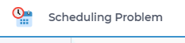

Adding a Logo to an AIMMS WebUI App
====================================

This article illustrates adding a logo to an AIMMS WebUI application, using AIMMS 4.85 and newer. 
Please use the `Employee Scheduling <https://how-to.aimms.com/Articles/387/387-employee-scheduling.html>`_ example to experiment with this feature.

Example
--------

To add a logo into your application as shown on the following image, you need to follow a few steps.

Step 1
~~~~~~~~~
Add the logo as a ``png``. Prefer the selection of a already small sized image. 
The image file ``schedule.png`` is placed in the folder ``./MainProject/WebUI/resources/images``, 

Step 2
~~~~~~~~~
Add a ``css`` file named ``icon.css`` in the folder ``./MainProject/WebUI/resources/stylesheets``.  

This file has the following contents:

.. code-block:: css
    :linenos:

    :root {
        --bg_app-logo: 15px 50% / 30px 30px no-repeat url(/app-resources/resources/images/schedule.png);
        --spacing_app-logo_width: 45px;
    }

Step 3
~~~~~~~~~

Evaluate if your logo needs further size analysis. If so, check for further documentation about styling `here <https://documentation.aimms.com/webui/theming.html#a-special-case-the-application-logo>`_. 

.. note::
    When you want to achieve similar results using AIMMS 4.84 or older, please check out the now deprecated how-to article: :doc:`../518/518-add-logo-to-webui-app-481`