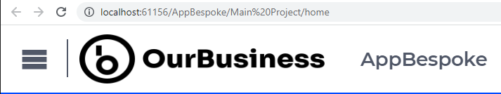

Adding a logo to an AIMMS WebUI app
====================================

This article illustrates adding a logo to an AIMMS WebUI application, using AIMMS 4.85 and newer.

The example provided
---------------------

Please download :download:`The AIMMS 4.85 sample application <model/AppBespoke.zip>` to experiment with the example.
The top bar of this app looks as follows (snapshot taken with a browser zoom of 200%):

The image file ``OurBusinessLogo.png`` is placed in the folder ``./MainProject/WebUI/resources/images``, 
and the css file ``icon.css`` is placed in the folder ``./MainProject/WebUI/resources/css``.  
This file has the following contents:

.. code-block:: css
    :linenos:

    :root {
        --bg_app-logo: 8px 50% / 175px 35px no-repeat url(/app-resources/resources/images/OurBusinessLogo.png);
        --spacing_app-logo_width: 190px;
    }

For an explanation of the above, 
please check the `AIMMS WebUI documentation about adding a LOGO <https://documentation.aimms.com/webui/theming.html#a-special-case-the-application-logo>`_. 

When you want to achieve similar results using AIMMS 4.84 or older, please check out the now deprecated how-to article: :doc:`../518/518-add-logo-to-webui-app-481`

Logo attribution
------------------

The placeholder logo used in this article was created by Paul Wolfs from Total Design (http://www.totaldesign.com).
