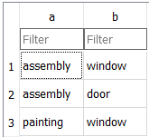
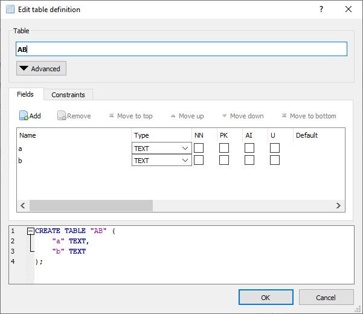
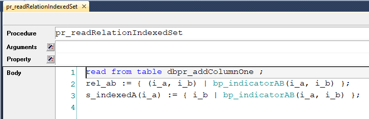

Reading Relations and Indexed Sets from Databases
=================================================

AIMMS does not support reading relations and indexed sets directly using the ``READ FROM TABLE`` statement.
Therefore a table in a database such as

    
and with structure

|

cannot be directly copied to an AIMMS relation or an AIMMS indexed set. 

This article details a workaround to transfer the above table to a relation and to an indexed set and is based on :download:`this AIMMS 4.80 reading relations indexed set project <model/ReadRelationIndexedSet.zip>`.

First, to add a column artificially to an existing table in a database is obtained using the SQL:

.. code-block:: sql
    :linenos:
    
    select A, B, 1 as one from AB ;

where the fragment ``1 as one`` tricks the SQL interpreter to add an artificial column with all 1's.

This SQL fragment is embedded in an AIMMS database procedure as follows:

.. code-block:: aimms
    :linenos:
    :emphasize-lines: 4

    DatabaseProcedure dbpr_addColumnOne {
        DataSource: "data\\one.dsn";
        SqlQuery: {
            "select A, B, 1 as one from AB ;"
        }
        Property: UseResultSet;
        Mapping: {
            "A" --> i_a,
            "B" --> i_b,
            "one" --> bp_indicatorAB(i_a,i_b)
        }
    }

Subsequently, the result of that database procedure is read and converted to a relation and to an indexed set as follows:

|

Remarks:

* Line 1: Normal way of reading result set from a database procedure

* Line 2: Converting the binary parameter to a relation

* Line 3: Converting the binary parameter to an indexed set

.. seealso::

    * :doc:`../554/554-direct-sql-example`
    * `Employee Scheduling Example <https://how-to.aimms.com/Articles/387/387-employee-scheduling.html>`_

