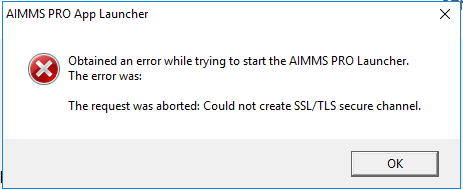
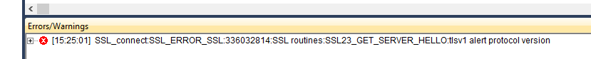

Evolution of AIMMS using Transport Layer Security
=====================================================

To ensure data security, more and more organizations justifiably 
require their applications to deploy recent or even latest security standards.
Notably, nowadays for the Transport Layer Security protocol (TLS), the 

*   recent TLS 1.2 is required, but also

*   the latest TLS 1.3 is more and more required.

As you may know, the TLS protocol:

*   takes care of encrypting the data transferred, and

*   is an essential component for 

    *   the HTTPS protocol, to consume REST API's, 

    *   the WSS protocol, to launch AIMMS WinUI apps.

When a recent (TLS 1.2) is required or even the latest (TLS 1.3) is required, and an older AIMMS or an older AIMMS PRO is used 
that does not support the required TLS version, the decision support application you've build using AIMMS will fail. 

This article is structured as follows:

#.  An overview of the symptoms 

#.  An overview of which TLS version is supported by which product from the AIMMS portfolio.

#.  A few references to blogs on the internet.

Symptoms
--------

There are two types of symptom when an older AIMMS or AIMMS PRO is used in conjunction with a recent or latest required TLS:

WinUI
^^^^^^

For AIMMS WinUI applications deployed on AIMMS PRO, you will get the following error message when launching the application:

    
.. note:: The error message text: ``The request was aborted: Could not create SSL/TLS secure channel``.

Consuming REST-API
^^^^^^^^^^^^^^^^^^^

.. note:: The error message text: ``SSL_connect: SSL:336032814: SSL routines: SSL23_GET_SERVER_HELLO: tlsv1 alert protocol version`` .

See also :doc:`Error message tlsv1 alert protocol version <../496/496-tls-connection-version>`

Relating evolutions
-----------------------------------------

AIMMS Evolution related to TLS evolution is as follows:

#.  AIMMS Developer:

    #.  All AIMMS 4 releases support TLS 1.0, TLS 1.1, and TLS 1.2.
    
    #.  Since AIMMS 4.76.4, also TLS 1.3 is supported.
    
#.  AIMMS PRO:

    #.  The PRO AppLauncher, a separate component, supports TLS 1.0 and TLS 1.1 for all versions of AIMMS PRO.
        This component is needed to start WinUI applications.

    #.  The other components of AIMMS PRO, support TLS 1.0, TLS 1.1, and TLS 1.2.

    #.  Since AIMMS PRO 2.37.2, TLS 1.3 is supported for all components of AIMMS PRO.

Upgrading to AIMMS PRO 2.37.2 or later:
^^^^^^^^^^^^^^^^^^^^^^^^^^^^^^^^^^^^^^^

When AIMMS PRO is upgraded from before AIMMS PRO 2.37.2 to AIMMS PRO 2.37.2 or later; the PRO AppLauncher that supports TLS 1.3 also becomes available.
For End-Users of WinUI applications to make use of this AppLauncher, they will need to 

*   download (AIMMS PRO Portal > Help > Getting started > Button Download App Launcher) and 

*   install it (by running the downloaded executable).

.. note:: This AppLauncher requires the ``.NET`` Framework 4.0 or later, and to leverage TLS 1.3, it requires the ``.NET`` Framework 4.7 or later.

Best practice   
------------------------

Regrettably, enforcing TLS 1.2 or TLS 1.3 is sometimes seen as a necessary part of an emergency response by an IT department to a security incident.
To avoid being taken off guard by such an understandable response, 
it is best practice to proactively switch to AIMMS PRO 2.37.2 (or later) and AIMMS 4.76.4 (or later).

.. note:: The good news: when your application is deployed on AIMMS Cloud, TLS 1.3 is available!

References
----------

#.  `AIMMS PRO 2.37.2 release notes <https://documentation.aimms.com/pro-release-notes.html#aimms-pro-2-37-2-release>`_

#.  `AIMMS 4.76.4 release notes <https://documentation.aimms.com/release-notes.html#aimms-4-76-4-release-october-28-2020-build-4-76-4-11>`_

#.  `Wikipedia page on TLS <https://en.wikipedia.org/wiki/Transport_Layer_Security>`_

#.  `TLS 1.3 Is Here to Stay <https://www.ssl.com/blogs/need-know-tls-1-3>`_

#.  `TLS 1.3: Wikipedia <https://en.wikipedia.org/wiki/Transport_Layer_Security>`_
