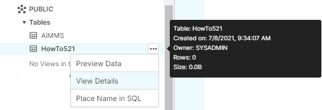
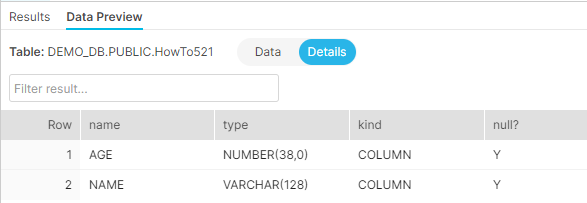
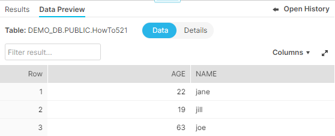

Writing to a Snowflake database
================================

.. Execution error while evaluating the assignment statement for "sp_connectionString" on line 1 in user-defined function section "PostMainInitialization". Error with SQLCreateConnectionString(ODBC, SnowflakeDSIIDriver, tna31667.snowflakecomputing.com, DEMO_DB, aimms): ODBC Driver 'SnowflakeDSIIDriver' is not installed on this system. For a list of available ODBC drivers, please refer to the AIMMS functions SQLNumberOfDrivers and SQLDriverName.

`Snowflake <https://www.snowflake.com/>`_ is a modern cloud based data warehousing company, see `Wikipedia <https://en.wikipedia.org/wiki/Snowflake_Inc.>`_.
Its databases can be accessed via ODBC, and a corresponding ODBC driver is available for `download on their website<https://docs.snowflake.com/en/user-guide/odbc-download.html>`_.

Creating schema's without specifying the widths of columns may lead to you encountering the following phrase in an AIMMS error message: ``Streaming value for bind variable not supported``.  In this article, a running example is used to:

#.  :ref:`reproduction`  : Illustrate how the error message is reproduced.

#.  :ref:`remedy`  : How the schema can be adapted to avoid this error message from recurring.

.. _reproduction:

Reproduction
------------

First we create a table without being explicit about the column widths:

.. code-block:: sql

    create table "DEMO_DB"."PUBLIC" . "HowTo521" ( "NAME" VARCHAR, "AGE" INT ) ; 

Looking at the table created in Swowflake's web interface:

We observe that the created table has the following design:

.. image:: images/created-design-table-how-to-521.png
    :align: center

The default width for ``VARCHAR``, 16777216 is used for this table.

Using the following declarations in the AIMMS model:

.. code-block:: aimms

    DeclarationSection HowTo521 {
        Set s_names {
            Index: i_name;
            Definition: data { jane, joe, jill };
        }
        Parameter p_age {
            IndexDomain: i_name;
            Definition: data { jane : 22, joe : 63, jill : 19 };
        }
        DatabaseTable db_unknownPeopleWithAge {
            DataSource: sp_connectionString;
            TableName: "HowTo521";
            Owner: "PUBLIC";
            Mapping: {
                "NAME" -->i_name,
                "AGE"   -->p_age
            }
        }
    }

And running the following procedure:

.. code-block:: aimms

    Procedure pr_writeHT521 {
        Body: {
            write to table db_unknownPeopleWithAge ;
        }
    }

We encounter the following error message:

.. code-block:: none
    
    Error writing to database table "db_unknownPeopleWithAge": ODBC[21] : HY000 [Snowflake][Snowflake] (21)
    ``Streaming value for bind variable not supported: 2``.

Thusfar the reproduction of the error message. Let's continue with a potential remedy.

.. _remedy:

Remedy
---------

The remedy chosen here is to explicitly specify the width of the column "NAME".

At the time of writing this article, changing the column width seemed only possible by first dropping the column and then recreating it with an explicit width as follows.

First drop the column name: 

.. code-block:: sql

    alter table "DEMO_DB"."PUBLIC" . "HowTo521" drop column "NAME"  ; 

Then create it with a specific width:

.. code-block:: sql

    alter table "DEMO_DB"."PUBLIC" . "HowTo521" add column "NAME" VARCHAR(128) ;
    
Checking the design of the altered table:

Viewing the data after executing the AIMMS procedure ``pr_writeHT521`` again: 

.. Writing again, asking for the data:

We see that the remedy worked.

.. instead of "we see that the rememdy worked", can we include a couple lines explaining why this worked ? For example, Snowflake by default creates columns with width xyz, which is different from other database providers like MySQL, SQL server. AIMMS is incompatible with such a large column width.

