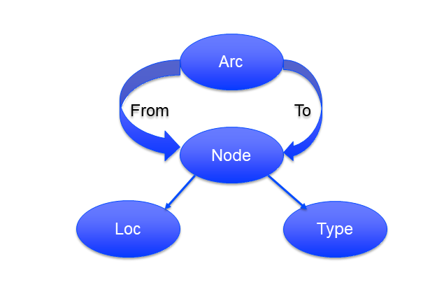
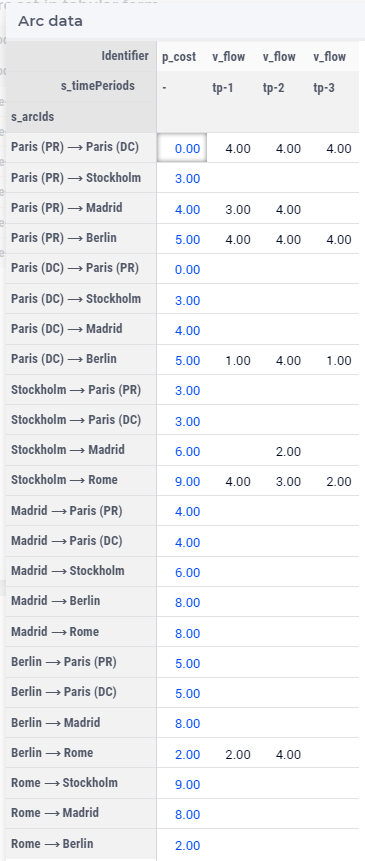

Hierarchical composite objects
========================================

Can a component in a composite object be a composite object itself? 
Is it possible to hierarchically construct composite objects and use the AIMMS language which is an algebraic language?

The component based approach supports this by recursively enumerating all components in all declarations over the sets of composite objects. This article will not present a worked example as the details drag on and on.

The reference based approach permits this.  
This article is a companion article to :doc:`../526/526-modeling-composite-objects` and refines the running example introduced there.

The :download:`AIMMS 4.82 project download <model/TimeSpaceNetworkHierachical.zip>`

The refinement of the running example
--------------------------------------

The running example refers to 6 locations which are also nodes: ParisP, ParisD, Stockholm, Madrid, Berlin, and Rome.
The first two nodes are located in Paris, one being a Production and the other a Distribution node.

Each node actually has two components: the location and the facility type. 
In the companion articles, the arcs were modeled as two components: a from and a to node.
So why don't we structure the arcs and nodes as follows:

The node type is declared in AIMMS as follows:

.. code-block:: aimms
    :linenos:

    Set s_locations {
        Index: i_loc;
    }
    Set s_nodeTypes {
        Definition: data { Production, Distribution };
    }
    Set s_nodeIds {
        Index: i_node, i_nodeFrom, i_nodeTo;
    }
    ElementParameter ep_nodeLocation {
        IndexDomain: i_node;
        Range: s_locations;
    }
    ElementParameter ep_nodeType {
        IndexDomain: i_node;
        Range: s_nodeTypes;
    }

And then the arc type is declared as follows.

.. code-block:: aimms
    :linenos:

    Set s_arcIds {
        Index: i_arc;
        webui::ElementTextIdentifier: sp_arcName( i_arc );
    }
    ElementParameter ep_arcNodeFrom {
        IndexDomain: i_arc;
        Range: s_nodeIds;
    }
    ElementParameter ep_arcNodeTo {
        IndexDomain: i_arc;
        Range: s_nodeIds;
    }

Part of the input for this model can be presented as AIMMS Composite tables as follows:

.. code-block:: aimms
    :linenos:

    Composite table:
        i_node    ep_nodeLocation(i_node)  ep_nodeType(i_node)  p_initialStock(i_node)  p_productionCap(i_node)
    !   ------    -----------------------  -------------------  ----------------------  -----------------------
        node-1    Paris                    Production                               10                        7
        node-2    Paris                    Distribution
        node-3    Stockholm                Production                                9                        7
        node-4    Madrid                   Distribution
        node-5    Berlin                   Distribution
        node-6    Rome                     Distribution
        ;

    Composite table:
        i_arc     ep_arcNodeFrom(i_arc)  ep_arcNodeTo(i_arc)  p_cost(i_arc)
    !   ------    ---------------------  -------------------  -------------
        arc001    node-1                 node-2
        arc002    node-1                 node-3                           3
        arc003    node-1                 node-4                           4
        arc004    node-1                 node-5                           5
    ...    
    ;

Clearly, as we have to look up the interpretation of a node name, it is not immediately clear what an arc is.
This can be improved in the reporting, as the screenshot of a WebUI widget of the solution shows below:

This is achieved using the following report naming of nodes and arcs (ie the element text annotation):

In the node name definition, we assume that the decision maker / end user knows which facility type is used for each location, 
except when there are multiple facilities in one location.

.. code-block:: aimms
    :linenos:

    StringParameter sp_nodeName {
        IndexDomain: i_node;
        Definition: {
            if p_noNodesPerLocation(ep_nodeLocation( i_node)) = 1 then
                formatString("%e", ep_nodeLocation( i_node) )
            else
                formatString("%e (%e)", ep_nodeLocation( i_node), ep_nodeType( i_node ) )
            endif
        }
    }

Once we have a clarifying node name, we can use that node name in the arc name as follows:

.. code-block:: aimms
    :linenos:

    StringParameter sp_arcName {
        IndexDomain: i_arc;
        Definition: {
            formatString( "%s %s %s", 
                sp_nodeName( ep_arcNodeFrom( i_arc ) ), 
                character( 10230 ), ! Long right arrow (unicode char).
                sp_nodeName( ep_arcNodeTo(   i_arc ) ) )
        }
    }

