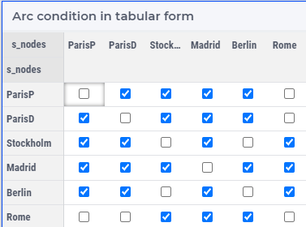
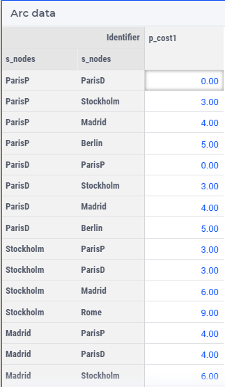
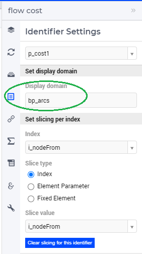
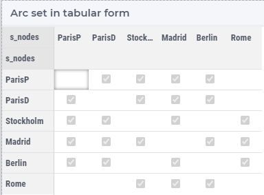
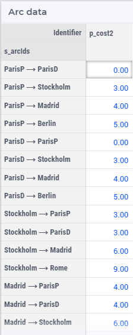
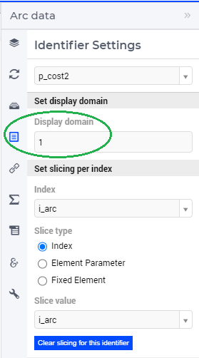

Reporting data over composite objects
======================================

This is a companion article to :doc:`../526/526-modeling-composite-objects`.

In this article, a tabular and a composite table are presented based on data from both the component and reference element based approaches.

The :download:`AIMMS 4.82 project download <model/TimeSpaceNetworkBasic.zip>`

Creating tabular and composite tables with the composite approach
------------------------------------------------------------------

A tabular display of the arcs allowed based on node sets is presented easily by displaying the identifier ``bp_arcs``.

The following is a display of all data defined over arcs

To get the data for all arcs including zeros, the display domain needs specifications as follows:

Creating tabular and composite tables with the reference approach
------------------------------------------------------------------

To create a tabular display of the arc set, see following image,  

a new identifier needs to be created based on the components in the arcs.

.. code-block:: aimms
    :linenos:

    Parameter bp_arcsDef {
        IndexDomain: (i_nodeFrom,i_nodeTo);
        Range: binary;
        Definition: {
            pr_defArcDef();
        }
    }

To fill this parameter with data, a small procedure is perhaps efficient.

.. code-block:: aimms
    :linenos:

    Procedure pr_defArcDef {
        Body: {
            bp_arcsDefTmp( i_arc, ep_arcNodeFrom( i_arc ), ep_arcNodeTo( i_arc ) ) := 1;
            bp_arcsDef(i_nodeFrom, i_nodeTo ) := exists( i_arc | bp_arcsDefTmp(i_arc, i_nodeFrom, i_nodeTo) );
        }
        Parameter bp_arcsDefTmp {
            IndexDomain: (i_arc,i_nodeFrom,i_nodeTo);
            Range: binary;
        }
    }

However, except for a from/to like relation, a tabular display of a set of composite objects is rarely used.
More likely a list view of the data is presented as below.

To create the row names in this list, an element text annotation can be used.

.. code-block:: aimms
    :linenos:

    StringParameter sp_arcName {
        IndexDomain: i_arc;
        Definition: {
            formatString( "%e %s %e", 
                ep_arcNodeFrom( i_arc ), 
                character( 10230 ), ! Right arrow unicode.
                ep_arcNodeTo(   i_arc ) )
        }
    }

Note that such arc descriptions are not available for the component based approach as element text annotation is per single set only.

To get the data for all arcs including zeros, the display domain needs specifications as follows:

Summary
-------------------

Reporting data from the component based and the reference element based approach is almost similar; except that the arc names can be more elaborate in the reference element based approach.