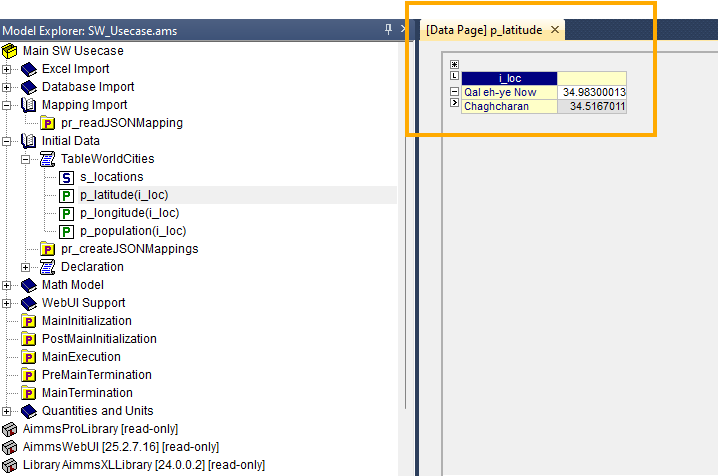

.. meta::
   :description: How to set up data exchange within your AIMMS application.
   :keywords: aimms, data, exchange

How to Integrate the Data Exchange Library
============================================

The Data Exchange Library (DEX) allows you to connect data in a given format (like JSON, XML, table-based CSV/Excel) to your AIMMS model by using a mapping file. These data formats are often used in REST APIs to communicate data. 

.. seealso::
	* `Data Exchange Library documentation <https://documentation.aimms.com/dataexchange/index.html>`_

For this article we will be working with :download:`SW_UseCase.zip <model/SW_UseCase.zip>` example, 
where we build an optimization model to find the least-cost solution. 

Instead of integrating the data from an Excel file or from a database, 
we will be integrating the needed data from a JSON-file and use a mapping file to get the 
data to the correct identifier(s). The basic setup in this article can however be implemented for any tree-based data format.

Prerequisites
--------------

#. 	Make sure you have the `Data Exchange Library installed <https://documentation.aimms.com/general-library/getting-started.html>`__.

#. 	Have a mapping file ready and place it somewhere in your project, preferably in a folder called ``Mappings``. 
	
	Visit `this article <https://documentation.aimms.com/dataexchange/mapping.html>`__ to read more about mappings and how to write one for your specific situation. 
	Note that you can also `generate a mapping file automatically for your project <https://documentation.aimms.com/dataexchange/standard.html#creating-your-own-annotation-based-formats>`__. We will be doing this in the next step.

#. 	Have a data file ready and place it somewhere in your project, preferably in a folder called ``data``. This is the data you want to read into the model. In this example, we've created a JSON data file called ``test.json``, for testing purposes we've shortened the list so there are only two cities in it. The contents of our file look like this:

.. code-block:: json

    [
		{
			"city": "Qal eh-ye Now",
			"city_ascii": "Qal eh-ye",
			"country": "Afghanistan",
			"iso2": "AF",
			"iso3": "AFG",
			"lat": 34.98300013,
			"lng": 63.13329964,
			"pop": 2997.0,
			"province": "Badghis"
		},
		{
			"city": "Chaghcharan",
			"city_ascii": "Chaghcharan",
			"country": "Afghanistan",
			"iso2": "AF",
			"iso3": "AFG",
			"lat": 34.5167011,
			"lng": 65.25000063,
			"pop": 15000.0,
			"province": "Ghor"
		}
	]

Generate Mapping File
-----------------------
The easiest way to get a template for your mapping based on your current model, is to auto-generate a mapping through the :any:`dex::GenerateDatasetMappings` function. 
This generates standardized mappings based on the ``dex::Dataset``, ``dex::TableName``, and ``dex::ColumnName`` annotations. 
The generated mappings are then stored in the ``Mappings/Generated`` subfolder of the project folder.

To import ``test.json`` using :any:`dex::GenerateDatasetMappings`, 
it is needed to add the ``dex::Dataset``, ``dex::TableName`` and ``dex::ColumnName`` annotations 
to the related identifiers. 
We were only able to do so by moving the identifiers (holding the same index) 
that are relevant for our JSON data file into a new declaration and assign the correct ``dex`` 
annotations to this declaration. For the parameter identifiers we've added column-names. 

.. figure:: images/data-exchange-1.png
	:align: center

	The annotations on declaration-level

|

	The annotations on identifier-level

|

Once the annotations are set, by running :any:`dex::GenerateDatasetMappings` directly, you will be generating only
the default mappings, which will not include JSON. To include JSON we need to update ``dex::DatasetGeneratorFilter``, 
this is already created in the procedure ``pr_createJSONMappings``. 

.. code-block:: aimms

	! will create all possible mappings
	dex::DatasetGeneratorFilter(dex::gt, dex::mm, dex::amt) := 1;

	dex::GenerateDatasetMappings;

After running the procedure ``pr_createJSONMappings`` which includes the auto-generating procedure, you should see the following under ``Mappings`` folder:

|

We can find the mapping file for JSON sparse mapping. Without edits, it looks like this:

.. code-block:: xml

	<?xml version="1.0"?>
	<AimmsJSONMapping>
		<ObjectMapping>
			<ArrayMapping name="rows">
				<ObjectMapping>
					<ValueMapping name="i_loc" binds-to="i_loc" />
					<ValueMapping name="lat" maps-to="p_latitude(i_loc)" />
					<ValueMapping name="lng" maps-to="p_longitude(i_loc)" />
					<ValueMapping name="pop" maps-to="p_population(i_loc)" />
				</ObjectMapping>
			</ArrayMapping>
		</ObjectMapping>
	</AimmsJSONMapping>

We have to make a few small changes to this file, as we are working with an array-oriented dataset that holds objects. Hence we removed the first ``<ObjectMapping>`` tag. We can also remove the "name=rows" element from the ``<ArrayMapping>`` tag. Furthermode we had to change the name 'l' to 'city' for the first ``<ValueMapping>>`` as that is the correct name of the property in the JSON file. We couldn't define this name in the annotations within the model as this specific identifier is a set that refers to an index:

.. code-block:: xml

	<AimmsJSONMapping>
		<ArrayMapping>
			<ObjectMapping>
				<ValueMapping name="city" binds-to="i_loc" />
				<ValueMapping name="lat" maps-to="p_latitude(i_loc)" />
				<ValueMapping name="lng" maps-to="p_longitude(i_loc)" />
				<ValueMapping name="pop" maps-to="p_population(i_loc)" />
			</ObjectMapping>
		</ArrayMapping>
	</AimmsJSONMapping>

We saved the file under the same name and are now ready to use it in our basic setup.

Basic Setup
--------------

.. note::

        All functions from the library are referenced and described on `this page <https://documentation.aimms.com/dataexchange/api.html>`__.

For this article we use the above-mentioned JSON-based data file that holds data from two cities. For every city in the array we will need the name, latitude, longitude and the population and match these items to their respective identifiers in the model, as defined in the mapping file.

To use the mapping in a procedure, you must first read the mapping file into your model. You do this by setting up a procedure in which you call the :any:`dex::AddMapping` function.

After this is done without errors or warnings, you can use the :any:`dex::ReadFromFile` function to read the data from the specified data source.

This is ready in ``pr_readJSONMapping``:

.. code-block:: aimms

	dex::AddMapping(
		mappingName :  "WorldCitiesMapping", 
		mappingFile :  "Mappings/Generated/WorldCities-TableWorldCities-JSON-Sparse.xml");

	dex::ReadFromFile(
		dataFile         :  "data/test.json", 
		mappingName      :  "WorldCitiesMapping", 
		emptyIdentifiers :  1, 
		emptySets        :  1, 
		resetCounters    :  1);

If this procedure is run successfully you will see that the data from the data source is imported as specified in the mapping file:

|

.. spelling:word-list::

    dex