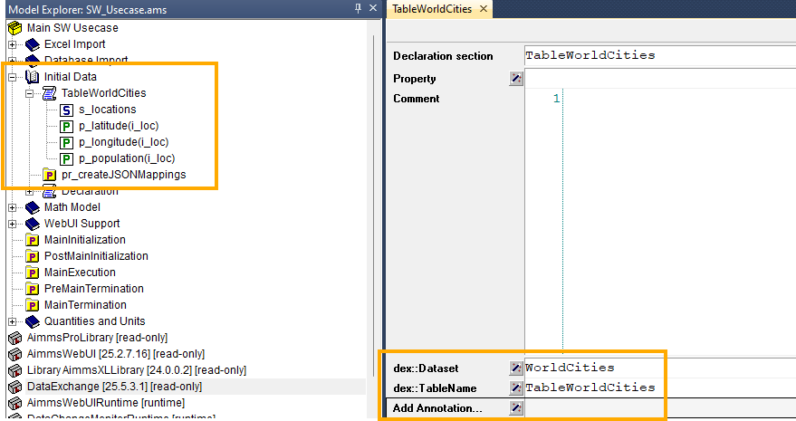

.. meta::
   :description: How to set up data exchange within your AIMMS application.
   :keywords: aimms, data, exchange

How to integrate the Data Exchange Library
============================

The Data Exchange Library allows you to connect data in a given format (like JSON, XML, table-based CSV/Excel) to your AIMMS model by using a mapping file. This allows you to consume and provide REST API's. You can find more documentation on the Data Exchange Library via `this link <https://documentation.aimms.com/dataexchange/index.html>`_.

Prerequisites
--------------

#. Make sure you have the Data Exchange Library installed. Visit `this article <https://documentation.aimms.com/library-repository/getting-started.html>`_ for instructions on how to do this.

#. Have a mapping file ready and place it somewhere in your project, preferably in a folder called 'Mappings'. Visit `this article <https://documentation.aimms.com/dataexchange/mapping.html>`_ to read more about mappings and how to write one for your specific situation. Note that you can also `generate a mapping file automatically for your project <https://documentation.aimms.com/dataexchange/standard.html>`_.

#. Have a data file ready and place it somewhere in your project, preferably in a folder called 'Data'. This is the data you want to read into the model.

Basic setup
--------------
All functions from the library are referenced and described on this page.

For this how-to we've created a very simple mapping file with a simple JSON-based data file:

`The mapping file`
   
.. image:: images/data-exchange-2.png
   :scale: 50
   :align: center
`The data file in JSON format`

To use a mapping in a procedure, you must first read the mapping file into your model. You do this by setting up a procedure in which you call the AddMapping function:

.. js:function::  dex::AddMapping(mappingName,mappingFile)

After this is done without errors or warnings, you can use the ReadFromFile function to read the data from the specified data source:

.. js:function::  dex::ReadFromFile(dataFile,mappingName,emptyIdentifiers,emptySets,resetCounters)

In our model it looks like this:

.. image:: images/data-exchange-3.png
   :scale: 50
   :align: center

If this procedure is run succesfully you will see that the data from the data source is imported as specified in the mapping file:

.. image:: images/data-exchange-4.png
   :scale: 50
   :align: center

This is the most basic setup for integrating and using the Data Exchange Library in your model. 

