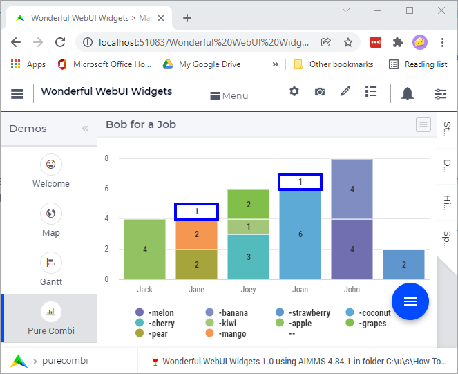
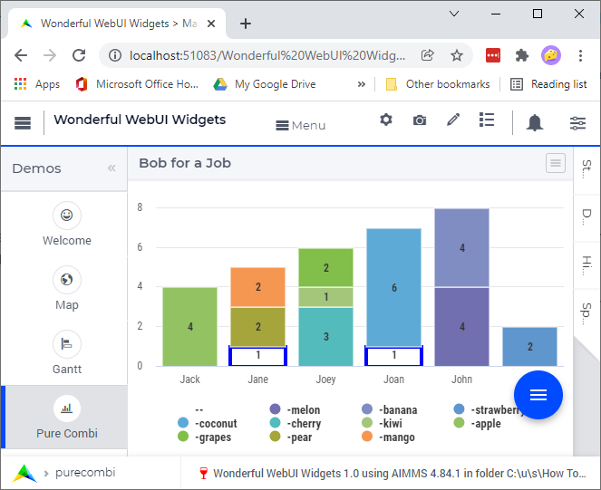

Create Wonderful WebUI Widgets
===============================

In case you have not yet tried the Wonderful WebUI Widgets app yourself, 
you may want to scan :doc:`../531/531-working-with-wonderful-webui-widgets` first.

Welcome and workflow
--------------------

It is good practice to provide a welcome `text <https://documentation.aimms.com/webui/text-widget.html>`_ 
to the end-user. 
This way the end-user reads about the operation of the app and about expected actions.
In addition, it is good practice to make the welcome page part of the workflow, 
such that the user feels guided right from the start.

Map page
--------

The latitude and longitude for the `map widget <https://documentation.aimms.com/webui/map-widget.html#map-widget>`_ 
of arbitrarily selected German cities are extracted from data provided by `simplemaps <https://simplemaps.com/data/world-cities>`_.

Icons for nodes
^^^^^^^^^^^^^^^^^^^^^^^^^^^^^^^^^^ 

The support for `icons on nodes <https://documentation.aimms.com/webui/map-widget.html#icons-for-nodes>`_ 
makes it easy to specify the icons to be used on the nodes via a definition similar to the following:

.. code-block:: aimms
    :linenos:

    StringParameter sp_locationIcon {
        IndexDomain: i_loc;
        Definition: {
            if i_loc in s_sources then
                "aimms-factory"
            elseif i_loc in s_destinations then
                "aimms-store"
            else
                "aimms-width"
            endif ;
        }
    }

Detail tooltip
^^^^^^^^^^^^^^^^^^

HTML can be used for `tooltips on nodes <https://documentation.aimms.com/webui/map-widget.html#tooltips-for-nodes>`_
so a definition like the following is used:

.. code-block:: aimms
    :linenos:

    StringParameter sp_locationTooltip {
        IndexDomain: i_loc;
        Definition: {
            "
"  +
            "<Table>" +
                    "<TR>"  +
                            "<TD>"  +
                                            "<B> Name : </B>" +
                            "</TD>" +
                            "<TD>"  +
                                            formatString("%e", i_loc) +
                            "</TD>" +
                    "</TR>" +
                    "<TR>"  +
                            "<TD>"  +
                                            "<B> Type : </B>" +
                            "</TD>" +
                            "<TD>"  +
                                            sp_locationType( i_loc ) +
                            "</TD>" +
                    "</TR>" +
                    "<TR>"  +
                            "<TD>"  +
                                            "<B> " + 
                                            if i_loc in s_sources then
                                                "Capacity"
                                            elseif i_loc in s_intermediate then 
                                                "Capacity"
                                            else
                                                "Demand"
                                            endif
                                            + " : </B>" +
                            "</TD>" +
                            "<TD>"  +
                                            p_locationSize(i_loc) +
                            "</TD>" +
                    "</TR>"  +
                    if sum( i_locFrom, v_prod(i_locFrom ) ) then
                    "<TR>"  +
                            "<TD>"  +
                                            "<B> " + 
                                            if i_loc in s_sources then
                                                "Production"
                                            elseif i_loc in s_intermediate then 
                                                "Flow"
                                            else
                                                "Unmet demand"
                                            endif
                                            + " : </B>" +
                            "</TD>" +
                            "<TD>"  +
                                            if i_loc in s_sources then
                                                v_prod(i_loc)
                                            elseif i_loc in s_intermediate then 
                                                sum( i_locFrom, v_flow(i_locFrom, i_loc) )
                                            else
                                                v_unmetDemand(i_loc)
                                            endif +
                            "</TD>" +
                    "</TR>"  
                    else "" endif 
                    +
            "</Table>"
        }
    }

There are some remarks regarding the above definition:

#.  It uses the table syntax of HTML.

#.  It is admittedly lengthy, but having this length and indentation, makes the structure apparent.

#.  Lines 38-61 are part of an if-then-else expression; based on a condition, a row is added to the tooltip table.

Detail context menu
^^^^^^^^^^^^^^^^^^^^^^^^^^^^^^^^^^ 

.. code-block:: aimms
    :linenos:

    StringParameter sp_mapLocationItemActions {
        IndexDomain: (webui::indexWidgetItemActionSpec,webui::indexPageExtension,webui::indexWidgetActionSpec);
        Definition: {
            {
                ('p_locationSize', '1', 'displaytext') : "Debug",
                ('p_locationSize', '1', 'icon'       ) : "aimms-bug",
                ('p_locationSize', '1', 'procedure'  ) : "pr_locDebug",
                ('p_locationSize', '1', 'state'      ) : if bp_developmentSupport then "Active" else "Hide" endif,

                ('p_locationSize', '2', 'displaytext') : formatString("Increase %s %e by 1", if ep_selectedLocation in s_destinations then "demand" else "capacity" endif, ep_selectedLocation),
                ('p_locationSize', '2', 'icon'       ) : "aimms-volume-increase2",
                ('p_locationSize', '2', 'procedure'  ) : "pr_locSizeIncrease1",
                ('p_locationSize', '2', 'state'      ) : "Active",

                ('p_locationSize', '3', 'displaytext') : formatString("Increase %s %e by 5", if ep_selectedLocation in s_destinations then "demand" else "capacity" endif, ep_selectedLocation),
                ('p_locationSize', '3', 'icon'       ) : "aimms-volume-increase",
                ('p_locationSize', '3', 'procedure'  ) : "pr_locSizeIncrease5",
                ('p_locationSize', '3', 'state'      ) : "Active",

                ('p_locationSize', '4', 'displaytext') : formatString("Decrease %s %e by 1", if ep_selectedLocation in s_destinations then "demand" else "capacity" endif, ep_selectedLocation),
                ('p_locationSize', '4', 'icon'       ) : "aimms-volume-decrease2",
                ('p_locationSize', '4', 'procedure'  ) : "pr_locSizeDecrease1",
                ('p_locationSize', '4', 'state'      ) : "Active",

                ('p_locationSize', '5', 'displaytext') : formatString("Decrease %s %e by 5", if ep_selectedLocation in s_destinations then "demand" else "capacity" endif, ep_selectedLocation),
                ('p_locationSize', '5', 'icon'       ) : "aimms-volume-decrease",
                ('p_locationSize', '5', 'procedure'  ) : "pr_locSizeDecrease5",
                ('p_locationSize', '5', 'state'      ) : "Active",

                ('p_locationSize', '6', 'displaytext') : formatString("Edit %e", ep_selectedLocation),
                ('p_locationSize', '6', 'icon'       ) : "aimms-quill",
                ('p_locationSize', '6', 'procedure'  ) : "pr_locSizeDetails",
                ('p_locationSize', '6', 'state'      ) : "Active"
            }
        }
    }

Some remarks on the above:

#.  A defined list is created using ``{ ... }``.  
    Note the absence of the word ``data`` here.
    It does require to put the element literals between single quotes (``''``). 
    But then you can nicely use expressions behind the ``:``.

    The advantage of this style of defining context menu behavior is that the small procedures 
    that modify the data of the string parameter to fine control the behavior of such menus are no longer needed.

    This application uses a similar style for controlling the behavior workflow, status bar, widget menus, and page actions.

#.  Line 5: Debug - to help test the application. 
    The visibility of the item 

#.  Line 10: :any:`formatstring` is used to make the descriptions of the menu items more to the point.

Gantt page
----------

Data representation
^^^^^^^^^^^^^^^^^^^^^^^^^^^^^^^^^^ 

There are three different data representations that need to be kept consistent:

#.  User data

#.  Gantt Chart data: start and length of each task.

#.  Coefficients used by the optimization algorithm.

Border: use of CSS
^^^^^^^^^^^^^^^^^^^^^^^^^^^^^^^^^^ 

We built on the intuition that 
blue indicates "can be changed manually in this session" and that 
black indicates "derived or computed data" and is treated as read-only in this session.

Specifying tooltips is similar to what is used for the map widget, and not repeated here.

Context menu
^^^^^^^^^^^^^^^^^^^^

The context menu is to be used for:

#.  The scheduled jobs in the Gantt Chart

#.  Each column/row in the Order Details tab.

.. code-block:: aimms
    :linenos:

    StringParameter sp_ganttSpecItemActions {
        IndexDomain: (webui::indexWidgetItemActionSpec,webui::indexPageExtension,webui::indexWidgetActionSpec);
        Definition: {
            {
                ('p_WebUIGNTDuration', '1', 'displaytext') : "Debug",
                ('p_WebUIGNTDuration', '1', 'icon'       ) : "aimms-bug",
                ('p_WebUIGNTDuration', '1', 'procedure'  ) : "pr_jobDebug",
                ('p_WebUIGNTDuration', '1', 'state'      ) : if bp_developmentSupport then "Active" else "Hide" endif,
            
                ('p_WebUIGNTDuration', '2', 'displaytext') : formatString("Move order %e to front", ep_selectedOrder),
                ('p_WebUIGNTDuration', '2', 'icon'       ) : "aimms-first",
                ('p_WebUIGNTDuration', '2', 'procedure'  ) : "pr_moveToFront",
                ('p_WebUIGNTDuration', '2', 'state'      ) : if bp_orderScheduledByLivingCreature( ep_selectedOrder ) then "Active" else "Inactive" endif,
            
                ('p_WebUIGNTDuration', '3', 'displaytext') : formatString("Delay order %e until deadline", ep_selectedOrder),
                ('p_WebUIGNTDuration', '3', 'icon'       ) : "aimms-last",
                ('p_WebUIGNTDuration', '3', 'procedure'  ) : "pr_delayUntilDeadline",
                ('p_WebUIGNTDuration', '3', 'state'      ) : if bp_orderScheduledByLivingCreature( ep_selectedOrder ) then "Active" else "Inactive" endif,
            
                ('p_WebUIGNTDuration', '4', 'displaytext') : formatString("Allow scheduling of %e by living creature", ep_selectedOrder),
                ('p_WebUIGNTDuration', '4', 'icon'       ) : "aimms-grab",
                ('p_WebUIGNTDuration', '4', 'procedure'  ) : "pr_scheduleByLivingCreature",
                ('p_WebUIGNTDuration', '4', 'state'      ) : if not bp_orderScheduledByLivingCreature( ep_selectedOrder ) then "Active" else "Inactive" endif,
            
                ('p_WebUIGNTDuration', '5', 'displaytext') : formatString( "Allow scheduling of %e by optimization algorithm", ep_selectedOrder),
                ('p_WebUIGNTDuration', '5', 'icon'       ) : "aimms-music",
                ('p_WebUIGNTDuration', '5', 'procedure'  ) : "pr_scheduleByOptimizationAlgorithm",
                ('p_WebUIGNTDuration', '5', 'state'      ) : if bp_orderScheduledByLivingCreature( ep_selectedOrder ) then "Active" else "Inactive" endif,
            
                ('p_WebUIGNTDuration', '6', 'displaytext') : formatString("Delete order %e", ep_selectedOrder),
                ('p_WebUIGNTDuration', '6', 'icon'       ) : "aimms-bin",
                ('p_WebUIGNTDuration', '6', 'procedure'  ) : "pr_deleteJob",
                ('p_WebUIGNTDuration', '6', 'state'      ) : "Active",
            
                ('p_WebUIGNTDuration', '7', 'displaytext') : formatString("Edit order %e", ep_selectedOrder),
                ('p_WebUIGNTDuration', '7', 'icon'       ) : "aimms-quill",
                ('p_WebUIGNTDuration', '7', 'procedure'  ) : "pr_editJob",
                ('p_WebUIGNTDuration', '7', 'state'      ) : "Active"
            }
        }
    }

Remarks:

#.  Similar to the context menu in the map widget above.

#.  Several actions are only available to a job that can be scheduled manually.

#.  Every job can be edited.

#.  The use of ``'p_WebUIGNTDuration'`` in the above definition implies: Only available to the Gantt Chart, so how to reuse this menu in the order table?

Let's first identify the identifiers to be used, namely the ones in the columns:

.. code-block:: aimms
    :linenos:

    Set s_ganttItemActionIdentifiers {
        SubsetOf: AllIdentifiers;
        Definition: {
            data  {
                bp_orderScheduledByLivingCreature,
                ep_orderProduct,
                p_orderLength,
                ep_orderProductType,
                p_orderQuantity,
                ep_orderDeliveryDueDate,
                ep_orderProductionLine,
                ep_orderStartDate,
                p_WebUIGNTDuration,
                p_WebUIGNTStartTime
            }
        }
    }

And then we can easily replicate the data of ``sp_ganttSpecItemActions`` for each of these column names using the below definition:

.. code-block:: aimms
    :linenos:

    StringParameter sp_ganttItemActions {
        IndexDomain: (webui::indexWidgetItemActionSpec,webui::indexPageExtension,webui::indexWidgetActionSpec);
        Definition: {
            if webui::indexWidgetItemActionSpec in s_ganttItemActionIdentifiers then
                sp_ganttSpecItemActions('p_WebUIGNTDuration', webui::indexPageExtension, webui::indexWidgetActionSpec)
            else
                ""
            endif
        }
    }

Pure combi page
------------------

Tooltip
^^^^^^^^^

a simple sentence for the tooltip suffices for this application, and a HTML table is not created.

To make multiple identifiers accessible for the right mouse menu and the tooltip,
the ``<IDENTIFIER-SET>`` index should not be placed in the ``Totals:`` pivot group.
That is why the ``<IDENTIFIER-SET>`` is placed in the ``Stacked:`` pivot group.

Slack, definition
^^^^^^^^^^^^^^^^^^

The slack is what can be carried minus what is already assigned to a youngster. 
For the element ``'me'`` there is no slack - 
in the story the "me" just carries the booth and the bags of fruit left behind by the youngsters myself 
without regard to a maximum weight that can be carried.

Visualizing slack
^^^^^^^^^^^^^^^^^^^^

item order
""""""""""""""

The item order is that the slack should be on top.

The design of the column chart is such that items are placed in order of the set on top of each other; 
so the first visible element will be at the bottom!

As the ``<IDENTIFIER-SET>`` is in the ``Stacked:`` pivot group, this also applies to the order of the contents.
By swapping this order, the columns look as follows (clearly not desired).

White with blue border
""""""""""""""""""""""""

To give the impression of empty space to be filled a blue rectangle around a white box is used.
This is achieved using the following .css code:

.. code-block:: CSS
    :linenos:

    .annotation-hassomeslack {
        fill:white; 
        stroke:blue!Important; 
        stroke-width:4px; 
    }

Remarks:

* The annotation ``hassomeslack`` is added in the model.

* The ``Important`` is needed to make this coloring of the borderline sufficiently specific to be accepted.

Right mouse menu
^^^^^^^^^^^^^^^^^^

.. (index <Identifiers> not in Totals)

This page has only one widget: the combination chart, introduced with AIMMS 4.84.
The story is about assigning an item to an element in a set.
To invoke an assignment, the right mouse menu should be popped up at a colored rectangle in the column chart.

The right mouse menu contains an entry for each element in a set.
The code shows how to generate these lines for an arbitrary set (to be kind to the end-user, please limit the size of such a set to no more than 10 elements).

For each line in the menu, there should also be a corresponding procedure.
To create the proper number of procedures, a runtime library is used.

.. Status bar
.. -----------

.. Author's note: I really enjoyed creating this small AIMMS application.

.. spelling:: 

    endif