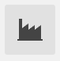

Experience Wonderful WebUI Widgets
=======================================

Purpose
-------

AIMMS is designed for building bespoke interactive optimization applications. 
To let you experience such an interactive optimization application, 
the :download:`Wonderful WebUI Widgets <model/WonderfulWebUIWidgets.zip>` application 
provides some examples whereby optimization helps an end user to do analysis or scheduling.
Each example takes just a few minutes of your precious time 
to give you an impression on how an interactive optimization application 
can support end users, such as analysts or planners, in their activities.

Feel free to run the ``Wonderful WebUI Widgets`` application 
using the `AIMMS Community Edition <https://licensing.cloud.aimms.com/license/community.htm>`_.

We appreciate feedback about the ``Wonderful WebUI Widgets`` application 
on the `AIMMS Community <https://community.aimms.com/>`_ 
or by writing to `AIMMS User Support <support@aimms.com>`_.

In the following, how to use each of the page of this application is briefly described.

Welcome
-------

The Welcome page introduces the ``Wonderful WebUI Widgets`` application 
and provides an overview of the available pages.
To the left of that page there is a Workflow allowing you to easily navigate between the examples incorporated.

Map
---

Story
^^^^^^^^

OxyGem is a Oxygen distillation and bottling company in Germany.  
Amongst others, the company provides oxygen tanks for industry (welding), tourism (diving), and health care (breathing).
There are separate locations for 

#.  |oxygem-distillation| distillation, 

#.  |oxygem-pumping| pumping, and 

#.  |oxygem-bottling| bottling. 

The distillation and bottling locations are owned, but the pipes and pumps between the locations are rented. 

Its network functioned well for years; usually demand could be met. 
Lately, however, due to the corona crisis, the demand for oxygen tanks has significantly grown, and sometimes there is unmet demand. 
This is a painful and unexpected surprise to management. 
Unexpected because there is a significant surplus capacity at their distillation locations.

Can you advise OxyGem management on how to adapt the network to cater for this increased demand?

To help you answer this question, a map widget is provided.  Its operation is presented below.

Operating the map widget
^^^^^^^^^^^^^^^^^^^^^^^^^^^^^

The map widgets opens with a network showing the available connections.
The capacity of the distillation and pumping nodes, and the demand of the bottling nodes is reflected in the size of the corresponding icons.

Your tools are as follows:

#.  **The widget actions**:  You can find the hamburger menu in the right upper corner of the map widget:

    .. image:: images/map-widget-menu.png
        :align: center

    This menu provides two actions:

    #.  Initialize: initialize the network and randomize the demand.

    #.  Solve: optimize the flows over the existing network.

#.  **Hovering**: 
    By hovering over a node, a small table is presented as a tooltip.
    Which looks, for instance, as follows: 

    .. image:: images/map-widget-tooltip.png
        :align: center

#.  **Control**:

    This is a side panel, and in this side panel some configuration parameters of the network can be specified. Notably:

    #.  The cost coefficients for unmet demand, production unit capacity, and oxygen transportation
    
    #.  The production capacity of the distillation units

#.  **The item menu**:

In addition, the app auto colors:

* In red, those bottling stations that do not have enough oxygen to meet demand

* In orange, those pumping and distillation locations that are at their capacity.

.. tip:: You may want to start with optimizing the flow over the given network to identify the existing bottlenecks.

.. simplemaps references: 
.. https://simplemaps.com/data/world-cities

