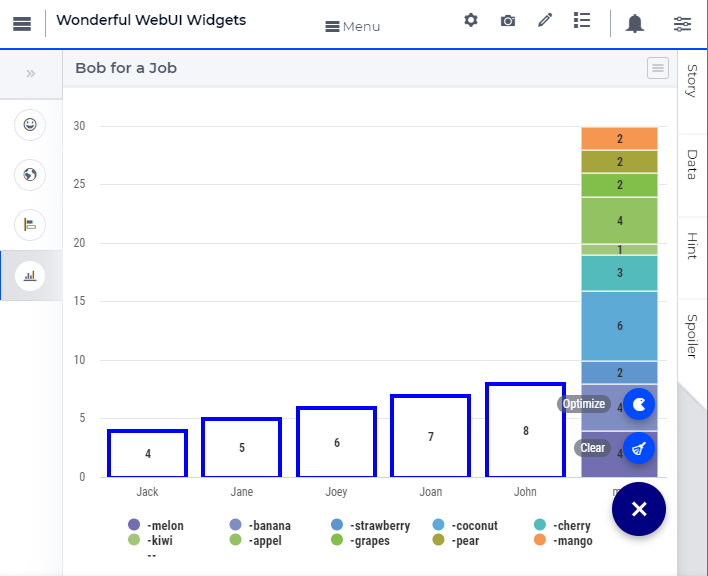
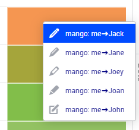
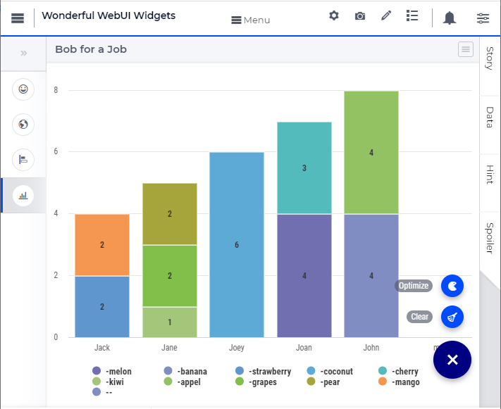
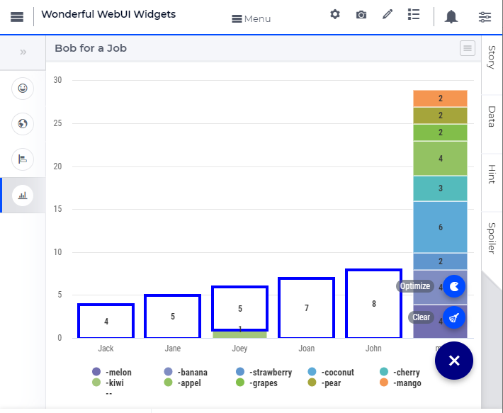
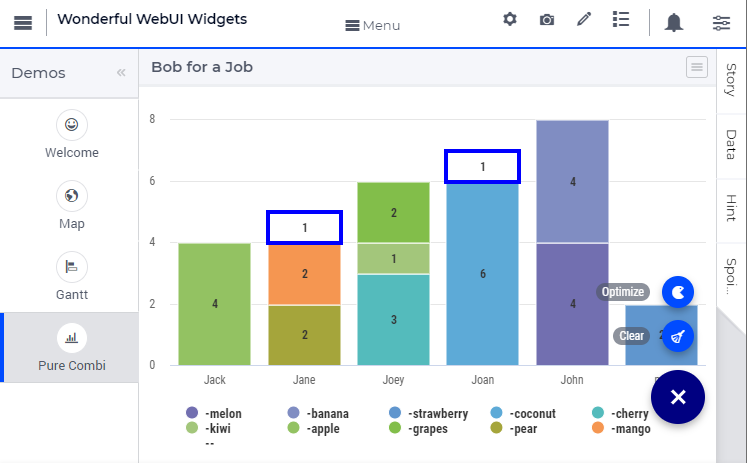
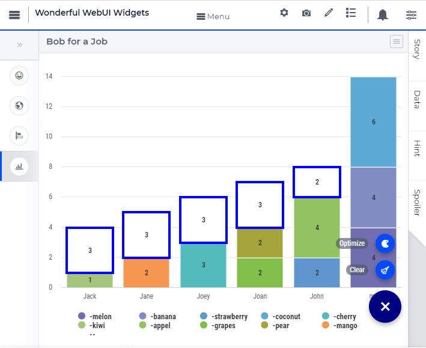

.. |oxygem-distillation| image:: images/oxygem-distillation.png

.. |oxygem-pumping| image:: images/oxygem-pumping.png

.. |oxygem-bottling| image:: images/oxygem-bottling.png

Working with Wonderful WebUI Widgets
=======================================

Purpose
-------

AIMMS is designed for building bespoke interactive optimization applications. 
To let you experience such an interactive optimization application, 
the :download:`Wonderful WebUI Widgets <model/WonderfulWebUIWidgets.zip>` application 
provides some examples whereby optimization helps an end-user to do analysis or scheduling.
Each example takes just a few minutes of your precious time 
to give you an impression on how an interactive optimization application 
can support end-users, such as analysts or planners, in their activities.

The ``Wonderful WebUI Widgets`` application requires at least AIMMS 4.84.
As license, the `AIMMS Community Edition <https://licensing.cloud.aimms.com/license/community.htm>`_ suffices.

We appreciate feedback about the ``Wonderful WebUI Widgets`` application 
on the `AIMMS Community <https://community.aimms.com/>`_ 
or by writing to `AIMMS User Support <support@aimms.com>`_.

In the following, how to use each page is briefly described.

Welcome
-------

The Welcome page introduces the ``Wonderful WebUI Widgets`` application 
and provides an overview of the available pages.
To the left of that page, there is a Workflow allowing you to easily navigate between the examples incorporated.

Map
---

Story
^^^^^^^^

OxyGem is an oxygen distillation and bottling company in Germany.  
Amongst others, the company provides oxygen tanks for industry (welding), tourism (diving), and health care (breathing).
There are separate locations for 

#.  |oxygem-distillation| distillation, 

#.  |oxygem-pumping| pumping, and 

#.  |oxygem-bottling| bottling. 

The distillation and bottling locations are owned, but the pipes and pumps between the locations are rented. 

Its network functioned well for years; usually, demand could be met. 
Lately, however, due to the corona crisis, the demand for oxygen tanks has significantly grown, and sometimes there is unmet demand. 
This is a painful and unexpected surprise to management. 
Unexpected because there is a significant surplus capacity at their distillation locations.

Can you advise OxyGem management on how to adapt the network to cater for this increased demand?

To help you answer this question, a map widget is provided.  Its operation is presented below.

Operating the map widget
^^^^^^^^^^^^^^^^^^^^^^^^^^^^^

The map widget opens with a network showing the available connections.
The capacity of the distillation and pumping nodes and the demand of the bottling nodes is reflected in the size of the corresponding icons.

Your tools are as follows:

#.  **The widget actions**:  You can find the hamburger menu in the right upper corner of the map widget:

    .. image:: images/map-widget-menu.png
        :align: center

    This menu provides two actions:

    #.  Initialize: initialize the network and randomize the demand.

    #.  Solve: optimize the flows over the existing network.

#.  **Hovering**: 
    By hovering over a node, a small table is presented as a tooltip.
    Which looks, for instance, as follows: 

    .. image:: images/map-widget-tooltip.png
        :align: center

    .. tip:: hovering over a bottling location with an orange background will give you the unmet demand for that location.

#.  **Control**:

    This is a side panel, and in this side panel, some configuration parameters of the network can be specified. Notably:

    #.  The cost coefficients for unmet demand, production unit capacity, and oxygen transportation

    #.  The pipe capacity

#.  **The item menu**:

    By clicking first left, and then right on one of the nodes, a tailored item menu pops up:
    
    #.  For distillation and pumping locations, the capacity can be increased or decreased by 1 or 5.
        For bottling locations, the demand can be increased or decreased by 1 or 5.
        
    #.  The properties of the location can be inspected and edited.

In addition, the app auto colors:

* In red, those bottling stations that do not have enough oxygen to meet demand

* In orange, those pumping and distillation locations are at their capacity.

.. tip:: You may want to start with optimizing the flow over the given network to identify the existing bottlenecks.

Gantt
-----

The Levram company operates three production lines, nicknamed 

#.  King Kong, 

#.  Hercules, and 

#.  Antman.  

Each production line handles an order as a single task: stopping a task halfway leads to clogging and other problems. 
Even though all three lines can handle all types of orders, 

* King Kong is more suited to handling orders with large items, 

* Antman is more suited to handling orders with small items, and 

* Hercules is somewhat in between. 

Based on order amount, type, and production line, the app will compute the time needed to complete the order. 

Normally the orders are scheduled by an optimization algorithm, but each order can be scheduled by manually.

In between handling orders, there can be maintenance tasks (product "none" made). 
The duration of these tasks need to be specified manually.
Normally maintenance tasks are scheduled manually.

As a production planner, you were notified yesterday by Quality Control that there will be a surprise inspection on 
2016-05-10 between 08:00 and 14:00 on all three production lines. 
They expect each production line to be halted for at least two hours to do the inspection. 
Of course, Business Development wants the production to be interrupted minimally.

Hopefully, the Gantt page will help you in planning existing orders.

The Gantt Chart page contains a Gantt Chart and a table.
The jobs that are scheduled by the optimization algorithm have a black border.  
The jobs that can be dragged to a suited position by a human scheduler have a blue border.

#.  **Page actions**: in the lower right there is a menu containing two page actions:

    #.  **Pacman**: This invokes an optimization algorithm scheduling tasks.
    
    #.  **New**: A dialog page is opened allowing you to create a new task.
    
#.  Hovering over a job will show a tooltip as follows:

    .. image:: images/gantt-widget-tooltip.png
        :align: center
        
#.  Clicking left and then right brings up a menu.  
    Some actions will be greyed, and thereby not available, depending on the properties of the task selected:

    .. image:: images/edit-gantt-menu.png
        :align: center

    #.  Move the task to the first possible position, only applicable to manually scheduled tasks.
    
    #.  Move the task to the deadline, only applicable to manually scheduled tasks.

    #.  Allow order to be scheduled by a living creature.

    #.  Allow order to be scheduled by an optimization algorithm.

    #.  Delete the order

    #.  Open a dialog page to edit the properties of the task.

Pure Combi
----------------

I want to go to the local market to sell fruit.  
I have several bags of fruit (total 30 kg) and a provisional stand (20 kg) to showcase the fruit I'm selling.
To get to the market, the scouting group Js, offered to do a Bob for a Job: carry the bags of fruit.
Each of the youngsters that offered to help has his/her own limit in what that person can carry.
Coincidentally, what the youngsters can carry together is also 30 kg. 
Clearly, the bags they don't carry, I have to carry myself. 
As I'm already carrying the booth, I don't want to carry bags of fruit in addition.

The page opens as follows:

    
As you can see, all bags are still assigned to me, and 
the youngsters have a slack indicating how much they can still carry.

To assign a bag of fruit to a youngster, 
you can right-click on the bag in the column chart and select the person assigned to carry the bag.

To quickly assign the remaining bags of fruit, you can use the optimizer. 
The optimizer is invoked via the page actions, choice "optimize"
which makes the screen look as follows:

Likely the slack of all youngsters is gone, as is the assignment of bags of fruit to me.

You can reset the assignment by clicking the broom in the lower right.

By just assigning kiwi to Joey, 

and then optimizing, a solution similar to the one below is reached:

As you can see, I still need to carry a bag of fruit.
Can you explain why?

Anyway, if you want you can see a hint or verify your solution via the side panels in the application.
And it can get worse: 

With these assignments, I'm stuck with more than 10 kg of fruit to be carried by myself.

.. spelling:: 

    greyed
