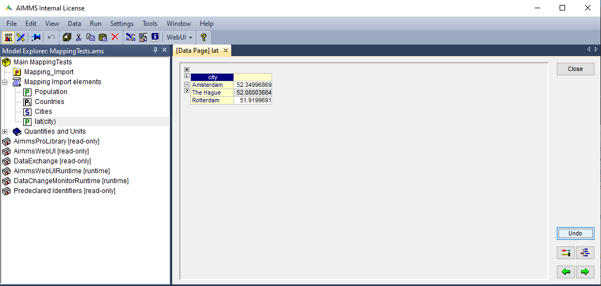
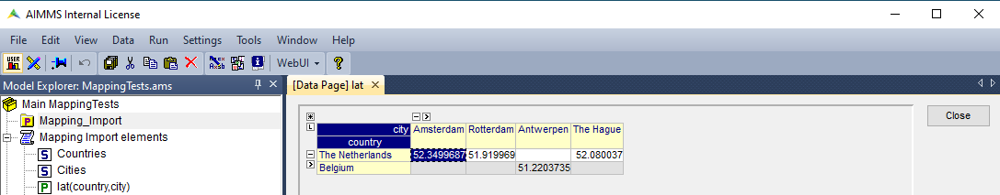
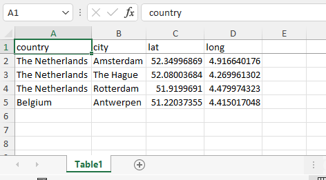

.. meta::
   :description: How to set up data exchange within your AIMMS application.
   :keywords: aimms, data, exchange

Dealing with different data types in the DEX
=============================================

The Data Exchange Library (DEX) allows mapping to and from the following supported formats:

* JSON
* XML
* CSV
* Excel
* Parquet 

where JSON and XML are tree-based formats and the others are table-based formats. You can find more documentation about the DEX and formats on `this documentation page <https://documentation.aimms.com/dataexchange/standard.html>`__.

When we look at the usage of these functions of the DEX, it is good to keep in mind that we're working with three components:

* The AIMMS model with its identifiers
* The specific type of file with data whether imported into or exported from the AIMMS model
* The mappingfile, which is basically the 'translator' between the aforementioned AIMMS model and data file, describing how the bytes in the file should be associated with the identifiers in the model. Typically you would see that nodes in mappings contain attributes for something in the model and something in the file.

In this how-to article we will explain how to implement the usage of the data formats in mapping files and, if applicable, format-specific requirements. The examples make clear that each mapping closely follows the structure of the file being described. Thus, if you know the format of the file to map, creating a corresponding mapping file for the Data Exchange Library is rather straightforward. 

We will show examples of mapping data into your AIMMS identifiers, but note that you can also write data from AIMMS identifiers into a specified datafile by using the function :any:`dex::WriteToFile`. An example of this is given for the Excelfile.

Prerequisites
--------------

#. To be able to map any data into your AIMMS model, you need to have the Data Exchange Library installed. Visit `this article <https://documentation.aimms.com/general-library/getting-started.html>`__ for instructions on how to do this.

#. A mapping file is necessary for mapping, preferably saved in a folder called 'Mappings'. Visit `this article <https://documentation.aimms.com/dataexchange/mapping.html>`__ to read more about mappings and how to write one for your specific situation. Note that you can also `generate a mapping file automatically for your project <https://documentation.aimms.com/dataexchange/standard.html#creating-your-own-annotation-based-formats>`__. 

Helpful remarks & frequent errors
-----------------------------------

* In general, your sources' data model should match 100% with the AIMMS model and translate as such in the mappingfile. This means that every element that you put into your mappingfile, should on an individual level match with the paired AIMMS identifier type. For example: an array should go into an indexed parameter.
* Following the aforementioned, make sure that your parameter in AIMMS is set to the parameter type to align with the data as it will be mapped to AIMMS. 
* Mind that no errors or warnings will be given if the "name=" element is written incorrectly in a tag in your mappingfile - the data will simply not map in this case.
* The order of rows and columns should always be aligned with the order of the indices of the parameter.
* A common known error is *"The maps-to attribute 'x' for node 'y' refers to an non-existing identifier"*. In this case it is helpful to check if you have written the "maps-to" element correctly, including a possible index.
* Another commonly known error is *"The dimension of the maps-to attribute x for node y does not coincide with the specified numbers of indices"*. In this case the most probable cause is that the element is referring to an AIMMS-identifier that should have at least one index defined but where no index can be found (like for an indexed parameter), where the index is not properly named in the mappingfile or where more indices are expected than defined (or the other way around).
* Based on how AIMMS works it is not possible to reference an index in a mappingfile for a ``maps-to`` element of a parameter, without adding the mapping for that index itself. In other words: every referenced index in a mappingfile should have its own mapping element as well.
* It probably speaks for itself at this point, but just as a reminder: when mapping to an index, make sure to reference the name of the index and not the name of the set.

For reading mappingfiles, two functions are needed: :any:`dex::AddMapping` and :any:`dex::ReadFromFile`. The first function will verify if the specified mappingfile is a valid XML and if so, add it to the set ``dex::Mappings``. :any:`dex::ReadFromFile` will handle the actual importing of the data into the AIMMS model, first checking whether all nodes in the mappingfile are compatible with the model. If the mappingfile has been added to ``dex::Mappings``, you can still change the contents of that mappingfile as well as name of AIMMS identifiers without having to re-use :any:`dex::AddMapping`.

JSON mapping (importing data, one-dimensional identifier)
----------------------------------------------------------

Suppose the following JSON-formatted data, saved in a folder called 'data' with name 'data.json':

.. code-block:: json

    {
        "country": "The Netherlands",
        "array": [
            {
                "city": "Amsterdam",
                "lat": 52.34996869,
                "long": 4.916640176
            },
            {
                "city": "The Hague",
                "lat": 52.08003684,
                "long": 4.269961302
            },
            {
                "city": "Rotterdam",
                "lat": 51.9199691,
                "long": 4.479974323
            }
        ]
    }

This JSON-file holds an object with three children, one of which is an array holding multiple (structurally identical) objects, bound to an index ``city``. A matching mappingfile, stored in a folder called 'Mappings' with name 'JSONMapping.xml', could look like: 

.. code-block:: xml

    <AimmsJSONMapping>
        <ObjectMapping>
            <ValueMapping name="country" maps-to="countries"/>
            <ArrayMapping name="array">
                <ObjectMapping>
                    <ValueMapping name="city" binds-to="city"/>
                    <ValueMapping name="lat" maps-to="lat(city)"/>
                    <ValueMapping name="long" maps-to="long(city)"/>
                </ObjectMapping>
            </ArrayMapping>
        </ObjectMapping>
    </AimmsJSONMapping>

Note the start- and ending tags ``AimmsJSONMapping`` specific for JSON-formatted data. The ``ValueMapping`` tags are used for children and the ``ArrayMapping`` holds its own ``ValueMapping`` tags for the children in its own array. 

The procedure to read data into the model in AIMMS will be:

.. code-block:: aimms
    
    	dex::AddMapping(
    		"JSONMapping",			! mapping name
    		"Mappings/JSONMapping.xml"	! location + name of mapping file
    	);

    	dex::ReadFromFile(
    		"data/data.json",		! data file
    		"JSONMapping",			! mapping name, as specified in AddMapping
    		1,				! empty identifiers
    		1,				! empty range sets
    		1				! reset 'iterative-binds-to'
    	);

Your model will look like this:

As you can see in the image, the data from the JSON-file is imported into the AIMMS-identifiers as prescribed by the mappingfile. The index ``city`` has been filled with the values Amsterdam, The Hague and Rotterdam and the parameter ``lat`` is using this index with the corresponding values as indicated in the mappingfile by the ``maps-to`` element. 

In our example the ``maps-to`` element contains the value "lat(city)" - referring to the index name within the parentheses. If you would have left out the index name, the error *"The dimension of the maps-to attribute x for node y does not coincide with the specified numbers of indices"* would have occurred.

The parameter ``Countries`` is defined as a string parameter within the AIMMS model, as to being able to hold string values.

XML Mapping (importing data, one-dimensional identifier)
----------------------------------------------------------

Assume the following XML-formatted data, stored in a folder 'data' with the name 'data.xml':

.. code-block:: xml

    <RootObject>
        <country>The Netherlands</country>
        <arraylats>
            <lat city="Amsterdam">52.34996869</lat>
            <lat city="The Hague">52.08003684</lat>
            <lat city="Rotterdam">51.9199691</lat>
        </arraylats>
        <arraylongs>
            <long city="Amsterdam">4.916640176</long>
            <long city="The Hague">4.269961302</long>
            <long city="Rotterdam">4.479974323</long>
        </arraylongs>
    </RootObject>

It describes an XML file with an object with three children, two of which are an array holding multiple structurally identical values, bound to an index ``city``. A matching mappingfile, stored in a folder called 'Mappings' with name 'XMLMapping.xml', could look like: 

.. code-block:: xml

    <AimmsXMLMapping>
    <ElementObjectMapping name="RootObject">
        <ElementValueMapping name="country" maps-to="countries"/>
        <ElementObjectMapping name="arraylats">
            <ElementValueMapping name="lat" maps-to="lat(city)">
                <AttributeMapping name="city" binds-to="city"/>
            </ElementValueMapping>
        </ElementObjectMapping>
        <ElementObjectMapping name="arraylongs">
            <ElementValueMapping name="long" maps-to="long(city)">
                <AttributeMapping name="city" binds-to="city"/>
            </ElementValueMapping>
        </ElementObjectMapping>
    </ElementObjectMapping>
    </AimmsXMLMapping>  
    
Note the start- and ending tags ``AimmsXMLMapping`` specific for XML-formatted data. Following the XML-structure of the datafile, the ``ElementValueMapping`` is used for the children and the ``ElementObjectMapping`` holds its own ``ElementValueMapping`` tags for the children in its array. The ``AttributeMapping`` describes, with the ``binds-to`` element, the mapping for the index.

AIMMS procedure to read data:

.. code-block:: aimms
    
    	dex::AddMapping(
    		"XMLMapping",			! mapping name
    		"Mappings/XMLMapping.xml"	! location + name of mapping file
    	);

    	dex::ReadFromFile(
    		"data/data.xml",		! data file
    		"XMLMapping",			! mapping name, as specified in AddMapping
    		1,				! empty identifiers
    		1,				! empty range sets
    		1				! reset 'iterative-binds-to'
    	);

With result:

The result is comparable to the result of the example of the JSON: the data from the XML is imported into the AIMMS-identifiers as prescribed by the mappingfile. The index ``city`` has been filled with the values Amsterdam, The Hague and Rotterdam and the parameter ``lat`` is using this index with the corresponding values as indicated in the mappingfile by the ``maps-to`` element. 

In our example the ``maps-to`` element contains the value "lat(city)" - referring to the index name within the parentheses. If you would have left out the index name, the error *"The dimension of the maps-to attribute x for node y does not coincide with the specified numbers of indices"* would have occurred.

The parameter ``Countries`` is defined as a string parameter within the AIMMS model, as to being able to hold string values.

CSV mapping (importing data, n-dimensional identifier)
---------------------------------------------------------

Let's work with the following CSV-formatted data:

.. code-block:: xml
    
    country,city,lat,long
    The Netherlands,Amsterdam,52.34996869,4.916640176
    The Netherlands,The Hague,52.08003684,4.269961302
    The Netherlands,Rotterdam,51.9199691,4.479974323
    Belgium,Antwerpen,51.22037355,4.415017048

Note that the first line in the CSV differs from the other rows; it contains the header with the names of the columns. These names will correspond to the value of the ``name`` attribute in the mappingfile. Let's assume this file is saved in a folder 'data' and called 'data.csv'.

The related mappingfile, in which the repetitive structure of multiple rows and their multiple named column leaf-nodes are being bound to ``country`` and ``city``, or to multi-dimensional identifiers over these two indices, would look like this:

.. code-block:: xml

    <AimmsCSVMapping>
        <RowMapping name="table1">
            <ColumnMapping name="country" binds-to="country"/>
            <ColumnMapping name="city" binds-to="city"/>
            <ColumnMapping name="lat" maps-to="lat(country,city)"/>
            <ColumnMapping name="long" maps-to="long(country,city)"/>
        </RowMapping>
    </AimmsCSVMapping>

Note that the order of the elements is the same as the order of identifiers in AIMMS. The procedure in AIMMS is:

.. code-block:: aimms
    
    	dex::AddMapping(
    		"CSVMapping",			! mapping name
    		"Mappings/CSVMapping.xml"	! location + name of mapping file
    	);

    	dex::ReadFromFile(
    		"data/data.csv",		! data file
    		"CSVMapping",			! mapping name, as specified in AddMapping
    		1,				! empty identifiers
    		1,				! empty range sets
    		1				! reset 'iterative-binds-to'
    	);

With result:	

In this result you can see that two indices are visible: ``city`` and ``country``. Both of them are filled with data from the CSV file, thanks to the ``binds-to`` elements in the mappingfile. If one of the ColumnMappings would have been left out of the mappingfile, the error *"The dimension of the maps-to attribute x for node y does not coincide with the specified numbers of indices"* would have occurred as both referenced indexes should be in the mappingfile.

Excel mapping (exporting data)
-------------------------------

Assume the following mapping for an Excelfile, identifiable with the start- and ending tags of ``AimmsExcelMapping``:

.. code-block:: xml

    <AimmsExcelMapping>
        <SheetMapping name="Table1">
            <RowMapping name="row">
                <ColumnMapping name="country" binds-to="country"/>
                <ColumnMapping name="city" binds-to="city"/>
                <ColumnMapping name="lat" maps-to="lat(country,city)"/>
                <ColumnMapping name="long" maps-to="long(country,city)"/>
            </RowMapping>
        </SheetMapping>
    </AimmsExcelMapping>

Just like the previous examples this mappingfile can be used to map data into AIMMS identifiers, but any mappingfile can also be used to write data to a datafile - so the other way around. This mapping will generate somewhat the same table as in the CSV example, but will now output the table to an Excel workbook with a sheet called ``Table1``. 

To do so we need to also use the :any:`dex::ReadAllMappings` (or :any:`dex::ReadMappings` for specific mappings) to store successfully read mappings in the set ``dex::Mappings`` so we can use it in :any:`dex::WriteToFile`. This is needed because the latter function uses a reference to a mappingname, based on the assumption that the mapping is already known in ``dex::Mappings``. The :any:`dex::ReadAllMappings` will scan the full Mappings folder in search of mappingfiles and automatically add found ones to the model (if no errors occur while reading it). The full procedure looks like this:

.. code-block:: aimms
    
    dex::ReadAllMappings();		! to read all findable mappings into your AIMMS model
    
    dex::WriteToFile(
    	"output.xls",			! location + name of the output file
    	"ExcelMapping",			! mapping name
    	1				! use a pretty writer
    );

The output:

An Excelfile has been created with one sheet called "Table1". Each ``SheetMapping`` element in the mappingfile corresponds to just one sheet. A single Excel mapping can contain mappings for multiple sheets. The values for ``ColumnMapping`` are used for the column names in Excel.

Parquet mapping
------------------------

Look at the following mapping for a Parquet format:

.. code-block:: xml

    <AimmsParquetMapping>
        <RowMapping name="table1">
            <ColumnMapping name="country" binds-to="country"/>
            <ColumnMapping name="city" binds-to="city"/>
            <ColumnMapping name="lat" maps-to="lat(country,city)"/>
            <ColumnMapping name="long" maps-to="long(country,city)"/>
        </RowMapping>
    </AimmsParquetMapping>

Just like the CSV format the Parquet format describes a repetitive table node i.e. a repetitive structure of multiple rows, each consisting of multiple named column leaf-nodes. The only difference with the CSV mapping is the root node of the mapping, which should be ``AimmsParquetMapping``.

The parquet format is popular in python where it is used to save and load pandas dataframes. Suppose the above mapping was used to write data into file *filefromdex.parquet*. Then we could print it in python (with *pyarrow* and *pandas* installed) using the code below. 

.. code-block:: python

    import pandas as pd
    import pyarrow.parquet as pq

    table = pq.read_table("filefromdex.parquet")
    df = table.to_pandas()
    print(df)

This could then print:

.. code-block:: xml

           country  		city 		lat 		long
    0      The Netherlands   	Amsterdam 	52.34996869 	4.916640176
    1      The Netherlands   	The Hague 	52.08003684 	4.269961302
    2      The Netherlands   	Rotterdam  	51.9199691 	4.479974323
    3      Belgium   		Antwerp  	51.22037355 	4.415017048

Here we see in the top row the names from the ``ColumnMapping`` of the mapping. In the left column are the row numbers added by python. The other columns are data read from file *filefromdex.parquet*.

.. spelling::

    dex
    mappingfile
    mappingfiles
    mappingname
    datafile
    JSON-formatted
    JSON-file
    XML-structure
    XML-formatted
    parquet
    parquetfile
    pyarrows
    dataframes
    Excelfile
    AIMMS-identifiers