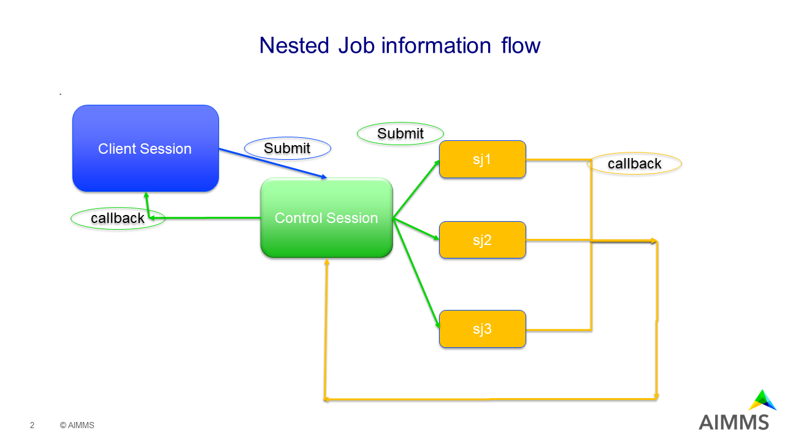

Waiting for sub jobs to complete
=================================

.. warning:: Article in draft


Introduction
--------------

For large jobs, it may make sense to split it into multiple jobs. 
It may not be convenient, or appropriate, to let the client session organize the communication between the various jobs.

This article presents and discusses an example, whereby one control job manages several sub jobs. 
In addition, results are presented in the client session when all jobs are finished.

The running example
^^^^^^^^^^^^^^^^^^^^^^^^

A transport problem with two origins and two destinations.  
The demand and supply are both fixed and matching.
The unit transport cost between the origins and destinations are unknowns and vary considerably.

An overview is requested by generating various scenarios, and comparing the runs.

The example to download: 

:download:`AIMMS 4.86 project download <model/nestedJobLibWait.zip>`


Focus
^^^^^^^^^^^^

This article focuses on job creation and communication between jobs.  
This article does not focus on analysis of results.

Structure of article
^^^^^^^^^^^^^^^^^^^^^^^^

#.  Overview of information flow

#.  Waiting on sub jobs

#.  Best practice considerations


Overview of information flow
-----------------------------

The information flow between client session, control job, and sub jobs is depicted below:



A.  Blue, the client session:

    #.  Collect the inputs for the Solver Session, and start it as ``Control job``.

        .. raw:: html

            <details style="border: solid 1px gray; border-radius: 5px;">
            <summary style="cursor: pointer;">How to: 👇</summary>

        #.  Construct input case via `sections <https://documentation.aimms.com/language-reference/data-communication-components/data-initialization-verification-and-control/working-with-the-set-allidentifiers.html#:~:text=Predefined%20identifier%20sets>`_ and `pro::ManagedSessionInputCaseIdentifierSet <https://documentation.aimms.com/pro/appl-state.html#id1>`_.

            As an example consider the following excerpt from ``MainExecution``:

            .. code-block:: aimms 
                :linenos:

                pro::ManagedSessionInputCaseIdentifierSet := 
                    scj::solver_control_job_input_output_declarations + 
                    scj::solver_control_job_input_declarations +
                    wsj::static_inputs_sub_job ;

            This will put the identifiers declared in the sections ``scj::solver_control_job_input_output_declarations``,  
            ``scj::solver_control_job_input_declarations``, and ``wsj::static_inputs_sub_job`` in the input case.

        #.  Submit job by ``pro::DelegateToServer``, as illustrated in the following excerpt from ``scj::pr_globSol``

            .. code-block:: aimms 
                :linenos:

                if pro::DelegateToServer(
                        requestDescription :  "solver control job",
                        waitForCompletion  :  0,
                        completionCallback :  'scj::pr_globSolCallback' 
                    ) then
                    return 1 ;
                endif ;

            #.  Line 2: **requestDescription**: 
                When multiple jobs are involved, it is worth paying attention to the job description.  
                For starters, this makes identifying the job in the jobs tab of the AIMMS PRO portal easy.

            #.  Line 3: **waitForCompletion**: Not waiting for completion.  
                This will allow the user to continue interacting with the application whilst the control session is working to obtain the desired results.
                See also these `how tos <https://how-to.aimms.com/C_Deployment/Sub_Client_Server/index.html>`_

            #.  Line 4: **completionCallback**: 
                Specify the procedure to process the output case upon completion.
                Note that the library and module prefixes are needed here, when this procedure happens to be declared in a library/module to unambiguously identify the procedure in the set `AllIdentifiers <https://documentation.aimms.com/language-reference/data-communication-components/data-initialization-verification-and-control/working-with-the-set-allidentifiers.html#working-with-the-set-allidentifiers>`_.

            #.  Not specified: **delegationOverride**: The client session uses the default of this argument, and therefore it is not specified here.

        .. raw:: html

            </details>

    #.  When the ``B. Control job`` finishes, the client session receives its results.

        .. raw:: html

            <details style="border: solid 1px gray; border-radius: 5px;">
            <summary style="cursor: pointer;">How to: 👇</summary>
            
        #.  The results of the solver session ``B.  Control Job.`` are to be put in the output case, and this is done in the session of that job.
            Thus the ``pro::ManagedSessionOutputCaseIdentifierSet`` needs to be assigned in the ``B.  Control Job.``.  
            As an example, the procedure ``pr_workGlobSol`` contains the following code:

            .. code-block:: aimms 
                :linenos:

                pro::ManagedSessionOutputCaseIdentifierSet := 
                    solver_control_job_input_output_declarations + 
                    solver_control_job_output_declarations ;

        #.  Process the data in the output case by the ``A. Client Session``.

            The completion callback procedure ``scj::pr_globSolCallback`` executes inside the client session, and accesses data relevant to that session.

            The procedure ``scj::pr_globSolCallback(sp_requestDescription)`` is invoked upon completion of the solver session ``Control Job``.
            The argument ``sp_requestDescription`` can be used by ``pro::session::LoadResultsCallBack`` to actually load the case.

            .. code-block:: aimms 
                :linenos:

                Procedure pr_globSolCallback {
                    Arguments: (sp_requestDescription);
                    Body: {
                        ! Load results from output case of subjob.
                        pro::session::LoadResultsCallBack(sp_requestDescription);
                        
                        ! Opportunity to add some application specific code for receiving final solution here.
                    }
                    StringParameter sp_requestDescription {
                        Property: Input;
                    }
                }

            Perhaps more friendly is to notify the user first and permit that person loading the data at a convenient moment, see: :doc:`Load solver session Results Manually<../40/40-data-server-load-results>`.

        .. raw:: html

            </details>

#.  Green, the Control job.

    3.  Collect the inputs for a sub job and start that sub job.

        .. raw:: html

            <details style="border: solid 1px gray; border-radius: 5px;">
            <summary style="cursor: pointer;">How to: 👇</summary>

        #.  Construct input for a sub job.

            Similar as in step 1, the input case is specified by ``pro::ManagedSessionInputCaseIdentifierSet`` in the following excerpt from ``scj::pr_submitAllSubjobs``

            .. code-block:: aimms 
                :linenos:

                ! Each sub job get the data from the following sections:
                pro::ManagedSessionInputCaseIdentifierSet := 
                    wsj::inputs_outputs_sub_job + 
                    wsj::inputs_sub_job + 
                    wsj::static_inputs_sub_job ;

            By specifying ``pro::ManagedSessionInputCaseIdentifierSet`` in the ``B. Control job``; the app developer does not need to worry about accidentally influencing the input specification of the ``B. Control Job`` itself as this is done in the ``A. client session``.  More specifically:

            *   The ``A.  Client Session`` and ```B.  Control Job`` are different processes, thus the identifier ``pro::ManagedSessionInputCaseIdentifierSet`` in these two processes does not share memory.

            *   As this is an identifier in the library ``AimmsProLibrary```, and this library has the property ``NoSave`` set, the contents of this identifier in these two libraries is not accidentally overwritten by the transfer of data via a case.

        #.  Start the sub job. This is done in the procedure ``scj::pr_delegateSubSol``.

            .. code-block:: aimms 
                :linenos:

                if pro::DelegateToServer(
                        requestDescription :  formatString("Sub job %s", wsj::sp_thisJob),
                        waitForCompletion  :  0,
                        completionCallback :  'wsj::pr_subSolCallback',
                        delegationOverride :  2 
                    ) then
                    return 1 ;
                endif ;

            #.  Line 2: **requestDescription**: 
                Again, when multiple jobs are involved, it is worth paying attention to the job description.  

            #.  Line 3: **waitForCompletion**: Not waiting for completion.  
                This will allow the control job to continue processing.

            #.  Line 4: **completionCallback**: 
                Specify the procedure to process the output case upon completion.

            #.  Line 5: **delegationOverride**: The ``B. Control Job`` has delegation level 1, so delegation level 2 is needed for a ``C. Sub job``, see `Distributing Work <https://documentation.aimms.com/pro/pro-delegate-adv.html#distributing-work>`_ 

        .. raw:: html

            </details>

    4.  When a ``C. Sub job`` finishes, the control job receives the results.

        .. raw:: html

            <details style="border: solid 1px gray; border-radius: 5px;">
            <summary style="cursor: pointer;">How to: 👇</summary>

        #.  Specify the output case to be constructed by a ``C. Sub job``.
            As you probably expect by now, this is done in the procedure ``wsj::pr_subsol`` as follows:

            .. code-block:: aimms 
                :linenos:

                pro::ManagedSessionOutputCaseIdentifierSet := 
                    inputs_outputs_sub_job + 
                    outputs_sub_job ;

        #.  Process the output case by the ``B. Control job``.

            .. code-block:: aimms 
                :linenos:

                Procedure pr_subSolCallback {
                    Arguments: (sp_requestDescription);
                    Body: {

                        ! Load results from output case of subjob.
                        pro::session::LoadResultsCallBack(sp_requestDescription);

                        ! Identify the subjob whose solutions is just read in.
                        ep_subJob := StringToElement( scj::s_subJobNames, sp_thisJob );

                        ! Store the solution of the sub job in the declarations of the global job.
                        scj::p_solutionsPerJob(ep_subJob, i_from, i_to) := v_transport(i_from, i_to);
                        scj::p_objectivesPerJob(ep_subJob) := v_totCost ;

                        ! Increment the number of subjobs that shared their solution with the global job.
                        scj::p_noReceivedSolutions += 1 ;
                    }
                    StringParameter sp_requestDescription {
                        Property: Input;
                    }
                    ElementParameter ep_subJob {
                        Range: scj::s_subJobNames;
                    }
                }

            Remarks:

            #.  Line 6: First load the case

            #.  Line 9: The name of the job is passed back. 
                Avoid passing the set of job names: in larger applications this set may be very dynamic. 
                Thus it is important that reading a case from a sub job, does not influence the set of job names already created in ``B. Control job``.

            #.  Lines 12-13: Multiple jobs will contain information on the same identifiers; thus collecting information per job needs to be explicit for all identifiers passed back from a ``C. Sub job`` to the ``B. Control job``.

            #.  Line 16: The number of received solutions is carefully administered; as this indicates to the ``B. Control job`` when all information is gathered.

        .. raw:: html

            </details>

#.  Yellow, a sub job.


Waiting on sub jobs
--------------------

A completion callback procedure is passed as a message from the called job, here ``C. Sub job``, back to the calling job, here ``B. Control job``.
These messages do not have a priority. 
If no precautions are taken, these messages will be handled after the delegated procedure ``scj::pr_globSol`` of ``B. Control job`` finishes.

The intent of the app, however, is to let ``B. Control job`` collect results, perhaps do some processing of its own, then pass the results back to the client session.

Luckily, the AIMMS PRO procedure ``pro::messaging::WaitForMessages`` permits to check and handle any message received.
An example is provided in the following:

.. code-block:: aimms 
    :linenos:

    p_timeout := 60 /* seconds */ ; ! Should be configurable.
    sp_startTime := CurrentToString( "%c%y-%m-%d %H:%M:%S:%t%TZ('UTC')" );
    while p_noReceivedSolutions < p_noSubmittedJobs do
        ! p_noReceivedSolutions is incremented when a sub job callback is processed by pro::messaging::WaitForMessages
        pro::messaging::WaitForMessages("",0,10/* milli seconds */);
        sp_now := CurrentToString("%c%y-%m-%d %H:%M:%S:%t%TZ('UTC')");
        p_elapsedTime := StringToMoment(
            Format        :  "%c%y-%m-%d %H:%M:%S:%t%TZ('UTC')", 
            Unit          :  [s], 
            ReferenceDate :  sp_startTime, 
            Timeslot      :  sp_now);
        pr_trace(formatString("p_noReceivedSolutions = %i, p_noSubmittedJobs = %i, elapsed = %n", 
            p_noReceivedSolutions, p_noSubmittedJobs, p_elapsedTime ) );
        if p_elapsedTime > p_timeout then ! waiting loop timed out - some subjob likely not able to present solution.
            break ;
        endif ;
    endwhile ;

Remarks:

*   Line 3: check if sufficient solution have been received.

*   Line 5: The call to ``pro::messaging::WaitForMessages``. 

    The first two arguments are filters on the messages received and handled; respectively on the queue name, and on the type of message.
    Passing "" and 0 as first two arguments is interpreted as: do not filter on queue and do not filter on type.

    The third argument is a timeout.  
    Here 10 milliseconds, corresponding to one tick, is used.

*   Line 14: Did we exceed the timeout.

.. note:: The concern mentioned in this section is not a concern for a WinUI or WebUI client session. For such a session, there will be idle time between procedures executed and then the completion callback message is handled.

Best practice considerations
---------------------------------

Avoid over structuring
^^^^^^^^^^^^^^^^^^^^^^^^^^

Avoid over structuring into separate jobs.  This is because submitting a job has the following steps:

#.  construct input case by calling process

#.  start new process

#.  Compile app, and perform app initialization

#.  transfer input case, Both WinUI caller, and on cloud this may be on different machines!

#.  read input case

#.  actually execute the delegated procedure

#.  write output case

#.  transfer output case to calling process

#.  read output case by calling process

When step 6 is small, the relative overhead of the other steps may be high!

Resource considerations
^^^^^^^^^^^^^^^^^^^^^^^^^^^^

When multiple processes are actively executing at the same time on a single machine, it is important to avoid thread starvation.

Please note that Both CPLEX and the AIMMS Execution engine may deploy multiple threads for efficient execution. 
If there is also parallelization by doing multiple AIMMS PRO jobs simultaneously, thread starvation may occur. 
When there is thread starvation, the overall performance is likely to be disappointing. 
Both CPLEX and AIMMS provide option settings that limit the number of threads used:

*   CPLEX: global_thread_limit 

*   AIMMS: Number_of_execution_threads 

.. note:: Important: For AIMMS Cloud this is not a consideration, as each job gets its own docker image and therefore can behaves as if it is the only active process 😉.


