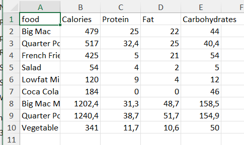
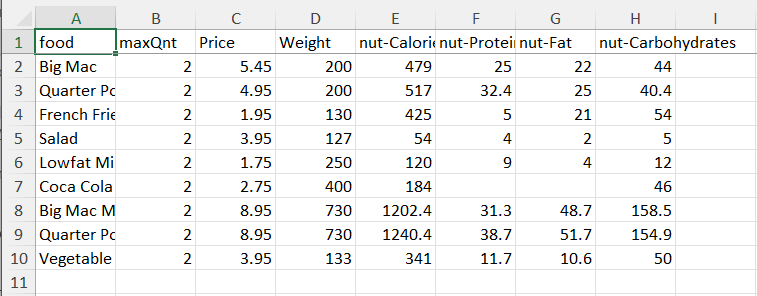

How to create mappings for matrix-oriented data
=================================================

Sometimes your data source consists of both column- and row-oriented data, showing data matrix-style. 
For these setups you can still use a mapping file, using certain elements in your tags to guide the data to the correct identifier(s). 
In this how-to, we’ll use an example to show you how to write the corresponding mapping files.

Running example
----------------

When creating a diet, care is taken to adhere to limits on selected ingredients.  
The actual selection of ingredients that is important to a person depends on the person.
For instance, some people need restrictions on salt and some people need restrictions on refined sugar. And so on.
Also, the availability of products, and their fractions of these ingredients, varies over time and location.

Thus the core information used to create a diet depends on a matrix that looks like this:

Whereby both the collection of

#.  foods, and

#.  nutrients

vary.

The purpose of this article is to illustrate the use of `Data Exchange Library <https://documentation.aimms.com/dataexchange/index.html>`_, and in particular the mapping attribute `name-bind-to <https://documentation.aimms.com/dataexchange/mapping.html#the-name-binds-to-attribute>`_, to flexibly and compactly specify exchanging data between data source and AIMMS. In this example, the data source is an EXCEL workbook.

The running example is based on the :doc:`../441/441-diet-problem` example from `AIMMS The modeling guide <https://documentation.aimms.com/aimms_modeling.html>`_.

A selection of the declarations:

#.  Nutriets, index: :math:`n`.  In model: ``i_n`` in ``s_nutrients``

#.  Food types, index: :math:`f`.  In model: ``i_f`` in ``s_foodTypes``

#.  Fractions: Nutrient value per unit of food, :math:`fr_{f,n}`.  In model: ``p_nutrientValuePerUnit(i_f,i_n)``

The corresponding :download:`AIMMS 4.84 project can be downloaded here <model/Diet Problem - AIMMS 4.84.zip>` 

Mapping file version 1
-----------------------

.. code-block:: xml
    :linenos:
    :emphasize-lines: 5,6

    <?xml version="1.0"?>
    <AimmsExcelMapping>
        <ExcelSheetMapping name="foodnutrient">
            <RowMapping>
                <ColumnMapping name="food" binds-to="i_f" />
                <ColumnMapping name-binds-to="i_n" name-regex=".*" maps-to="p_nutrientValuePerUnit(i_f,i_n)" />
            </RowMapping>
        </ExcelSheetMapping>
        <ExcelSheetMapping name="food">
            <RowMapping>
                <ColumnMapping name="food" binds-to="i_f" />
                <ColumnMapping name="maxQnt" maps-to="p_maximumNumberOfServings(i_f)" />
                <ColumnMapping name="Price" maps-to="p_pricePerUnit(i_f)" />
                <ColumnMapping name="Weight" maps-to="p_weightOfFoodType(i_f)" />
            </RowMapping>
        </ExcelSheetMapping>
        <ExcelSheetMapping name="nutrient">
            <RowMapping>
                <ColumnMapping name="nutrient" binds-to="i_n" />
                <ColumnMapping name="atMost" maps-to="p_maximumAllowanceOfNutrient(i_n)" />
                <ColumnMapping name="atLeast" maps-to="p_minimumRequirementOfNutrient(i_n)" />
            </RowMapping>
        </ExcelSheetMapping>
    </AimmsExcelMapping>

Remarks:

#.  Lines 5,6: The sheet ``foodnutrient`` is used for exchanging data with the parameter ``p_nutrientValuePerUnit(i_f,i_n)`` as follows:

    *   Rows are mapped to the ``s_foodTypes`` set.    
        The ``<ColumnMapping/>`` element uses the following attributes:

        #.  ``name="food"``: The row names are taken from the column with name ``food``

        #.  ``binds-to="i_f"``: in the AIMMS model, these row names are mapped to element names in the set ``s_foodTypes`` as this set is the range of the index ``i_f``.

        This mapping element is also used for `CSV and Parquet files <https://documentation.aimms.com/dataexchange/using.html#example-excel-mapping>`_. 

    *   Columns are mapped to the ``s_nutrients`` set. 
        The ``<ColumnMapping/>`` element uses the following attributes for this purpose:

        #.  ``name-binds-to="i_n"`` 
            This indicates that the names of columns, in row 1, are input for the index ``i_n``.

        #.  ``name-regex=".*"`` 
            This regular expression rule on the column names indicates that the column names can be used as is for the set ``s_nutrients``.  
            More about `name-regex <https://documentation.aimms.com/dataexchange/mapping.html#the-name-binds-to-attribute>`_ as part of ``name-binds-to``.

        #.  ``maps-to="p_nutrientValuePerUnit(i_f,i_n)"``
            As the indices ``i_f`` and ``i_n`` are now bound, the EXCEL content can be assigned to this parameter.

#.  The sheets ``food`` and ``nutrient`` are used for exchanging data with the other parameters, indexed over ``i_f`` and ``i_n`` respectively.

In this section, two sheets were used to present the data regarding the foods.
One for the nutrients, and one for the other aspects of each food.
It is possible to combine these two sheets into one; provided the data for the nutrients is clearly identified.

Mapping file version 2
-----------------------

By combining the information from the sheets ``foodnutrient`` and ``food``, we get a sheet that looks as follows:

Note that the column names for the nutrients are now prefixed with ``nut-``.
We use this in the mapping as specified below.

.. code-block:: xml
    :linenos:
    :emphasize-lines: 11

    <?xml version="1.0"?>
    <AimmsExcelMapping>
        <ExcelSheetMapping name="foodnutrient">
            <RowMapping>
                <ColumnMapping name="food" binds-to="i_f" />
                <ColumnMapping name="maxQnt" maps-to="p_maximumNumberOfServings(i_f)" />
                <ColumnMapping name="Price" maps-to="p_pricePerUnit(i_f)" />
                <ColumnMapping name="Weight" maps-to="p_weightOfFoodType(i_f)" />
                <ColumnMapping name-binds-to="i_n" 
                    name-regex=".*" 
                    name-regex-prefix="nut-" 
                    maps-to="p_nutrientValuePerUnit(i_f,i_n)" />
            </RowMapping>
        </ExcelSheetMapping>
        <ExcelSheetMapping name="nutrient">
            <RowMapping>
                <ColumnMapping name="nutrient" binds-to="i_n" />
                <ColumnMapping name="atMost" maps-to="p_maximumAllowanceOfNutrient(i_n)" />
                <ColumnMapping name="atLeast" maps-to="p_minimumRequirementOfNutrient(i_n)" />
            </RowMapping>
        </ExcelSheetMapping>
    </AimmsExcelMapping>

Remarks:

#.  All that is indexed over ``food`` is now moved in the ``ExcelSheetMapping`` on lines 3-14.

#.  Line 11: New is the prefix "nut-".  This prefix is used in two ways:

    #.  To recognize a column that contains nutrient information.

    #.  To remove the prefix from the column name before adding that name to the set ``s_nutrients``.

