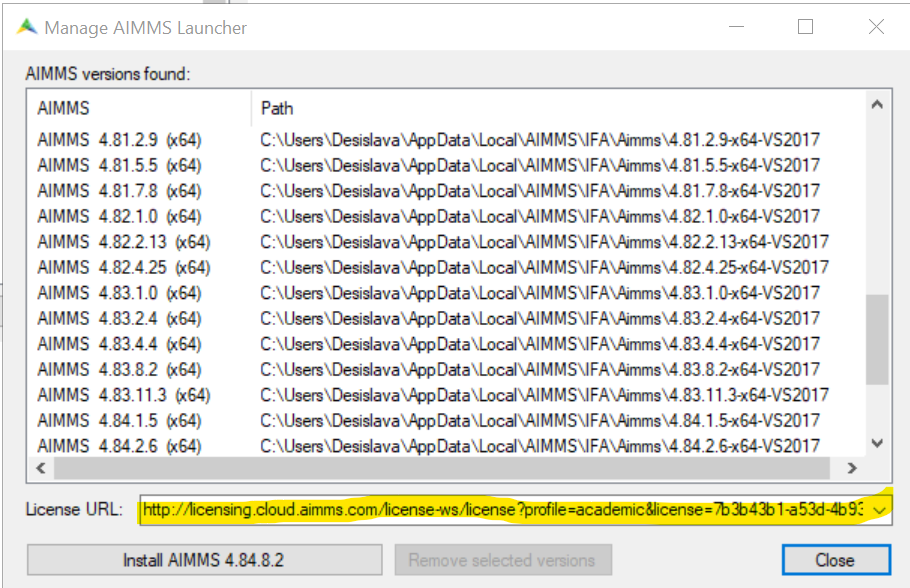

Troubleshooting academic and community licenses
===============================================

Short context on the academic and community licenses...(link to the main article)
Refer to the e-mail
An introduction sentence on the troubleshooting...

Symptom 1: No connection error message
----------------------------------------

When you have downloaded and installed AIMMS on your computer you get the error message below while launching:

.. image:: Images/no-connection-error-message.png
    :align: center

Possible issue: License URL misspelled
^^^^^^^^^^^^^^^^^^^^^^^^^^^^^^^^^^^^^^^^

How to verify it?
""""""""""""""""""""""""""""

Find the e-mail you received from AIMMS Licensing with subject "Your AIMMS Academic account has been verified" and look for the License URL. Does it completely match the URL in the field "License URL" in the AIMMS Launcher?

Solution
"""""""""""""""""""""""""""

Make sure the you have copied correctly the link from your e-mail into the License URL field of the Launcher.

Possible issue: Expired license
^^^^^^^^^^^^^^^^^^^^^^^^^^^^^^^^^^^^^^^^

How to verify it?
""""""""""""""""""""""

The community license gets automatically extended if it has been used in the last 6 months before its expiy date, otherwise it expires. If you are not sure please contact support@aimms.com so we can check that for you.

Solution
""""""""""

If your license has expired you need to reapply on our website for `Academic <https://licensing.cloud.aimms.com/license/academic.htm>`_ or `Community <https://licensing.cloud.aimms.com/license/community.htm?utm_source=website&utm_medium=footer>`_ license.

Symptom 2
-------------------------