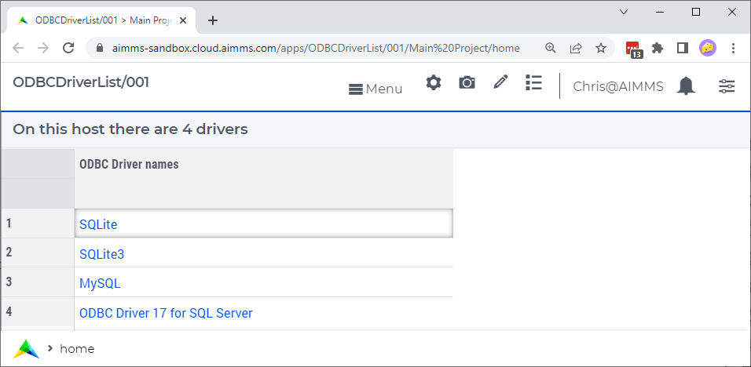

Which ODBC Drivers
===================

Before making a connection using ODBC to a database, it is important to know which ODBC drivers are installed on the systems that will be used for your application.

As you know, using the ODBC Windows control panel app, you can get a list of ODBC drivers installed.
However, not all systems on which your application is to be run, may allow you to open this Windows control panel app.

This article presents a small AIMMS app that shows the list of available ODBC drivers upon startup.

This source of this AIMMS 4.85 project can be downloaded: :download:`ODBC Driver List project <model/DriverList.zip>` 

Operating the app
-----------------

Upon opening, this app presents a list of ODBC drivers.
For the AIMMS Cloud this list looks as follows:

See also
---------

* `SQLNumberOfDrivers <https://documentation.aimms.com/functionreference/data-management/database-functions/sqlnumberofdrivers.html>`_

* `SQLDriverName <https://documentation.aimms.com/functionreference/data-management/database-functions/sqldrivername.html>`_

