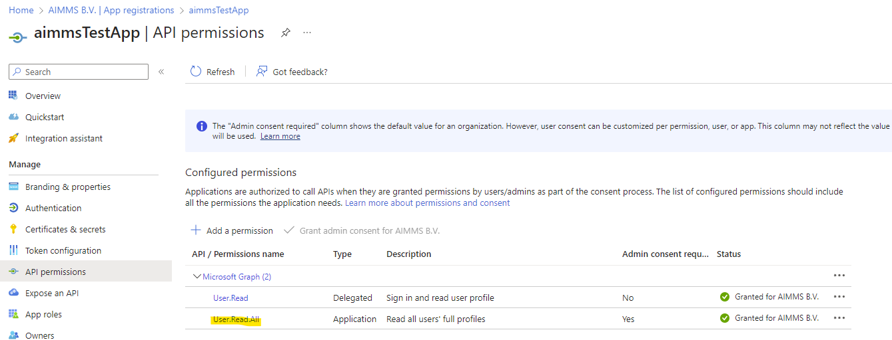

.. meta::
   :description: How to use OAuth2 for API authorization in DEX.
   :keywords: aimms, data, exchange, api, authorization, security, oauth
   

Using OAuth2 for API authorization with DEX
=============================================

.. image:: https://img.shields.io/badge/AIMMS_4.84-Minimum_AIMMS_Version_WebUI-brightgreen
.. image:: https://img.shields.io/badge/AIMMS_2.41-Minimum_AIMMS_Version_PRO-brightgreen

.. image:: https://img.shields.io/badge/AIMMS_4.84/2/41-OAuth_Example-blue 
	:target: model/OAuth example.zip

With the Data Exchange Library (DEX) you can use `the OAuth2 protocol <https://documentation.aimms.com/dataexchange/rest-client.html#using-oauth2-for-api-authorization>`__ for the authentication procedure of API's. On this how-to page you can find more details on how this type of authorization works and the flow that comes with it. You can download the example projects to replicate the examples described below.

In this article we will be demonstrating the two available options:

#. **the Authorization Code flow**, meaning we are requesting access to the API on behalf of a user. We need a client to manage the authentication request, but the logged in user needs to perform the manual step of granting the permission for this request. 

#. **the Client Credentials flow**. This one is often used when it makes more sense to authenticate and authorize an app instead of a personal user login. This is the case for server-to-server/machine-to-machine communications where the client ID and client secret are used to authenticate and get access. 

Prerequisites
--------------

#. You need to have the Data Exchange Library installed. Visit `this article <https://documentation.aimms.com/general-library/getting-started.html>`__ for instructions on how to do this.

#. You will need certain details from the API that needs authorization. This means either you are able to access/configure the API settings yourself, or you have access to someone who can do this for you. For the Client Credentials flow you'll need the client id, client secret, token endpoint and the scope. For the Authorization Code flow, these are the client id, client secret, token endpoint, scope, authorization endpoint and path part of the redirect URL where the used identity platform will need to forward the result to. 

Implementing the Authorization Code flow with Google
------------------------------------------------------

In this example we use `Google's OpenID Connect API <https://developers.google.com/identity/openid-connect/openid-connect>`__, with the goal to obtain the logged-in Google user data within the AIMMS application. Because we are following the Authorization Code Flow, user consent is required. 

Through the `Google Cloud dashboard <https://console.cloud.google.com/>`__ we have set up an account as to retrieve a client ID and client secret:

This provides us with some details we will need for the flow to work (see right top of the page):

.. image:: images/google_step2.png
   :align: center

You can see in the section at the bottom left that we've added two redirect URI's; one for usage from the AIMMS Cloud (URI 1) and one for usage from a locally opened AIMMS PRO (URI 2), so the connection should work both from a local connection as well as from an AIMMS app uploaded to the cloud. 

If we take a look at the setup within AIMMS we see the following:

.. code-block:: aimms
    
		!empty UserInfo_Data, just to make sure we start off clean
		empty dex::oauth::UserInfo_Data;

		!load data into an APIClient we name 'Google'
		dex::oauth::APIClients := data { Google };
		
		!set data for 'Google'
		dex::oauth::APIClientStringData('Google',dex::oauth::apidata) :=$ data { 
			authorizationEndpoint : "https://accounts.google.com/o/oauth2/v2/auth", 
			tokenEndpoint : "https://oauth2.googleapis.com/token", 
			openIDEndpoint : "https://www.googleapis.com/oauth2/v3/userinfo",
			clientId : "xxxxxxxxxxxxxxxxxxxx.apps.googleusercontent.com", 
			clientSecret : "xxxxxx-xxxxxxxxxxxxxxx", 
			scope: "openid profile";
		}

The authorization endpoint, token endpoint and open ID endpoint should be provided by the API that requires authentication. The client ID and client secret are, in this example, provided by Google's OAuth 2.0 authentication system (as shown in the screenshot above). 

Now, when we open the example project either locally or as an app uploaded on our cloud, we are able to run the procedure (in the WebUI by clicking the related button). The underlying procedure in AIMMS is:

.. code-block:: aimms
    
		InitializeOAuthClients;
		dex::oauth::GetUserInfo('Google');

This will first send us to the Google authentication screen, where we will have to select the profile to authenticate with:

After that we will receive the message:

When this request has processed, you will see the requested data is provided:

Implementing the Authorization Code flow with Azure
------------------------------------------------------

For Azure, the `OAuth 2.0 authentication flow <https://learn.microsoft.com/en-us/azure/active-directory/develop/v2-oauth2-auth-code-flow>`__ is kind of similar to the one from Google, but of course set up from a different context. In this case, we can find the App Registrations in the Azure Active Directory within the `Azure Portal <https://learn.microsoft.com/en-us/azure/active-directory/develop/v2-oauth2-auth-code-flow>`__. Once you've created the registration of the app, you will receive the necessary details:

The secret can be found (or created, if none exists yet) under 'Certificates & secrets', or by simply clicking on the link next to 'Client credentials' in the above screenshot. Redirect URI's should be added under 'Authentication':

The correct scope(s) for the request should be added in the 'API permissions' section. Since for the Authentication Code Flow we will retrieve the user data from the logged in user, we don't need admin consent and the User.Read permission should be sufficient:

In the request we'll also need to add the 'offline_access' scope as defined by the documentation. 
If we take a look at the setup within AIMMS we see the following:

.. code-block:: aimms

		!empty UserInfo_Data, just to make sure we start off clean
		empty dex::oauth::UserInfo_Data;

		!load data into an APIClient we name 'MSACF'
		dex::oauth::APIClients := data { MSACF };
		
		!set data for 'MSACF'
		dex::oauth::APIClientStringData('MS',dex::oauth::apidata) :=$ data { 
			authorizationEndpoint : "https://login.microsoftonline.com/[tenantID]/oauth2/v2.0/authorize", 
			tokenEndpoint : "https://login.microsoftonline.com/[tenantID]/oauth2/v2.0/token", 
			openIDEndpoint : "https://graph.microsoft.com/v1.0/me",
			clientId : "xxxxxxx-xxxx-xxxx-xxxx-xxxxxxxxx", 
			clientSecret : "xxxxxxxxxxxxxxxxxxxx", 
			scope: "offline_access https://graph.microsoft.com/User.Read"
		};

The same arguments as the previous example should be provided, but of course with different data. Note that the tenantID should be provided in both the authorizationEndpoint and tokenEndpoint.
We also perform the same request but with a different argument because we changed the name of the client:

.. code-block:: aimms
    
		InitializeOAuthClients;
		dex::oauth::GetUserInfo('MSACF');

Now, when we open the example project either locally or as an app uploaded on our cloud, we are able to run the procedure and/or use the button in the WebUI to retrieve the requested user data. 

Implementing the Client Credentials flow with Azure
------------------------------------------------------

The Client Credentials Code flow requires a slightly different setup to work. You can reuse the client that was set up for the Authorization Code Flow, but we need to add two additional API Permissions within the Azure portal:

In AIMMS, we will work with the :any:`dex::client::NewRequest` functionality. We first create the client:

.. code-block:: aimms
    
		!read mappings
		dex::ReadAllMappings;

		!empty UserInfo_Data, just to make sure we start off clean
		empty dex::oauth::UserInfo_Data;

		!create client
		dex::oauth::APIClients := data { MS };
		dex::oauth::APIClientStringData('MS',dex::oauth::apidata) :=$ data { 
			tokenEndpoint : "https://login.microsoftonline.com/[tenantID]/oauth2/v2.0/token", 
			clientId : "xxxxxxx-xxxx-xxxx-xxxx-xxxxxxxxx", 
			clientSecret : "xxxxxxxxxxxxxxxxxxxx", 
			scope: "https://graph.microsoft.com/.default"
		};

Note that you should input the tenant ID into to tokenEndpoint.
The scope has changed to the .default graph scope. We also left out the authorizationEndpoint (as we will now use a bearer) and the openIDEndpoint. 
Now we can create the request and add the bearer token:

.. code-block:: aimms

	!first create the request
	dex::client::NewRequest(
		"getUser",
		"https://graph.microsoft.com/v1.0/users/[identifier]",
		'Callback',
		responsefile:"Output.json",
		tracefile:"Trace.xml"
	);

	!add bearer token
	dex::oauth::AddBearerToken('MS', "getUser");

As you can see we've added a Callback and are tracing the request of which we store the results in a file called Trace.xml. The actual response will be in Output.json. Both of these files can be accesses if you run the procedure(s) locally. Now we are ready to perform the request:

.. code-block:: aimms

	!perform the request
	dex::client::PerformRequest(
		"getUser"
	);

	!wait for response
	dex::client::WaitForResponses(
		1000
	);

	!close request properly
	dex::client::CloseRequest(
		"getUser"
	);

	!now read and map the data properly for WebUI
	AzureExample_ReadData;

If the request was performed successfully, the response data is now in Output.json. Then we use a DEX-mapping to map the retrieved data onto the same parameters that we used for the previous requests as to be able to show it correctly in the WebUI.

.. spelling::

    dex
    mappingfile
    mappingfiles
    mappingname
    datafile
    JSON-formatted
    JSON-file
    XML-structure
    XML-formatted
    parquet
    parquetfile
    pyarrows
    dataframes
    Excelfile
    AIMMS-identifiers
	authorizationEndpoint
	tokenEndpoint
	openIDEndpoint
	tenantID