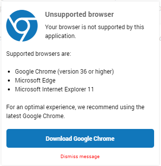

Unsupported browser
======================

Nowadays, the version number of Chrome has three digits.  
Opening a WebUI using AIMMS 4.60 or older will get you the following message:

Your users can click away safely this message.

By switching to AIMMS 4.61 or newer, they will no longer get this message.

