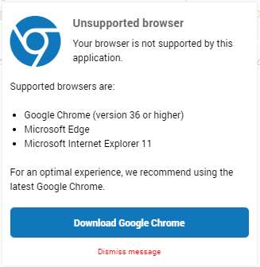

Unsupported Browser
======================

.. meta::
   :description: Explains the unsupported browser notification shown in AIMMS WebUI 4.60 or older when Chrome version numbers exceed two digits, and how to resolve it.
   :keywords: unsupported browser, Chrome, WebUI, AIMMS 4.61, browser compatibility, browser notification

Nowadays, the version number of Chrome has three digits.  
Opening a WebUI using AIMMS 4.60 or older will get you the following message:

| 

Your users can click away safely this message.

By switching to AIMMS 4.61 or newer, they will no longer get this message.

