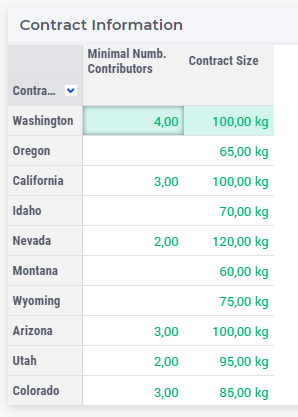
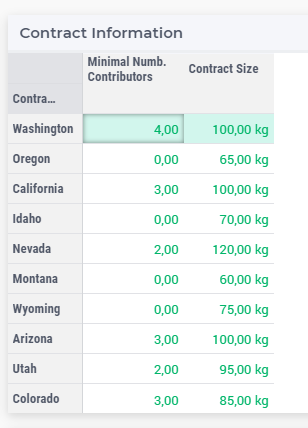

Hiding Default Values
======================

This article illustrates how to hide the default value using ``css``.
Please use the `Contract Allocation <https://how-to.aimms.com/Articles/383/383-contract-allocation.html>`_ example to experiment with this feature.

Example
--------

To hide default values using ``css`` as shown on the following image, you need to follow a few steps.

Step 1
~~~~~~~~~
If your are using the Contract Allocation example, you will start already not seeing the default values. So, go to ``./MainProject/WebUI/resources/stylesheets`` and delete ``textColor.css`` file. 
When refreshing the WebUI page, you will see:

Step 2
~~~~~~~~~
You can see that on any table, if you delete the current value, you will see the default, in this example, all defaults are set to 0. So now, add ``textColor.css`` again on the same folder.

Step 3
~~~~~~~~~
Copy and paste the following code into your ``css`` file. Note that, on this example our background color is also white, so the default value will disappear. Save it. 

.. code-block:: css
    :linenos:

    .tag-table .grid-viewport .cell.flag-default, 
    html:not(.using-touch) .tag-table .grid-viewport .cell.flag-default {
        color: white;
    }

Step 4
~~~~~~~~~

Refresh your WebUI page. 
