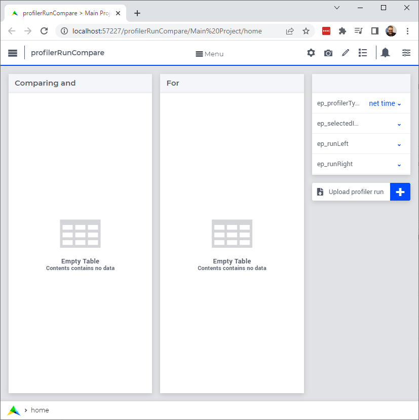
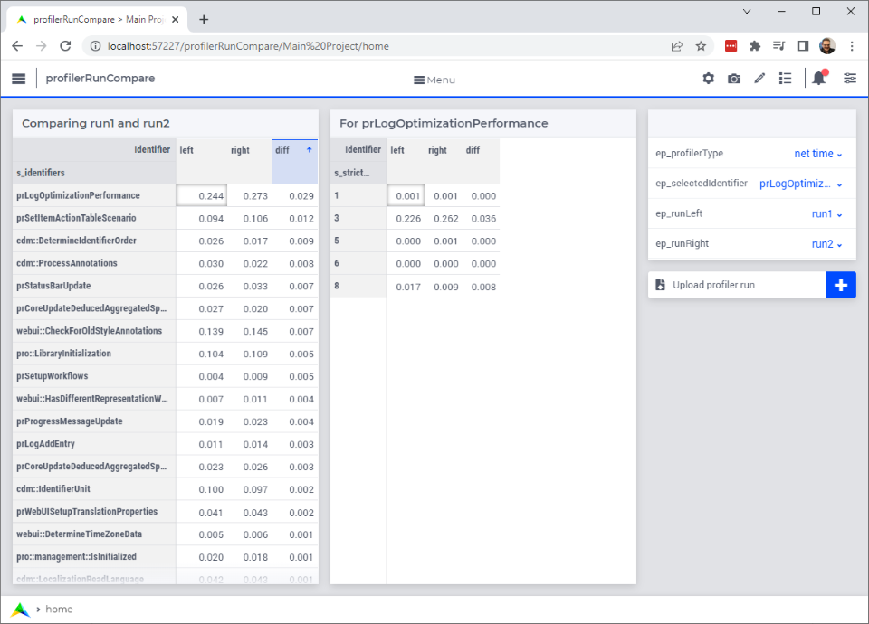

Comparing Profiler Runs
========================
.. meta::
   :keywords: aws, azure, profiler
   :description: This article is for modelers who want to compare profiler runs of deployed applications.

.. image:: https://img.shields.io/badge/AIMMS_4.88-ZIP:_ProfilerRunCompare-blue
   :target: https://github.com/aimms/profiler-run-compare/archive/refs/heads/main.zip

.. image:: https://img.shields.io/badge/AIMMS_4.88-Github:_ProfilerRunCompare-blue
   :target: https://github.com/aimms/profiler-run-compare

.. image:: https://img.shields.io/badge/AIMMS_Community-Forum-yellow
   :target: https://community.aimms.com/aimms-developer-12/profilerruncompare-app-1328

Introduction
-------------
For an existing application, especially one that has several features, a small change in data, environment, or code occasionally leads to unexpectedly different runtimes. 
The location in the code of that application, where these differences manifest themselves, is not always obvious. 
In such circumstances, comparing profiler results may be a useful next step to locate the code where the significant differences in runtimes manifest themselves.

Instructions 
-------------

This chapter is divided into three sections:

#. Application Preparation
#. Making a run and downloading runs
#. Reading and comparing runs

Application Preparation
~~~~~~~~~~~~~~~~~~~~~~~
Inside the project you want to analyze performance, follow these steps.

**Step 1:** Add `ProfilerStart <https://documentation.aimms.com/functionreference/development-support/profiler-and-debugger/profilerstart.html#ProfilerStart>`_ to the beginning of ``MainInitialization``.

**Step 2:** Add section `downloadProfilerResults <https://github.com/aimms/profiler-run-compare/blob/main/Auxiliar/downloadProfilerResults.ams>`_ to the application using `import section <https://how-to.aimms.com/Articles/145/145-import-export-section.html>`_. 
You can download this file by downloading the full repository available on github. 

**Step 3:** Add a `download button <https://documentation.aimms.com/webui/download-widget.html>`_ on one of your WebUI pages.  

Making a Run and Downloading Runs
~~~~~~~~~~~~~~~~~~~~~~~~~~~~~~~~~~
In the next subsection, we will be comparing the results of runs made.  Doing such a comparison, you don't want to be distracted by differences that have a difference cause than the cause at hand.

For instance, when changing the cloud provider from AWS to Azure, the results should not be fogged by different database contents or different versions of the same application.

Reading and Comparing Runs
~~~~~~~~~~~~~~~~~~~~~~~~~~~~

When you have two or more ``.profilerData.txt`` files, you can compare them using **profilerRunCompare** application.

This app starts up as follows:

|

Now, you should:

#. Upload two ``.profilerData.txt`` files.
#. Assign one of the to ``ep_runLeft``, and the other to ``ep_runRight``.

Then an initial comparison screen will show as follows:

|

Remarks:

#. Select an identifier by clicking in the data area of the first table.
#. You can select the profiler type in the upper right via the dropdown at ``ep_profilerType``.    

Minimal Requirements
--------------------   

`AIMMS Community license <https://www.aimms.com/platform/aimms-community-edition/>`_ is sufficient for working with this example. 

.. spelling::
   github