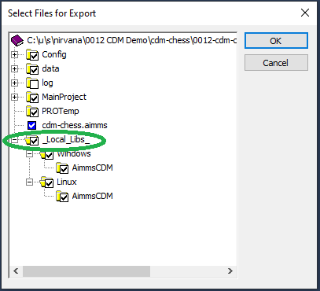

Publishing to offline servers
==============================

The `AIMMS Repository Library <https://documentation.aimms.com/library-repository.html>`_ 
places the library resources on the `url <https://library-repository.aimms.com/aimmslibs.all>`_.

When the AIMMS PRO server does not have access to this url, then the repository libraries can be included
in the .aimmspack by checking the ``_local_libs`` entry:

By putting these libraries in the ``.aimmspack``, the AIMMS PRO server no longer needs to download the AIMMS Libraries in the AIMMS repository them when the ``.aimmspack`` is published.

.. spelling::
    url
