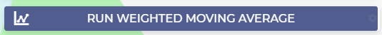
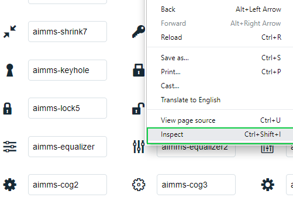
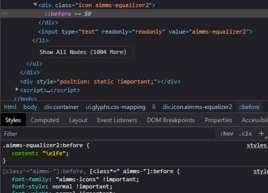

Adding an Icon on your Button
=============================

This article illustrates how to add an icon on a button widget while using an AIMMS WebUI application. This can be done to all buttons, or for an specific button widget. 
Please use the `Demand Forecasting <https://how-to.aimms.com/Articles/550/550-demand-forecasting.html>`_ example to experiment with this feature.

Example
--------

To add a icon into your button as shown on the following image, you need to follow a few steps. 

Step 1
~~~~~~~~~
Add a ``css`` file named ``button.css`` in the folder ``./MainProject/WebUI/resources/stylesheets``. If you are using the Demand Forecasting project, you will realize that this file already exists. 

Step 2
~~~~~~~~~
Copy and paste the following code to the file. If you are using the example, this code is already there. This code adds an icon on your button widget. 

.. code-block:: css
    :linenos:

    .tag-button::before {
        content: "\e229";
        position: absolute;
        display: inline-block;
        font-family: aimms-icons;
        font-style: normal;
        font-weight: normal;
        line-height: 2.125rem;
        cursor: pointer;
        color: #fff;
        z-index: 1;
        left: 14px;
        top: 1px;
        font-size: 1.25rem;
    }

Some remarks:

- *font-family:* needs to be aimms-icons.

- *content:* is the character code of the selected icon. 

- *color:* color of the icon.

- *left:* left margin. If you use right instead of left, the button will appear on the right side of the button. 

- *top:* top margin.
 
Step 3
~~~~~~~~~

Now, with the ``css`` file and the code above, if you either using the example or on a new project, any button the project has will appear with the icon:

|

To change the icon, go to `AIMMS Icons Reference List <https://documentation.aimms.com/_static/aimms-icons/icons-reference.html>`_. 

Step 4
~~~~~~~~~

Select which icon you would like, and inspect it. 

Step 5
~~~~~~~~~

A side panel will appear. Click on the ``::before`` line. On 'Styles', a class with content will appear as:

|    

Copy the character code and paste on your ``button.css`` file replacing the old character code. Save and refresh the WebUI page. The icon will change. 

But now, how to add an unique icon to an specific button?
~~~~~~~~~~~~~~~~~~~~~~~~~~~~~~~~~~~~~~~~~~~~~~~~~~~~~~~~~~~~~~~

Step 6
~~~~~~~~~

Go to the settings on the button you want an icon added. On the advanced settings, copy the 'widget.uri' value. 

Step 7
~~~~~~~~~

Go back to the ``button.css`` file and change from

.. code-block:: css
    :linenos:

    .tag-button::before

to

.. code-block:: css
    :linenos:

    .tag-button[data-name*="example"]::before

where *example* is the 'widget.uri' value. Save and refresh the WebUI page. 

.. spelling::
    aimms
    uri