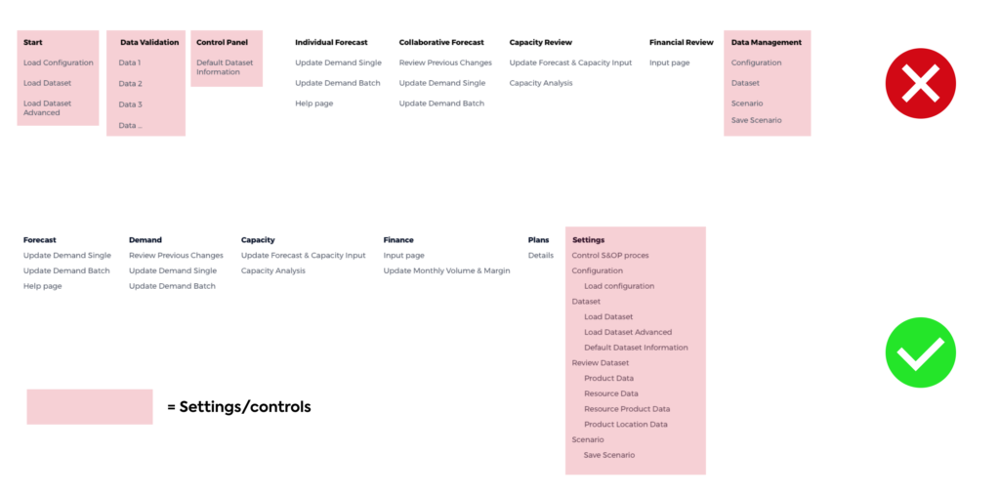
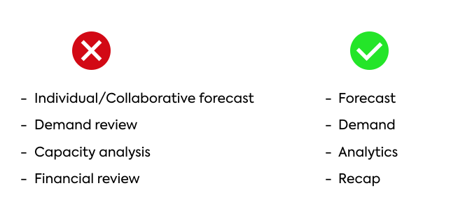

Dos and Don'ts
===============

Button Text
---------------

For consistency, we recommend to write button text in sentence case (capitalize only the first word). There is an exception for words that are always capitalized, for example “Visit Amsterdam”.

.. csv-table::
  :width: 50%
  :widths: 1, 1

  ✅ **Do**, 🚫 **Don’t**
  Calculate transport cost,	Calculate Transport Cost
  Visit Amsterdam,	Visit amsterdam
  
Text in buttons should be short and precise, using action words to indicate to the user exactly what the button does.

.. csv-table::
  :width: 50% 
  :widths: 1, 1

  ✅ **Do**,	🚫 **Don’t**
  Submit forecast,	Done
  Calculate difference,	Process
  Optimize,	Ok
  

Menu Organization
------------------

Move control tasks (configuration, data, application support) together and out of the way of the user. 
These are prerequisites for using the app, but don’t deliver value to the user directly.

Wording: Keep it Simple and Clear
--------------------------------------

Names of Top Pages should be simple. Use a single word whenever possible: “Review”, “Analytics”, “Demand”, “Forecast”. This helps users to not feel overwhelmed.

.. spelling:word-list::

	amsterdam