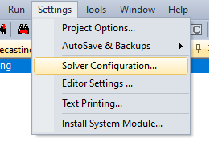
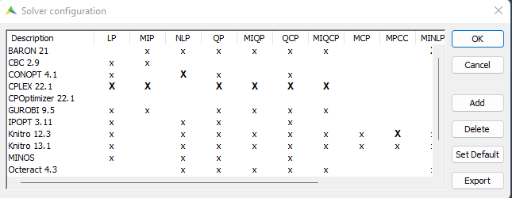
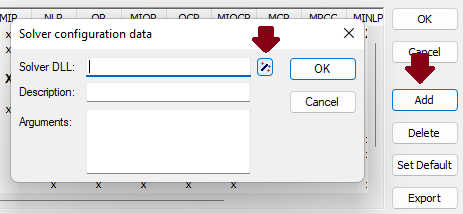
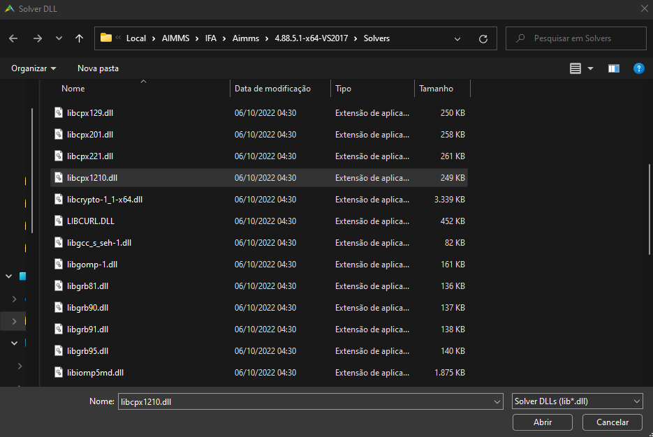
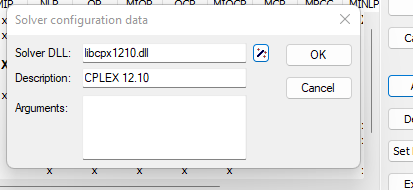
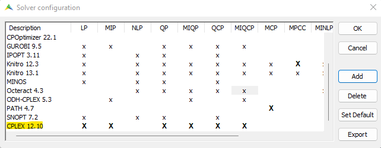

Adding a Solver
================

The list of solvers available are directly connected to the AIMMS version you are working on. 
To check which AIMMS version started to use a new solver version, please use the `release notes <https://documentation.aimms.com/release-notes.html#aimms-release-notes>`_. 

This article will show how to add a solver that is not on the list of your current AIMMS version.

Step 1
~~~~~~~~~
Go to :menuselection:`Settings > Solver Configuration`.

A list of already available solvers will appear.

|

Step 2
~~~~~~~~~
To add a new one, press the highlighted buttons below.

|

You will see a list of solvers ``dll``. Select the needed one of find on your computer a new ``dll`` to add. 

|

Step 3
~~~~~~~~~
Once the ``dll`` is selected, press :menuselection:`OK`.

|

To activate the new solver version, double click on the ``X``, it will become bold, this means that for this project, that will be the solver to be used on the selected type of solve. 

