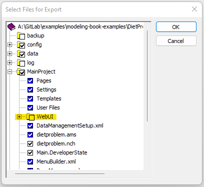
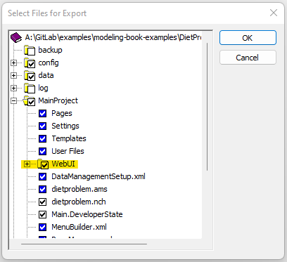

Exporting aimmspack for WinUI or WebUI
=========================================

This article has the goal of explaining how to differentiate the aimmspack creation for a WinUI and a WebUI application. 
If you seek further understanding for the process itself, please check `this <https://how-to.aimms.com/Articles/33/33-pro-deploy-app.html#creating-an-aimmspack>`_ article out.

Until the selection of files and folders, the process to create an aimmspack with any UI is the same.

.. important::
    This will only be required if the project has both UIs available.  

WinUI
~~~~~~~~~
To export a WinUI, please go to *Main Project* > *WebUI* and unselect the WebUI folder. Everything beneath will be unselected also.  

WebUI
~~~~~~~~~
To export a WebUI, please go to *Main Project* > *WebUI* and make sure the WebUI folder is selected.

|

After this step, both aimmspack can be uploaded as usual. 

.. spelling:word-list::

    aimmspack