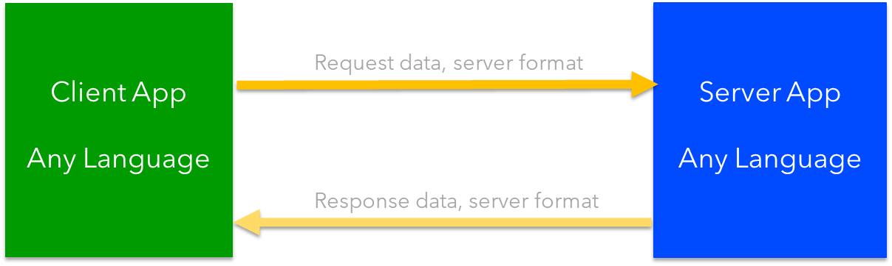
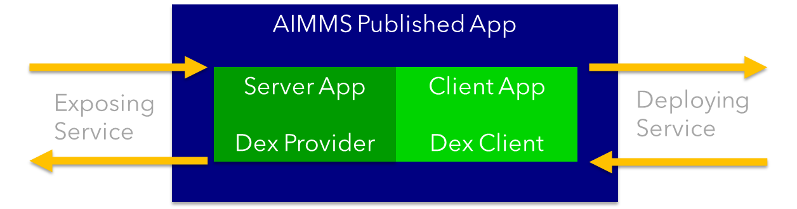
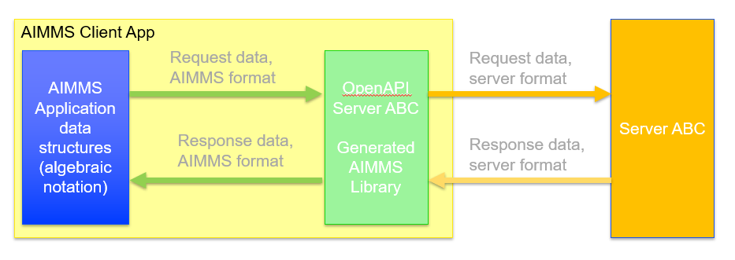

Overview OpenAPI in AIMMS
=========================

Leveraging REST Services in an AIMMS application is significantly easier when an OpenAPI specification
is provided for that service.   
This article is the overview of a series of articles that illustrate how to leverage the power of OpenAPI 
specifications in AIMMS models.

Simplified Client Server model
-------------------------------

A simplified overview of Client Server model:

Some remarks on this image:

#.  The languages and software development environments used to develop both the client and the server are independent.

#.  For AIMMS application developers there is a clear opportunity and a matter of concern. 
    Both will be briefly addressed here.

In addition, please note that there is over two decades of developments regarding REST.
One of the important results of those developments is the specification of OpenAPI; for over 3000 API's, an OpenAPI specification exists.
That is why AIMMS leverages the power of these servers by creating AIMMS libraries to unlock these servers to AIMMS applications.

Opportunity for AIMMS Application Developers
---------------------------------------------

An AIMMS application can be a client of other applications, and an AIMMS application can provide a service to other applications. This is illustrated in the next image:

* Client: See https://documentation.aimms.com/dataexchange/rest-client.html

* Server: See https://documentation.aimms.com/dataexchange/rest-server.html

Not just one service provided, not just one service used; but multiple of both.
Thus one application can be viewed as a node in a network:

Addressed matter of concern
----------------------------

The server defines its API. 
Consequently, a client needs to adhere to that API.

Using the architecture above, this requires the client:

* to translate the application data structures into the format accepted by the server

* to translate the response from the server to local application data structures 

This comes across as significantly more work than a procedure call. 
Is that necessary?
It is **not**.  

An OpenAPI specification can be converted to an AIMMS Library.
That AIMMS Library can subsequently be used to communicate with, instead of the communication with the server.
This eases the application development considerably, as the client no longer needs to translate to and from the data structures of the server. See below:

#.  Creating and submitting a request to the OpenAPI generated library.

#.  The OpenAPI generated library converts the request data to the format of the server and forwards the request.

#.  The Server processes the request and sends the response to the OpenAPI generated library. 
    The OpenAPI generated library translates the response to AIMMS data structures.
    Subsequently, the OpenAPI generated library calls the response hook of the request.

#.  The response hook is responsible for translating the data in the OpenAPI library to the data structures 
    of the application itself.

Obtaining OpenAPI generated libraries
-------------------------------------

See `Generating API clients from an OpenAPI specification <https://documentation.aimms.com/dataexchange/openapi-client.html#generating-api-clients-from-an-openapi-specification>`_

Detail how-to's provided
-------------------------

#.  :doc:`previous article<../562/562-ipTwist>`

#.  :doc:`previous article<../564/564-LocationIQ>`

References
-----------

* Definition: https://en.wikipedia.org/wiki/Representational_state_transfer

* History: https://blog.readme.com/the-history-of-rest-apis/

* List of OpenAPI sites: https://apis.guru/

* Swagger: https://editor.swagger.io/

.. spelling:word-list::

    openapi
    api

