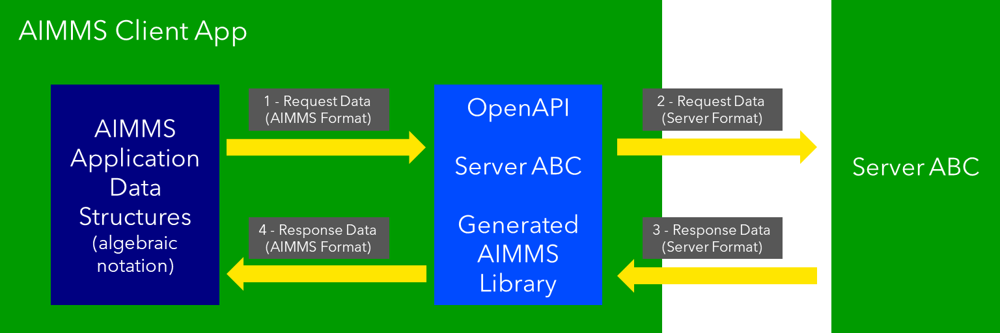

Overview OpenAPI in AIMMS
=========================

A simplified overview of Client Server model:

.. image:: images/client-server.png
    :align: center

From this image:

#.  The languages and software development environments used to develop both the client and the server are independent.

#.  Over two decades of development on REST API includes the development of OpenAPI.

#.  For AIMMS application developers there is a clear opportunity and a matter of concern. Both will be briefly addressed here.

Opportunity for AIMMS Application Developers
---------------------------------------------

An AIMMS application can be a client of other applications, and an AIMMS application can provide a service to other applications. This is illustrated in the next image:

* Client: See https://documentation.aimms.com/dataexchange/rest-client.html

* Server: See https://documentation.aimms.com/dataexchange/rest-server.html

Not just one service provided, not just one service used; but multiple of both.
Thus one application can be viewed as a node in a network:

Addressed matter of concern
----------------------------

The server defines its API. 
Consequently, a client needs to adhere to that API.

Using the architecture above, this requires the client:

* to translate the application data structures into the format accepted by the server

* to translate the response from the server to local application data structures 

This comes across as significantly more work then a procedure call. 
Is that necessary?
It is **not**.  

An OpenAPI specification can be converted to an AIMMS Library.
That AIMMS Library can subsequently be used to communicate with, instead of the communication with the server.
This eases the application development considerably, as the client no longer needs to translate to and from the data structures of the server. See below:

An important contribution of OpenAPI is that specifications of a server can be translated to a library in AIMMS.
For this purpose, the  

`Many APIs <https://apis.guru/>`_ nowadays come with an `OpenAPI <https://www.openapis.org/>`_ specification.
Tools such as `swagger <>`_ make effective use of such specifications to create libraries that can be used directly by clients.
This enables an application developer to stay within the language of preference and make calls almost as if they are library calls in the native environment.

For AIMMS application developers, there 

References
-----------

* Definition: https://en.wikipedia.org/wiki/Representational_state_transfer

* History: https://blog.readme.com/the-history-of-rest-apis/

* List of OpenAPI sites: https://apis.guru/

* Swagger: https://editor.swagger.io/

.. spelling::
    openapi
    api

