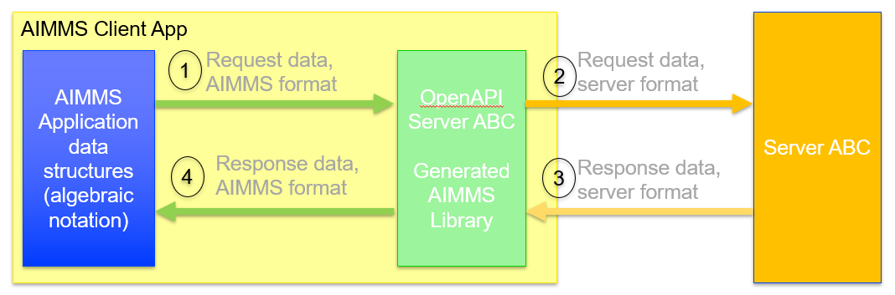
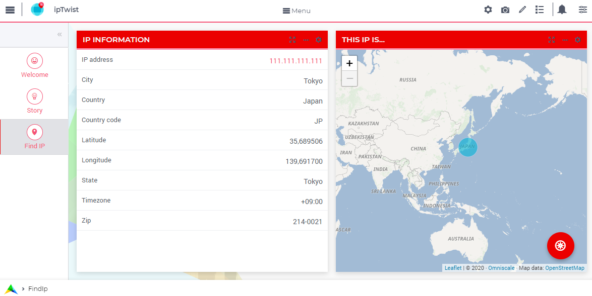

Using an API with OpenAPI Spec
===============================

An API with an OpenAPI 3.0 spec can be used to generate an AIMMS Library.
This AIMMS Library can subsequently be used to ease interfacing the corresponding service significantly.

This article illustrates interfacing a service with an OpenAPI 3.0 specification. 
As you `know <https://how-to.aimms.com/Articles/561/561-openapi-overview.html>`_ the following architecture is provided:

|

The translation of AIMMS data to the format accepted by the server (arrow 2), and 
translating the response provided by the server into AIMMS data (arrow 3) are taken care of by a generated AIMMS library.

The purpose of this article is to illustrate:

#.  initialization of an OpenAPI generated AIMMS library,

#.  make a request to such a library (arrow 1), and

#.  handle a response from such a library (arrow 4).

However, to make this concrete, an example is used, which is presented `here <https://how-to.aimms.com/Articles/563/563-functional-geolocation-abstractapi.html>`_. This example illustrates a IP Locator. Note that to work with this example you will need an API key, from `abstractapi <https://app.abstractapi.com/api/ip-geolocation/tester>`_.

|

Preparation
-----------

The preparations needed come prepackaged in the ``LibraryInitialization`` routine of the OpenAPI generated library ``openapi-geoAbstract``:

.. code-block:: aimms 
    :linenos:

    ! Read mapping files for this library.
    block
        DirectoryOfLibraryProject("openapi-geoAbstract", libFolder);
    onerror err do
        libFolder := "../libs/openapi-geoAbstract/";
        errh::MarkAsHandled(err);
    endblock;
    dex::ReadMappings(libFolder, "Generated/openapi-geoAbstract", 0);

    ! Read server initialization data (e.g. service URL, API key, OAuth credentials)
    apiInitFile := "../api-init/openapi-geoAbstract.txt";
    if FileExists(apiInitFile) then
        read from file apiInitFile;
    endif ;

Selected remarks about this code:

*   Lines 1-8: The mapping files are in the subfolder ``./Mappings/Generated/openapi-geoAbstract`` of the library folder.

*   Lines 10-14: Read in geolocation abstractapi config information, such as server name and API Key.

Example contents for the ``openapi-geoAbstract.txt`` are as follows:

.. code-block:: aimms 
    :linenos:

	geoAbstract::api::APIServer := "https://ipgeolocation.abstractapi.com" ;
	sp_apiKey := "11111111111111111111111" ;

There is one server for the service ``ipgeolocation.abstractapi``, namely ``ipgeolocation.abstractapi.com``; so the server is specified in the initialization file.
Of course, you can choose to enter your API key directly in this file.
 
Calling the API
---------------

Using the ``openapi-geoAbstract`` library, making a request is just as follows:

.. code-block:: aimms 
    :linenos:

	! Starting current call.
	geoAbstract::api::NewCallInstance(ep_callInstance);

	! Install hook, which will copy the data or handle the error
	geoAbstract::api::get_v1_::UserResponseHook := 
		'pr_abstractapi_ResponseHook' ;

	! Start the request.
	geoAbstract::api::get_v1_::apiCall(ep_callInstance,sp_apiKey,sp_myIPAddress);

Remarks:

#.  Line 2: Each request is an object.  
    The value of this mechanism will be illustrated in another how-to.

#.  Line 6: The library needs to know which procedure should handle the response (arrow 4).

#.  Line 9: Actually starting the request, using the api key and IP.

#.  In the AIMMS project, this procedure is called ``pr_GeolocateMakeRequest``.

Handling the Response
----------------------

Using the ``openapi_geoAbstract`` library, handling the response is just as follows:

.. code-block:: aimms 
    :linenos:

	if geoAbstract::api::CallStatusCode(ep_callInstance) then
		switch geoAbstract::api::CallStatusCode(ep_callInstance) do

			'200':
				! Success, copy data retrieved to application core data structures.
				block ! Copy to data structures of scalar widget.
					sp_city         := geoAbstract::_inline_response_200::city(        ep_callInstance);
					sp_country      := geoAbstract::_inline_response_200::country(     ep_callInstance);
					sp_countryCode  := geoAbstract::_inline_response_200::country_code(ep_callInstance);
					p_lat           := geoAbstract::_inline_response_200::latitude(    ep_callInstance);
					p_lon           := geoAbstract::_inline_response_200::longitude(   ep_callInstance);
					sp_state        := geoAbstract::_inline_response_200::region_(       ep_callInstance);
					sp_timezone     := geoAbstract::_inline_response_200::timezone_::name_(   ep_callInstance);
					sp_zip          := geoAbstract::_inline_response_200::postal_code(         ep_callInstance);
				endblock ;
				geoAbstract::_inline_response_200::EmptyInstance(ep_callInstance);
				block ! Use data in core data structures for presentation purposes.
					p_shownLocationLatitude(  ep_def_location ) := p_lat ;
					p_shownLocationLongitude( ep_def_location ) := p_lon ;
				endblock ;

			'400','401','402','403','404','405','406','407','408','409','410','411','412','413','414','415','416','417','421','422','423','424','425','426','427','428','429','431','451',
			'500','501','502','503','504','505','506','507','508','510','511':
				raise error formatString("geoAbstract::Geolocate(%s) failed (instance: \'%e\', status: %e, error: %e): %s",
					sp_myIPAddress, ep_callInstance, 
					geoAbstract::api::CallStatusCode(ep_callInstance), 
					geoAbstract::api::CallErrorCode(ep_callInstance), 
					fnc_httpErrorCodeToString( geoAbstract::api::CallStatusCode(ep_callInstance) ) );

			default:
				raise error formatString("geoAbstract::Geolocate(%s) failed (instance: \'%e\', status: %e, error: %e): %s",
					sp_myIPAddress, ep_callInstance,
					geoAbstract::api::CallStatusCode(ep_callInstance), 
					geoAbstract::api::CallErrorCode(ep_callInstance), 
					"unknown reason" );

		endswitch ;
	else
		dex::client::GetErrorMessage( geoAbstract::api::CallErrorCode(ep_callInstance), _sp_curlMessage);
		raise error formatString("geoAbstract::Geolocate(%s) failed (instance: \'%e\', status: %e, error: %e): %s",
					sp_myIPAddress, ep_callInstance, 
					geoAbstract::api::CallStatusCode(ep_callInstance), 
					geoAbstract::api::CallErrorCode(ep_callInstance), 
					"curl error: " + _sp_curlMessage );
	endif ;

Remarks:

#.  Lines 7-16: This is where the application logic comes in again. 
    Here we copy the data from the ``openapi-geoAbstract`` library into the data structures of the application.

#.  Line 17: After the data is retrieved as needed, the data can be removed from the OpenAPI library.

#.  Lines 16, 17: Use the data now in the core of the app.

#.  Lines 23-29, 32-35, and 40-45: try to be nice to the end-user by sharing information about a failure.
    By sharing both what the response tries to handle (context information), and the cause of failure provided by the service,
    you will increase the chance that the user is able to handle the failure self, or find the proper point of contact directly.

#.  Line 29: The service provided by ``geolacation.abstractapi`` does not provide a schema for error messages.
    Instead, its OpenAPI spec documents how to handle status codes in case of failure.
    This is why a separate function is built to translate documented status code to explanations.

#.  At ``geolacation.abstractapi`` example, this procedure is called ``pr_ResponseHook``.

.. seealso::

	*  `Generating API client code from an OpenAPI specification <https://documentation.aimms.com/dataexchange/openapi-client.html>`_. The reference for creating and using OpenAPI generated AIMMS libraries.

	*  `API gurus <https://apis.guru/>`_ lists shared Open API specifications, including the one from `geolocation.abstractapi OpenAPI spec <https://api.apis.guru/v2/specs/abstractapi.com/geolocation/1.0.0/openapi.json>`_ . 

	*  `Swagger <https://editor.swagger.io/>`_ provides an editor and viewer for OpenAPI specifications.

.. important:: 

	The article is an adaptation of an earlier version whereby the server ``ipTwist.com`` was used.
	Regrettably, this server no longer exists.
	**ipTwist** provided a neat minimal interface ideal for creating an introductory example on openapi.
	Luckily, **geolocation.abstractapi** does the same, and is almost plug compatible with **ipTwist**.

.. spelling:word-list::

   ipTwist
   geolocation
   abstractapi
   openapi
   api