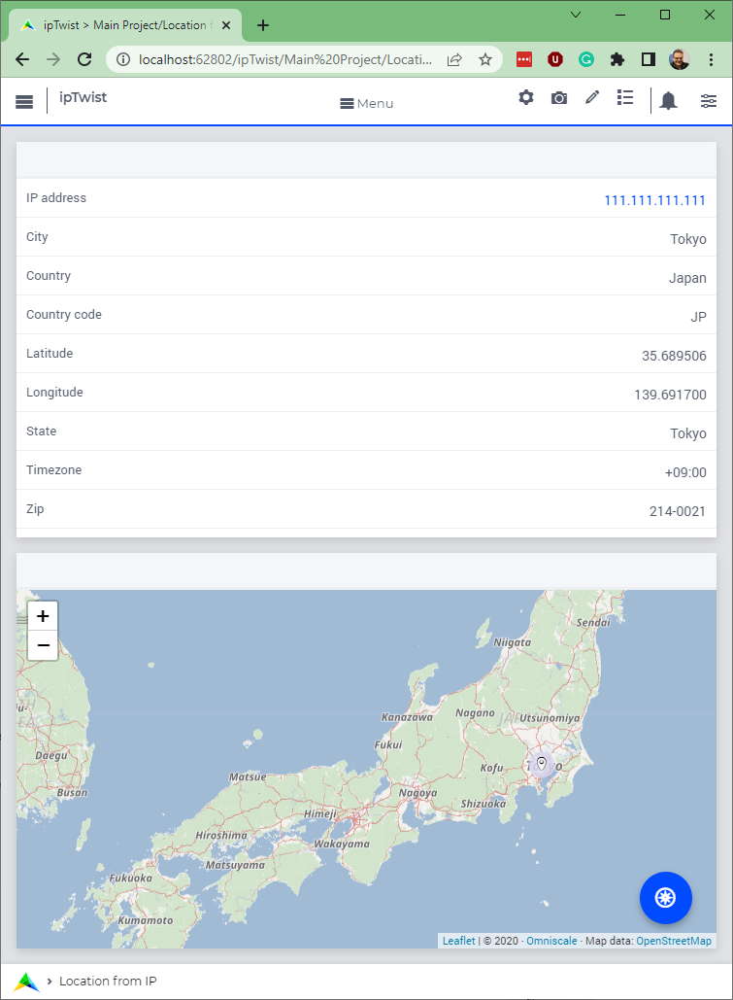

Using an API with OpenAPI spec
===============================

:download:`AIMMS 4.88 project download <model/ipTwist.zip>` 

An API with an OpenAPI 3.0 spec can be used to generate an AIMMS Library.
This AIMMS Library can subsequently be used to ease interfacing the corresponding service significantly.

This article illustrates interfacing a service with an OpenAPI 3.0 specification. 
As you `know <https://how-to.aimms.com/Articles/561/561-openapi-overview.html>`_ the following architecture is provided:

.. image:: images/client-server-openapi-lib.png
    :align: center

The translation of AIMMS data to the format accepted by the server (arrow 2), and 
translating the response provided by the server into AIMMS data (arrow 3) are taken care of by a generated AIMMS library.

The purpose of this article is to illustrate:

#.  initialization of an openapi generated AIMMS library,

#.  make a request to such a library (arrow 1), and

#.  handle a response from such a library (arrow 4).

However, to make this concrete, an example is used, which is presented first.

The Story
----------

The site `ipTwist <https://iptwist.com/>`_ provides a service for WhoIs GeoLocating; translating an IP Address to a location on the globe. 
For instance, the IP Address ``111.111.111.111`` will return Latitude 35.68, Longitude 136.69; which is in Tokyo, Japan.

Operating the application
-------------------------

To operate the application, you first need to obtain an API key, from `https://iptwist.com/settings <https://iptwist.com/settings>`_

Then you can start the AIMMS Project, press the GeoLocate button on the lower right of the page. You will be asked for an API key first, and then the IP address provided in the right upper will be GeoLocated.

Preparation
-----------

The preparations you need to make are prepackaged.

#.  The The download contains a generated library: ``openapi_ipTwist``. 
    The library consists mostly of code generated by `dex::schema::GenerateClientFromOpenAPISpec <https://documentation.aimms.com/dataexchange/api.html#dex-schema-GenerateClientFromOpenAPISpec>`_ .  

#.  Subsequently, this library is serialized, and the mapping files are placed in a subfolder of that library.

#.  Finally, some code is added to the ``LibraryInitialization`` procedure to 

    #.  read the mappings, 

    #.  to potentially read your personal private API key for ``ipTwist``, and 

    #.  state the single server that provides the described service.

The code of the ``LibraryInitialization`` procedure is as follows:

#.  To make the mappings of request and response files available, they are read in.
     
    
    .. code-block:: aimms 
        :linenos:

        DirectoryOfLibraryProject("openapi_ipTwist", sp_libFolder);
        dex::ReadMappings(
            startPath :  sp_libFolder, 
            subFolder :  "Generated/openapi-ipTwist", 
            recursive :  0);

#.  The library needs the URL of the server, and your API key.  
    `ipTwist setttings <https://iptwist.com/settings>`_ provides you with an API key.

    The following code initializes the corresponding library parameters:

    .. code-block:: aimms 
        :linenos:

        ipTwist::api::APIServer := "https://iptwist.com" ;
        ipTwist::api::APIKey(ipTwist::api::secscheme):= sp_ipTwist_apiKey ;

    Remarks:
    
    #.  Line 1: specify the URL of the server.  
        Some services are provides from multiple servers, thus 
        OpenAPI generated AIMMS libraries need to have the server identified.
        
    #.  Line 2: the API key for ipTwist needs to be specified before the first API call.
        When you don't specify your API key in the code, the ipTwist example will pop up a dialogue offering you to enter your API key.

Calling the API
---------------

Using the ``openapi_ipTwist`` library, making a request is just as follows:

.. code-block:: aimms 
    :linenos:
    :emphasize-lines: 5

    ! Starting current call.
    ipTwist::api::NewCallInstance(ep_openapi_ipTwist_CallInstance);

    ! Fill in the data for making the request.
    ipTwist::_Request::ip(ep_openapi_ipTwist_CallInstance) := sp_myIPAddress ;

    ! Clear RequestFile to ensure it will be generated by the library in the next call.
    ipTwist::api::post_::RequestFile(ipTwist::api::post_::reqpart) := "" ;

    ! Install hook, which will copy the data or handle the error
    ipTwist::api::post_::UserResponseHook :=
        'pr_GeolocateResponseHook' ;

    ! Start the request.
    ipTwist::api::post_::apiCall(ep_openapi_ipTwist_CallInstance);

Remarks:

#.  Line 2: Each request is an object.  
    The value of this mechanism will be illustrated in another how-to.

#.  Line 5: Here the data of the application is actually copied to the parameters of the ``openapi_ipTwist`` library.
    As you can see, it is an assignment in AIMMS syntax.  
    
    .. note:: The translation of this data to a format accepted by the server is handled by the generated ``openapi_ipTwist`` library, and therefore not specified in this procedure.

#.  Line 8: Every time a call is made, the request file parameter of the library is set. 
    As we want to avoid using the previous generated file, we clear the parameter here.

#.  Line 11: The library needs to know which procedure should handle the response (arrow 4).

#.  Line 15: Actually starting the request.

Handling the response
----------------------

Using the ``openapi_ipTwist`` library, handling the response is just as follows:

.. code-block:: aimms 
    :linenos:
    :emphasize-lines: 6-13

    switch ipTwist::api::CallStatusCode(ep_callInstance) do

        '200':
            ! Success, add user to core data structures.
            block ! Copy to data structures of scalar widget.
                sp_city         := ipTwist::_Response::city(        ep_callInstance);
                sp_country      := ipTwist::_Response::country(     ep_callInstance);
                sp_countryCode  := ipTwist::_Response::country_code(ep_callInstance);
                p_lat           := ipTwist::_Response::latitude(    ep_callInstance);
                p_lon           := ipTwist::_Response::longitude(   ep_callInstance);
                sp_state        := ipTwist::_Response::state(       ep_callInstance);
                sp_timezone     := ipTwist::_Response::timezone_(   ep_callInstance);
                sp_zip          := ipTwist::_Response::zip(         ep_callInstance);
            endblock ;
            block ! Copy to data structures of map widget.
                p_shownLocLatitude(  ep_ipLoc ) := p_lat ;
                p_shownLocLongitude( ep_ipLoc ) := p_lon ;
            endblock ;

        '400','401','402','403','404','405','406','407','408','409','410','411','412','413','414','415','416','417','421','422','423','424','425','426','427','428','429','431','451',
        '500','501','502','503','504','505','506','507','508','510','511':
            raise error formatString("ipTwist::Geolocate(%s) failed (status: %e, error: %e): %s",
                sp_myIPAddress,
                openapi_ipTwist::api::CallStatusCode(ep_callInstance), 
                openapi_ipTwist::api::CallErrorCode(ep_callInstance), 
                fnc_errorFunc( ipTwist::api::CallStatusCode(ep_callInstance) ) );

        default:
            raise error formatString("ipTwist::Geolocate(%s) failed (status: %e, error: %e): %s",
                sp_myIPAddress,
                openapi_ipTwist::api::CallStatusCode(ep_callInstance), 
                openapi_ipTwist::api::CallErrorCode(ep_callInstance), 
                "unknown reason" );

    endswitch ;

Remarks:

#.  Lines 6-13: here we copy the data from the ``openapi_ipTwist`` library into the data structures of the application.

#.  Lines 22-26, and 29-33: try to be nice to the end-user by sharing information about a failure. 
    By making this best practice, a common practice, you will 

#.  Line 26: The service from ipTwist does not provide a schema for error messages.
    Instead, its OpenAPI spec documents how to handle status codes in case of failure.
    This is why a separate function is built to translate documented status code to explanations.

Further information:
--------------------

*   `Generating API client code from an OpenAPI specification <https://documentation.aimms.com/dataexchange/openapi-client.html>`_ 
     and encourages to `Move a runtime generated openapi library to a permanent library <https://documentation.aimms.com/dataexchange/openapi-client.html#moving-the-runtime-library-to-a-permanent-library>`_ .

*   `API gurus <https://apis.guru/>`_ lists shared Open API specifications, including the one from `ipTwist OpenAPI spec <https://api.apis.guru/v2/specs/iptwist.com/1.0.0/openapi.json>`_ . 

*   `Swagger <https://editor.swagger.io/>`_ provides an editor and viewer for openapi specifications.

.. spelling::
   ipTwist