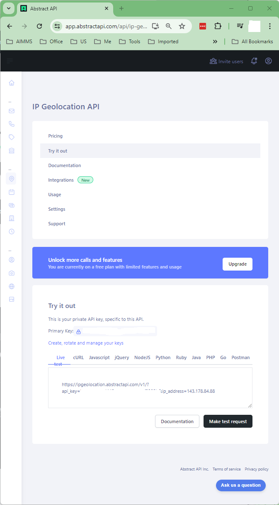
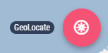
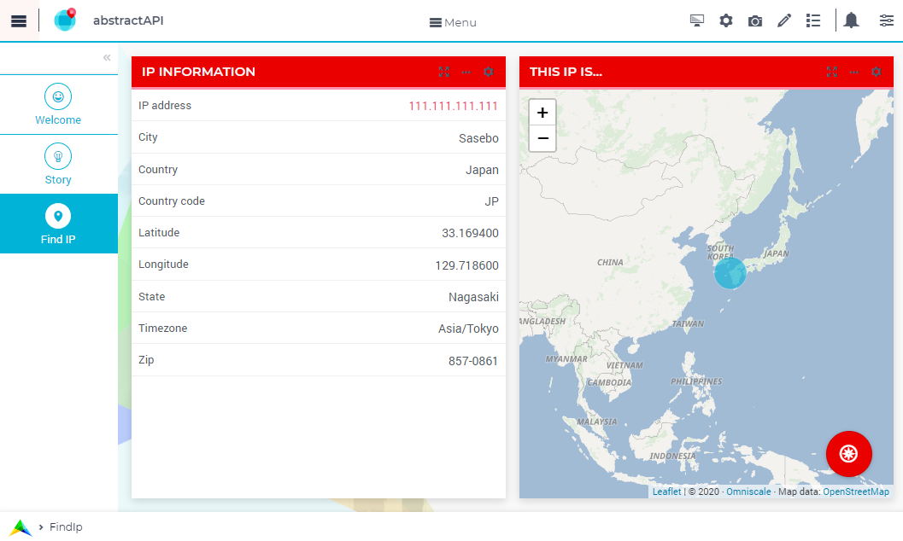

Geolocation AbstractAPI
==============================

.. meta::
   :keywords: aimms, api, rest api, library, ip
   :description: This example uses the rest api! 

.. image:: https://img.shields.io/badge/AIMMS_4.89-ZIP:_ipTwist-blue
   :target: https://github.com/aimms/ip-twist/archive/refs/heads/main.zip

.. image:: https://img.shields.io/badge/AIMMS_4.89-Github:_ipTwist-blue
   :target: https://github.com/aimms/ip-twist

.. image:: https://img.shields.io/badge/AIMMS_Community-Forum-yellow
   :target: https://community.aimms.com/math-or-optimization-modeling-39/using-an-api-with-openapi-specification-1368

Story
----------

In this functional example, you will see a IP Locator. The site `geolocation.abstractapi <https://geolocation.abstractapi.com/>`_ provides a service for WhoIs GeoLocating; translating an IP Address to a location on the globe. 
For instance, the IP Address ``111.111.111.111`` will return Latitude 33.169, Longitude 129.72; which is in Tokyo, Japan. Add your IP address and confirm where you are!

Language
-----------

Operating the Application
~~~~~~~~~~~~~~~~~~~~~~~~~~

To operate this example, you first need to obtain an API key, from `Getting API key abstract api geolocation <https://app.abstractapi.com/api/ip-geolocation/tester>`_

| 

Then you can start the AIMMS Project, press the GeoLocate button on the lower right of the page "Find IP". 

| 

You will be asked for an API key first. Then the IP address provided will be GeoLocated.

|

Using the API
~~~~~~~~~~~~~

While using REST APIs, you will need to **Prepare**, **Call the API** and **Handle the Response**. All three steps are detailed `here <https://how-to.aimms.com/Articles/562/562-geolocation-abstractapi.html>`_.  

WebUI Features
---------------

The following WebUI features are used:

- `Text Widget <https://documentation.aimms.com/webui/text-widget.html>`_

- `Image Widget <https://documentation.aimms.com/webui/image-widget.html>`_

- `Workflow <https://documentation.aimms.com/webui/workflow-panels.html>`_

- `Scalar Widget <https://documentation.aimms.com/webui/scalar-widget.html>`_ 

- `Page Actions <https://documentation.aimms.com/webui/page-menu.html>`_ 

- `Map Widget <https://documentation.aimms.com/webui/map-widget.html#map-widget>`_ 

UI Styling
---------------

Below described all UI modifications done on this example trough ``css`` files which can be found beneath ``MainProject/WebUI/resourses/stylesheets``. 

.. tab-set::
    .. tab-item:: workflow.css

        .. code-block:: css
            :linenos:

            /*Change color of the active step*/
            .workflow-panel .step-item.current,
            .workflow-panel.collapse .step-item.current {
                box-shadow: inset 0.3125rem 0 0 var(--primary);
            }

            /*Change color of the titles*/
            .workflow-panel .step-item.active.complete .title, 
            .workflow-panel .step-item.active.incomplete .title {
                color: var(--primaryLight);
            }

            /*Change color of the icons*/
            .workflow-panel .step-item.active.complete .icon, 
            .workflow-panel .step-item.active.incomplete .icon {
                color: var(--primaryLight);
                border: 1px solid var(--primaryLight);
            }
        
    .. tab-item:: textColor.css

        .. code-block:: css
            :linenos:

            /*Link color*/
            .ql-snow a {  
                color: var(--primaryLight) !important; 
            }

            /*Change checkbox color*/
            input.boolean-cell-editor-contents {
                accent-color: var(--primary);   
            }

            .aimms-widget .ui-button {
                text-transform: uppercase;
            }

            /*Changing tittle to be uppercase*/
            .title-addon,
            .ui-dialog .ui-dialog-title {
                text-transform: uppercase;
                text-shadow: 2px 2px 0px var(--primary);
                color: whitesmoke;
            }

    .. tab-item:: pageAction.css

        .. code-block:: css
            :linenos:

            .page-action-v2 .page-action-menu,
            .page-action-v2 .page-action-menu.open {
                background: var(--primary);
            }

            .page-action-v2 .page-action-menu:hover,
            .page-action-v2 .page-action-menu:hover {
                background: var(--primaryLight);
            }

            .page-action-v2 .page-action-holder .page-action-item .page-action-icon, 
            .page-action-v2 .page-action-holder .page-action-item .page-action-letter {
                background-color: var(--primary);
            }

            .page-action-v2 .page-action-holder .page-action-item .page-action-icon:hover, 
            .page-action-v2 .page-action-holder .page-action-item .page-action-letter:hover {
                background-color: var(--primaryLight);
            }

    .. tab-item:: colors.css

        .. code-block:: css
            :linenos:

            :root {
                --secondaryLight: #7DEBF5;
                --secondary: #3DD9EB;
                --secondaryDark: #00B3D7;
                --primaryLight: #F55376;
                --primary: #EB0000;
                --primaryLightest: #FA91AD;
                
                --bg_app-logo: 15px 50% / 30px 30px no-repeat url(/app-resources/resources/images/ipTwist.png);
                --spacing_app-logo_width: 45px;

                --color_border-divider_themed: var(--primaryLight);
                --color_text_edit-select-link: var(--primaryLight);
                --color_text_edit-select-link_hover: var(--primary);
                --color_bg_edit-select-link_inverted: var(--secondary);
                --color_bg_button_primary: var(--secondary);
                --color_bg_button_primary_hover: var(--secondaryLight);
                --color_text_button_secondary: var(--secondary);
                --border_button_secondary: 1px solid var(--secondary);
                --color_text_button_secondary_hover: var(--primary);
                --border_button_secondary_hover: 1px solid var(--primary);
                --color_bg_widget-header: var(--primary);
                --border_widget-header: 3px solid var(--primaryLightest);
            }

    .. tab-item:: body.css

        .. code-block:: css
            :linenos:

            /*Add logo on the background*/
            .scroll-wrapper--pagev2 .page-container {
                content: " ";
                background: url(img/RightBackground.png) rgb(249, 249, 249) no-repeat left/contain;
            }

            /*Changing button font*/
            .ui-widget, .ui-widget button, .ui-widget input, .ui-widget select, .ui-widget textarea {
                font-family: var(--font_headers),Montserrat,Roboto,Arial,Helvetica,sans-serif; 
            }

    .. tab-item:: annotations.css

        .. code-block:: css
            :linenos:                        

            .annotation-blue{
            /*fill changes*/
                fill: var(--secondaryDark);
                fill-opacity: .6;
            }

Minimal Requirements
----------------------

`AIMMS Community license <https://www.aimms.com/platform/aimms-community-edition/>`_ is sufficient for working with this example. 
However, you will need API key, to receive an free API key to test, please access `abstractapi <https://app.abstractapi.com/api/ip-geolocation/tester>`_ and sign up. 

.. spelling:word-list::

   ipTwist