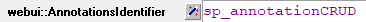
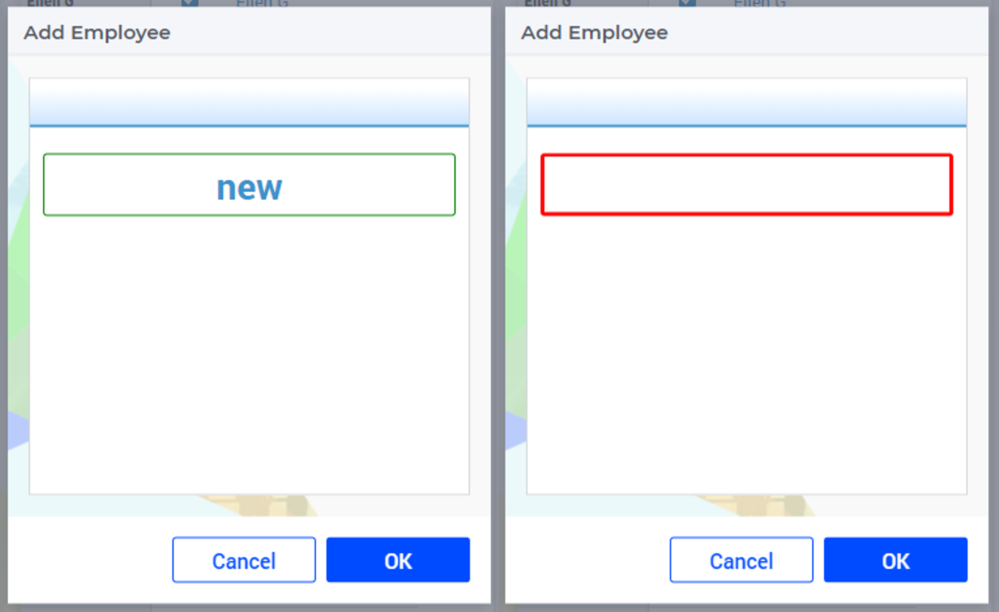

Using Scalar Border Annotation
============================================================

This article illustrates how to use the border annotation on a scalar widget while using an AIMMS WebUI application. This can be done to any scalar format: compact, multiline or simple/basic form.
Please use the `Employee Scheduling <https://how-to.aimms.com/Articles/387/387-employee-scheduling.html>`_ example to experiment with this feature.

Example
--------
As you may know, in the Employee Scheduling example there is a CRUD for each master set. So, as a way of visually help the user input data, the border annotation is used.
The scalar widget has a few annotations available, this is the `list of CSS properties <https://documentation.aimms.com/webui/css-styling.html#widgets-and-css-properties-supported-for-annotations>`_.

Step 1
~~~~~~~~~

First create the css file with the border property. This must be created under ``WebUI\resources\stylesheets``.

.. code-block:: css
    :linenos:

    .annotation-red-input  {
        border: 3px solid red;
        border-radius: 3px;
    }
    .annotation-green-input  {
        border: 1px solid green;
        border-radius: 3px;
    }

Step 2
~~~~~~~~~

Next step is to create a string parameter with the annotation logic. Such as:

.. code-block:: aimms

    StringParameter sp_annotationCRUD {
        Definition: {
            if sp_addEditElement then 
                "green-input"
            else 
                "red-input"
            endif;
        }
    }

Here the logic will be, if has a value, then, green, otherwise, red, which you visually indicate the user when there is no data. 

Step 3
~~~~~~~~~

Add ``sp_annotationCRUD`` to the identifier will be used on WebUI.

Results
~~~~~~~

|

.. spelling:word-list::

    css