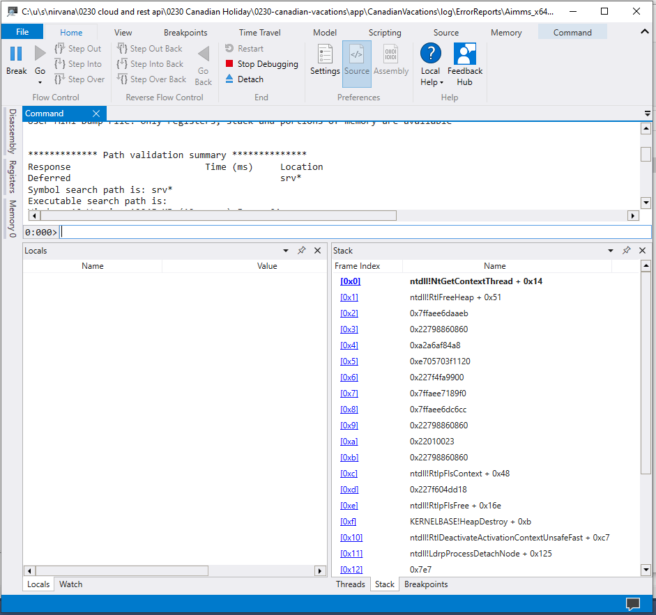
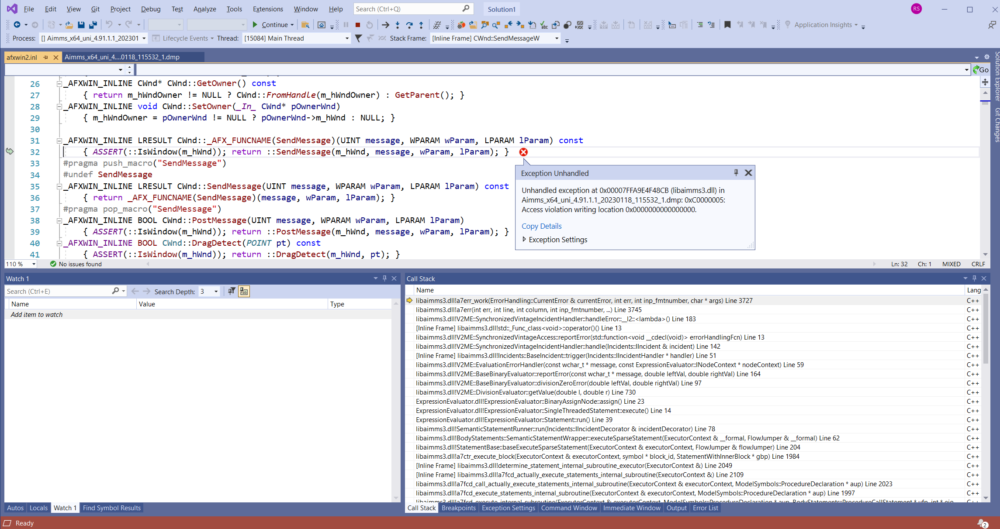

Dumpfile contents
=================================

Upon a severe internal error, the running AIMMS executable will create a dump file.
This is a dump file, **without heaps**, using `technology provided by Microsoft <https://learn.microsoft.com/en-us/visualstudio/debugger/using-dump-files?view=vs-2022>`_.

The contents of a dump file is primarily the execution stack of each thread during the severe internal error. 
An execution stack is a list of active functions.

As such, these stacks contain information about the state of ``AIMMS Developer`` itself; 
they hardly contain information of the state of the application.

However, the functions on the stack touch upon data of the application, 
to compute new data from existing data. 
An overview of the data referenced is given in the next section.

Referenced data
------------------
Short strings such as identifier names and page properties.
Individual numeric values

Additional info
------------------
When you send in a dump file via the Severe Internal Error dialog, you are using a web service; and this web service will use your IP address. Additional information supplied by you, such as your e-mail address and your description of the incident, is also shared.

Your analysis
--------------

A tool such as WinDBG can be used to analyze  :download:`this dump file <model/Aimms_x64_uni_4.91.1.1_20230118_115532_1.dmp>` .

The symbolic information necessary to make some sense out of a dump file is not shared; as this the AIMMS Source.

AIMMS analysis
-----------------
Only AIMMS staff has access to the dump files once they are sent in. 
In addition, they have access to the AIMMS Source and the symbolic information used to create the ``AIMMS Developer`` executable.
This is what they see from the above dump file:

Information in dump files is **not shared** with third parties.

As an aside, the example given above was created using an artificial mechanism to create dump files; 
needed to test, demo, and illustrate the use of dump files.

In the end
------------
Reports might unintentionally contain personal or AIMMS project-related information. 
For example, a report that contains a snapshot of memory might include your name, or part of an AIMMS project you were working on; 
however, they are not used when analyzing the dump file and are insufficient to retrieve any useful model information from the dump file. 

If you are concerned that a report might contain personal or confidential information, you should not send in the report.

References
---------------

* https://learn.microsoft.com/en-us/visualstudio/debugger/using-dump-files?view=vs-2022#BKMK_Dump_files__with_or_without_heaps

