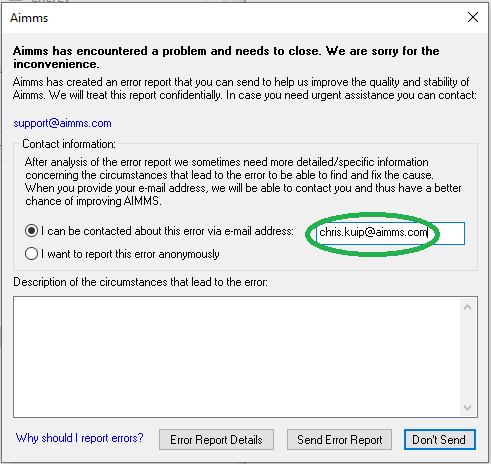

Why send in dump file?
============================

What?
-----------------------
A ``.dmp file``, pronounce as dump file, 
is generated when ``AIMMS Developer`` encounters a severe internal error. 
This may even force ``AIMMS Developer`` to close.

Purpose
-----------------------
The purpose of a dump file is to identify the potential software glitch that caused the severe internal error. 
The identification of a software glitch may ultimately lead to an improvement in the quality of the AIMMS software.

Contents
-----------------------
A dump file created by ``AIMMS Developer`` upon a severe internal error contains the stacks of the execution threads. 
Such a stack is information about the program logic of ``AIMMS Developer`` itself. 

A dump file created by ``AIMMS Developer`` upon severe internal error hardly contains any application data. 
The AIMMS Execution engine, when a severe internal error happens, touches some existing data to compute new data. 
Some of this touched data is visible in a dump file.

More details of :doc:`dumpfile contents<../569/569-dumpfile-contents>`.

Dialog
-----------------------
When ``AIMMS Developer`` encounters a severe internal error, but ``AIMMS Developer`` is not forced to close, 
``AIMMS Developer`` will pop up a dialog like:

Please fill in the e-mail address. 
This e-mail address will only be used to contact you when additional information is requested by AIMMS staff to analyze the issue at hand and/or create a reproducible example.

It is also worthwhile to fill in the "Description of the circumstance that lead to the error": 
A best practice here is to specify the steps taken after data load.  For instance:

* A next scenario is attempted by pressing the ...
* Data is loaded, filtering on period range ....
* Data is reviewed on pages, ..., and ...
* The optimization is run
* The data is reviewed, and selectors ... and .. are set to ...

Such a description is valuable in creating a reproducible example. 

It is also understandably difficult to remember these steps as you, as a user of ``AIMMS Developer`` was focused on something else. 

This is similar as to when you are hammering a nail into the wood and hit your thumb accidentally. 
As a user of the hammer, you were focused on the nail, and will remember the form of the nail more easily 
than the form of the handle of the hammer.

Analysis
-----------------------
AIMMS staff analyzes dump files sent in. 

When you want to analyze a dump file yourself, perhaps using WinDbg, 
please be aware that the symbols needed are only available to AIMMS staff. 
As these symbols link back to the AIMMS source code, these symbols are not provided. 
In short: attempting to analyze dump files yourself is not an efficient use of your time.

Cooperation
-----------------------
Based on a single dump file, there is usually not enough information to make a fix directly. 
This is why we seek your cooperation, such that together (you and AIMMS staff), 
a reproducible example might be constructed. 
As AIMMS permits a myriad of interaction paths, it can be a time-consuming process to create a reproducible example.

Even though creating a reproducible example may be an effort requiring some persistence, 
it is worthwhile; having a reproducible example permits AIMMS to do a detailed analysis, 
and subsequently create a software fix, for the issue at hand.

Later
-----------------------
Dump files are always stored in the folder ``log/ErrorReports``. 
This permits you to sent in dump files after the fact.