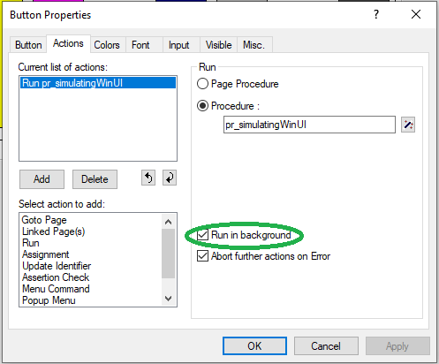
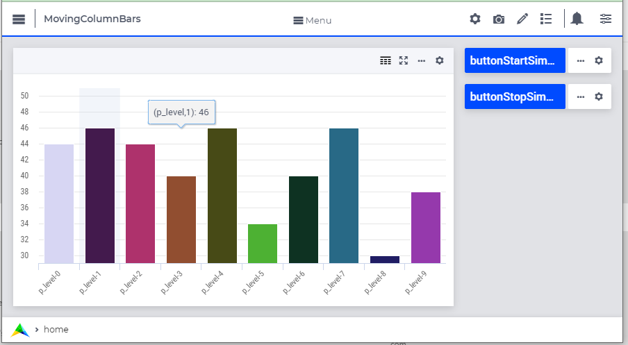

Showing Progress of Long Running Algorithms
=============================================

Most users can be re-assured that a long running algorithm is working by showing the progress that is being made.
There are various ways of doing this. This article gives a brief overview and a detailed example of showing progress in data for the WebUI.

WinUI
------

#.  Showing a progress bar using :aimms:function:`DialogProgress`

#.  During the running of the algorithm, call :aimms:function:`PageRefreshAll`

WebUI
------

#.  Showing progress message in the **busy** icon see `SetProgressMessage <https://documentation.aimms.com/webui/library.html#setprogressmessage>`_

#.  Regularly scheduling the next portion of the algorithm using :aimms:procedure:`ScheduleAt`.  This requires rewriting the algorithm, which is illustrated in the next section.

WinUI and WebUI Showing Progress
------------------------------------

WinUI Example Showing Progress
^^^^^^^^^^^^^^^^^^^^^^^^^^^^^^^

Showing the progress of an algorithm in WinUI is achieved by adding `PageRefreshAll` calls to the code, see line 6 below:

.. code-block:: aimms 
    :linenos:
    :emphasize-lines: 6

    Procedure pr_simulatingWinUI {
        Body: {
            bp_stop := 0 ;
            while not bp_stop do
                pr_iteration();
                pageRefreshAll();
                delay(1);
            endwhile ;
        }
    }

To enable interruption of the algorithm by running another procedure, you will need to activate the actual algorithm in the background; 
this can be done in the properties of the button activating the actual algorithm:

|

WebUI Example Showing Progress
^^^^^^^^^^^^^^^^^^^^^^^^^^^^^^^^

There is no equivalent to `PageRefreshAll` in the WebUI.  
To create an equivalent procedure, the algorithm is broken in separate procedures:

First the start of an algorithm:

.. code-block:: aimms 
    :linenos:

    Procedure pr_startSimulating {
        Body: {
            bp_stop := 0 ;
            pr_nextIteration();
        }
    }

In an iteration, we do it; and when the stopping condition is not yet satisfied, another iteration is started in a second:

.. code-block:: aimms 
    :linenos:

    Procedure pr_nextIteration {
        Body: {
            pr_iteration();
            if not bp_stop then
                pr_scheduleOver(
                    p_in_noSecs   :  1[s], 
                    ep_in_payLoad :  'pr_nextIteration');
            endif ;
        }
    }

Here `pr_scheduleOver` is a small wrapper around `ScheduleAt`, that schedules in the given number of seconds.

For the details see this :download:`AIMMS 4.91 project download <model/MovingColumnBars.zip>` 

A screenshot of this app: 

|

This app makes an arbitrary change in the levels by -1 or by +1 every second.

.. seealso::

    * TSP opt-2 example, see :doc:`../397/397-traveling-salesman`.