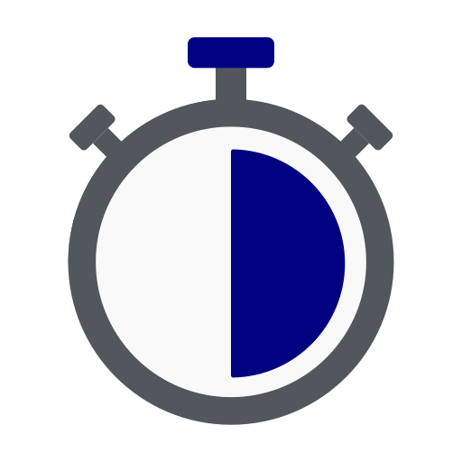

Stopwatch Library
==========================

.. meta::
   :description: How to measure efficiency of procedures with StopWatch function.
   :keywords: efficient, time, execute, stopwatch, watch, clock

.. image:: https://img.shields.io/badge/AIMMS_4.87-ZIP:_Stopwatch_Library-blue
   :target: https://github.com/aimms/stopwatch-library/archive/refs/heads/main.zip

.. image:: https://img.shields.io/badge/AIMMS_4.87-Github:_Stopwatch_Library-blue
   :target: https://github.com/aimms/stopwatch-library

.. image:: https://img.shields.io/badge/AIMMS_Community-Forum-yellow
   :target: https://community.aimms.com/aimms-developer-12/stopwatch-library-1426

Introduction
--------------
This toolkit library is used to facilitate measuring specific blocks of code by using two procedures, 
one to start the timer, and one to retrieve the execution time. 

.. seealso:: In this `article <https://how-to.aimms.com/Articles/144/144-Stopwatch.html>`_ deeper explanations about how to measure execution time with and without this library can be found. 

Instructions
----------------

This chapter is divided into three sections:

#. Adding the Library
#. Main Procedures
#. Example of Usage

Adding the Library
~~~~~~~~~~~~~~~~~~~~~~~

To add and use this library to your project, first download the code and after, 
follow these steps on `how to add an existing library to a project <https://how-to.aimms.com/Articles/84/84-using-libraries.html#add-aimms-libraries>`_.

Main Procedures start and elapsed
~~~~~~~~~~~~~~~~~~~~~~~~~~~~~~~~~

.. aimms:procedure:: pr_start(ep_stopwatch)

This procedure will start the timer(ep_stopwatch). 
Note that ``ep_stopwatch`` is optional, and usually not specified.

.. code-block:: aimms
   :linenos:

   ! Use the CurrentToString AIMMS function to store the current time
   ! in YYYY-MM-DD HH:MM:SS:TT format
   if p_option_Use_UTC_forcaseandstartenddate_active then
      sp_startTime := CurrentToString( "%c%y-%m-%d %H:%M:%S:%t%TZ('UTC')" );
   else
      sp_StartTime := CurrentToString( "%c%y-%m-%d %H:%M:%S:%t" );
   endif;

.. aimms:function:: fnc_elapsed(ep_stopwatch)

This procedure will return the total time in seconds since the timer ``ep_stopwatch`` started.
Note that ``ep_stopwatch`` is optional, and usually not specified.

.. code-block:: aimms
   :linenos:

   if p_option_Use_UTC_forcaseandstartenddate_active then
      sp_stopMoment := CurrentToString( "%c%y-%m-%d %H:%M:%S:%t%TZ('UTC')" );
      p_elapsedTime := StringToMoment(
         Format        :  "%c%y-%m-%d %H:%M:%S:%t%TZ('UTC')", 
         Unit          :  [tick], 
         ReferenceDate :  sp_startTime, 
         Timeslot      :  sp_stopMoment);
   else
      p_elapsedTime := CurrentToMoment( [tick],  sp_StartTime );
   endif;
   fnc_elapsed := p_elapsedTime;

There are ten stopwatches available.

.. code-block:: aimms
   :linenos:

	Set s_stopwatches {
		Index: i_stopwatch;
		Definition: ElementRange(0,9,prefix:"stopwatch-");
	}

Basic Example:
""""""""""""""" 

Below there is an example of usage for measuring ``pr_longRunningProcedure`` execution time. 
Line-7 is simply constructing a message using the stopwatch results. 

.. code-block:: aimms
   :linenos:

   ! Measuring time of some long running procedure.
   stopwatch::pr_start();
   pr_longRunningProcedure();
   p_elapsedTime := stopwatch::fnc_elapsed();

   ! Reporting of that time:
   sp_runTime := formatString("Execution of procedure took %n seconds", p_elapsedTime );

Ëxtended Example:
"""""""""""""""""""" 

The default stopwatch for both ``pr_start`` and ``fnc_elapsed`` is ``'stopwatch-0'``. 
When this stopwatch is "in use", it is not possible to use this stopwatch for another 
procedure, say ``pr_thisSpecificTask``. to measure the time spent on ``pr_thisSpecificTask``,
you can use another stopwatch; leading to the code:

.. code-block:: aimms
   :linenos:

   ! Measuring time of some long running procedure.
   stopwatch::pr_start('stopwatch-1') ;
   pr_thisSpecificTask();
   p_elapsedTimeSpecific := stopwatch::fnc_elapsed('stopwatch-1');

   ! Reporting of the time spent on a specific task:
   sp_runTime := formatString("Execution of procedure pr_thisSpecificTask took %n seconds", 
	   p_elapsedTimeSpecific );

The proc scheduleOver
~~~~~~~~~~~~~~~~~~~~~~~~

This is a small frontend to :aimms:func:`ScheduleAt`, and accepts an elapsed time in seconds, (and a payload procedure):

.. code-block:: aimms
   :linenos:

	Procedure pr_scheduleOver {
		Arguments: (p_noSeconds,ep_payLoad);
	}

The func Now
~~~~~~~~~~~~~~~~~~

The current time, up to seconds precise, timezone UTC is often used to mark moments, and log events.

.. code-block:: aimms
   :linenos:

	Function fnc_now {
		Range: string;
	}

Minimal Requirements
----------------------

`AIMMS Community license <https://www.aimms.com/platform/aimms-community-edition/>`_ is sufficient for working with this example. 

Release Notes
--------------

* In 2011, Guido Diepen developed the first Stopwatch section and blogged about it.

* In 2022, Chris Kuip made a small library out of that section, to

  * ease even further the adding of the functionality to an application, and

  * to cater for multi timezone support, see option Use_UTC_forcaseandstartenddate

* In October 2024, Added ``Now``, ``ScheduleOver``, and the stopwatch optional argument to ``pr_start``, and ``pr_elapsed``.

.. spelling:word-list::

	ep
	proc
	frontend
	func
	scheduleOver

