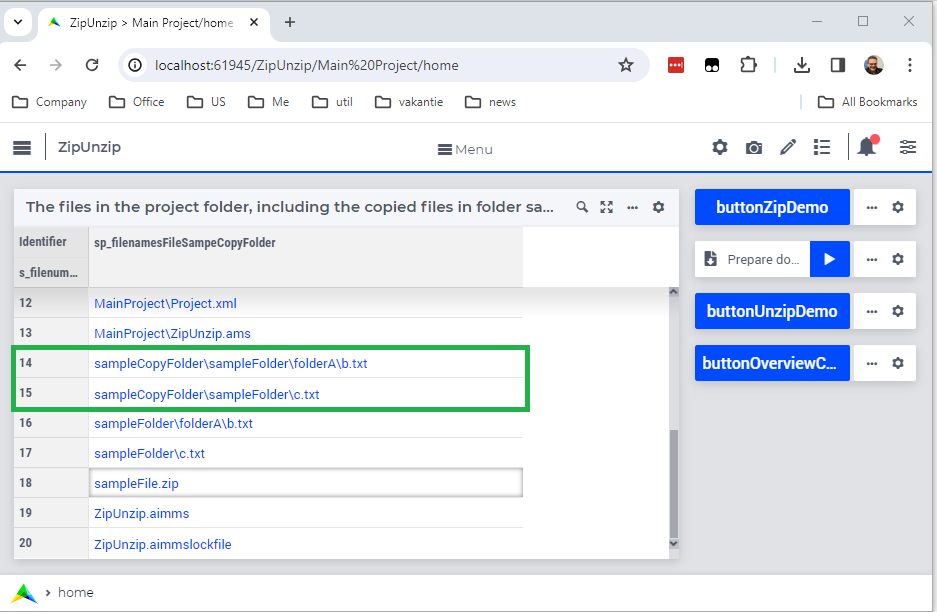

Zipping and Unzipping Files
====================================

.. meta::
   :description: How to zip, unzip using AIMMS Developer, AIMMS PRO and on AIMMS Cloud.
   :keywords: zip, unzip, compress, expand, cloud

Downloading and uploading a collection of files is achieved by first compressing into a single file, 
called an archive, and then transferring the archive from one machine to the other.
In this article, we will focus on the compression of a collection of files into a single archive, and 
on the expansion of such an archive into a collection of files.

The AIMMS core does not provide zipping and unzipping functionality natively; but:

* Windows 10 and Windows 11 provide the powershell commands 
  `Compress-Archive <https://learn.microsoft.com/en-us/powershell/module/microsoft.powershell.archive/compress-archive?view=powershell-7.4>`_ and
  `Expand-Archive <https://learn.microsoft.com/en-us/powershell/module/microsoft.powershell.archive/expand-archive?view=powershell-7.4>`_.
* Most Linux distributions, including the Linux distribution used on the AIMMS Cloud, provide zip.
  The use of zip is illustrated `here <https://www.geeksforgeeks.org/zip-command-in-linux-with-examples/>`_.

This can be leveraged using the :any:`Execute` procedure of AIMMS, for instance to create a zip archive as follows:

.. code-block:: aimms 
    :linenos:

	if AimmsStringConstants('Platform') = "Linux" then
		Execute( "zip", "-r " + sp_destinationFile + " " + sp_folderName , wait:1) ;
	else
		Execute( "powershell \"Compress-Archive -Path "+ sp_folderName+" -DestinationPath "+sp_destinationFile+"\"", wait:1);
	endif ;

and to unpack such a zip archive into files as follows:

.. code-block:: aimms 
    :linenos:

	if AimmsStringConstants('Platform') = "Linux" then
		Execute( "unzip", sp_fileName + " -d " + sp_destinationFolderName , wait:1) ;
	else
		Execute( "powershell \"Expand-Archive -Path "+ sp_fileName+" -DestinationPath "+sp_destinationFolderName+"\"", wait:1);
	endif ;

The above is captured in an example project that can be obtained via the download:

	:download:`AIMMS 24.2 project download <model/ZipUnzip.zip>` 

This project has the following interface:

|

The buttons have the following actions:

#. ``buttonZipDemo``: Activates the procedure to zip, containing the ``zip`` and ``powerShell Compress-Archive`` example above.

#. ``Prepare download``: Download the zip file created by the ``buttonZipDemo``

#. ``buttonUnzipDemo``: Activates the procedure to unzip, containing the ``unzip`` and ``powerShell Expand-Archive`` example above.

#. ``buttonOverviewCopiedFiles``: Lists all files in the project folder, including the files expanded from the archive by ``buttonUnzipDemo``

.. seealso::
	.. hlist::
		:columns: 2

		* :doc:`Run executable files <../../Articles/114/114-execute>`
		* `Upload widget <https://documentation.aimms.com/webui/upload-widget.html>`_ 
		* `Download widget <https://documentation.aimms.com/webui/download-widget.html>`_
		* `dex::dls::DownloadFile <https://documentation.aimms.com/dataexchange/api.html#dex-dls-DownloadFile>`_ 
		* `dex::dls::UploadFile <https://documentation.aimms.com/dataexchange/api.html#dex-dls-UploadFile>`_

.. spelling:word-list::

	powershell

