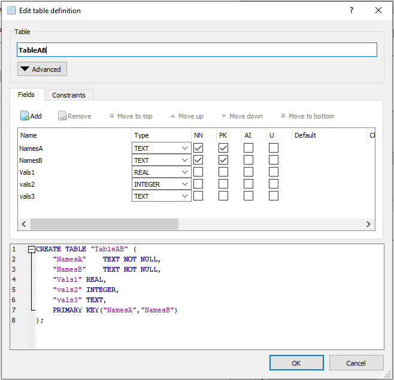

Create a static AIMMS Library from a runtime library
=====================================================

As you may know, runtime libraries offer enormous flexibility.
However, there are situations whereby the same runtime library is generated over and over again.
In these situations it is more efficient to generate the runtime library once and persist it.
The persisting only needs to rerun, when there is a change in the input defining the runtime library.

An example use case of that is when the context in which the app runs now and then changes slightly, 
for instance a database schema that changes by adding/removing tables, and/or adding/removing columns in tables.

This article provides an example of generating and persisting such a library on the one hand, and 
using it in another application.  In so doing, this article combines:

*   How databases can be queried for structure.

*   How runtime libraries can be used to generate code and persist code from such a structure.

*   How a DEX Client can be used to obtain a UUID.

*   How the put statement can be used to create a ``project.xml`` file.

The Story
-------------

In the database, occasionally table columns are added/removed/changed (type) to tables, or even tables are added/removed.
To facilitate easy reading of these tables, identifiers are created as follows:

* For a column that is a primary key, 

    * a set is created using the same name, but prefixed with ``s_``

    * an index is created using the same name, but prefixed with ``i_``

*   For a column that is not a primary key,

    * a parameter is created using the same name, but prefixed with

        *   ``p_`` if the column at hand is a numerical column, and

        *   ``sp_`` otherwise.

    * In addition, the index domain consists of the indices made up from the primary key.

To avoid name clashes due to columns with the same name, but used in different tables, a module is created for every table. 

A sample database table may look like:

Example generated code
^^^^^^^^^^^^^^^^^^^^^^^^^^^^^

The generated code for that table alone would be the following module:

.. code-block:: aimms 
    :linenos:

    Module modReadTableTableAB {
        Prefix: thisTableAB;
        DeclarationSection decls {
            Set s_NamesA {
                Index: i_NamesA;
            }
            Set s_NamesB {
                Index: i_NamesB;
            }
            Parameter p_Vals1 {
                IndexDomain: (i_NamesA, i_NamesB);
            }
            Parameter p_vals2 {
                IndexDomain: (i_NamesA, i_NamesB);
            }
            StringParameter sp_vals3 {
                IndexDomain: (i_NamesA, i_NamesB);
            }
            DatabaseTable db_TableAB {
                DataSource: sp_connectionString;
                TableName: "TableAB";
                Mapping: {
                    "NamesA"-->i_NamesA,
                    "NamesB"-->i_NamesB,
                    "Vals1"-->p_Vals1(i_NamesA, i_NamesB),
                    "vals2"-->p_vals2(i_NamesA, i_NamesB),
                    "vals3"-->sp_vals3(i_NamesA, i_NamesB)
                }
            }
        }
        Procedure pr_readThis {
            Body: {
                read from table db_TableAB ;
            }
        }
    }

The download
^^^^^^^^^^^^^^

:download:`Example download with AIMMS 4.92 apps <model/example.zip>` 

Once expanded, this example contains the following folders:

#.  ``data``: a SQLite database and ``.dsn`` file.

#.  ``GenReadLib`` an AIMMS application that queries the database for structure in the ``data`` folder.

#.  ``libs`` a folder in which the generated libraries are placed.

#.  ``LeverageReadLib`` an AIMMS application that uses a generated library as one of its libraries.

Generating the runtime library
-----------------------------------

Generating the runtime library uses:

*   `SQLNumberOfTables <https://documentation.aimms.com/functionreference/data-management/database-functions/sqlnumberoftables.html>`_ and 
    `SQLTableName <https://documentation.aimms.com/functionreference/data-management/database-functions/sqltablename.html>`_ to obtain the collection of tables.

*   `SQLNumberOfColumns <https://documentation.aimms.com/functionreference/data-management/database-functions/sqlnumberofcolumns.html>`_ and 
    `SQLColumnData <https://documentation.aimms.com/functionreference/data-management/database-functions/sqlcolumndata.html>`_ to obtain the columns and their 
    `characteristics <https://documentation.aimms.com/functionreference/predefined-identifiers/language-related-identifiers/alldatacolumncharacteristics.html>`_ : name, 
    data type, and whether it is a primary key.

With that information available, generating the runtime library can be coded using `model editing <https://documentation.aimms.com/functionreference/model-handling/model-edit-functions/index.html>`_ procedures. 
This is illustrated in the procedures in the section ``Generate Runtime Lib`` of the app ``GenReadLib``.

More information about runtime libraries can be found at:

*    `Runtime library reference <https://documentation.aimms.com/language-reference/advanced-language-components/model-structure-and-modules/runtime-libraries-and-the-model-edit-functions.html>`_

*    `Model editing procedures <https://documentation.aimms.com/functionreference/model-handling/model-edit-functions/index.html>`_ 

*    `How-to articles on (runtime) libraries <https://how-to.aimms.com/C_Developer/Sub_Language/sub_libraries/index.html>`_

Differences between runtime libraries and static libraries
-----------------------------------------------------------

To take advantage of the differences between runtime libraries and static libraries, code for the following is generated as well:

*   `Interface <https://documentation.aimms.com/language-reference/advanced-language-components/model-structure-and-modules/librarymodule-declaration-and-attributes.html#sec-module-library:~:text=of%20a%20library.-,The%20Interface%20attribute,-Through%20the%20Interface>`_ attribute.
    Here the identifiers declared in the ``Public Section`` are intended to be used from the outside, the contents of the interface attribute is ``Public_Section``.

*   Use of `initialization and termination <https://how-to.aimms.com/Articles/351/351-app-initialization-termination-with-libraries.html>`_ procedures such as ``LibraryInitialization``, ``LibraryPostInitialization``,  ``LibraryPreTermination``,  and ``LibraryTermination``.  
    They are typically not used in runtime libraries, but they are in static libraries.  
    As they are not normally called from outside the library, they are put in  a separate section within the ``Private Section`` of the library.

Persisting the library
--------------------------

To persist the library, the following functions are used:

*   `me::ExportNode <https://documentation.aimms.com/functionreference/model-handling/model-edit-functions/me_exportnode.html>`_

*   The DEX library for `consuming REST APIs <https://documentation.aimms.com/dataexchange/rest-client.html>`_ to make it a client of `UUIDTools: the REST API for UUIDs <https://www.uuidtools.com/>`_.  A UUID is needed in the project.xml file, generated next:

*   `The PUT statement <https://documentation.aimms.com/language-reference/data-communication-components/text-reports-and-output-listing/the-put-statement.html>`_ 
    to generate the file ``project.xml``.

Using the library
-------------------

*   In the leveraging app, ``AIMMS MEnu`` > ``File`` > ``Library Manager`` you can add the ``Existing Library``, by pointing to folder containing the library on your disk.  
    In the example, it is located in the ``libs`` folder next to the folders for the generation and leveraging apps. 

*   Direct use by name: In the app ``LeverageReadLib``, the procedure ``MainExecution`` can directly reference an identifier in the generated static lib: ``drl::pr_readAll();``

