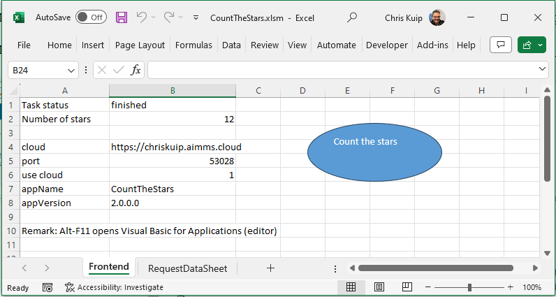
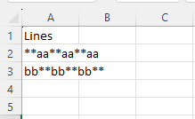

Using AIMMS Services with a VBA Client
========================================

AIMMS is an elaborate tool for modeling optimization problems.
Excel is a popular tool to model business problems.  
This article is about leveraging the power of AIMMS in EXCEL via HTTP requests.

Preparation
--------------

Excel comes with Visual Basic for Applications (VBA) permitting via the  
``WinHttp.WinHttpRequest.5.1`` library to leverage REST API services.

Preparing to create a VBA Client of your own using AIMMS REST API Tasks, you will have to:

#.  Enable some libraries, via the Visual Basic Editor (``Alt + F11``), :menuselection:`Tools > References`, most importantly:

    *   `Microsoft WinHTTP Services, version 5.1 <https://learn.microsoft.com/en-us/windows/win32/winhttp/about-winhttp>`_
    
        This library facilitates HTTP requests.
    
    *   `Microsoft Scripting Runtime <https://learn.microsoft.com/en-us/previous-versions/office/developer/office2000/aa155438(v=office.10)>`_
    
        Amongst others this library facilitates dictionaries.
    
    .. image:: images/vba-client-selected-tools-references.png
        :align: center

    |

#.  Download and `install The VBA JSON library <https://github.com/VBA-tools/VBA-JSON>`_.

Workbook
----------

In this section, a simple example of an end user interface of a VBA app that deploys the CountTheStars 
interface as implemented by an AIMMS app.

FrontEnd
^^^^^^^^^^

|

* Cell ``B1`` will contain the state of the request as it executes.

* Cell ``B2`` will contain the number of stars upon finishing the request.

* Cells ``B4-B8`` contain some additional info.

* The button labeled "Count the stars" will execute the ``CountTheSTars`` service in the AIMMS app.

RequestDataSheet
^^^^^^^^^^^^^^^^^^

This sheet contains sample input data.

VBA
----------

There are four steps, each detailed in separate subsection

Preparation
^^^^^^^^^^^^^^

Via the subroutine ``getConfig`` the configuration to be tested is read in following 
the conventions set out in :doc:`../585/585-example-conventions`

Initiate
^^^^^^^^^^^^^^^^^^^^

In this sub section, we'll handle submitting a request for executing a task using VBA.

The code to initiate an AIMMS task is:

.. code-block:: basic 
    :linenos:

    Sub RequestCountTheStars_usingWinHTTP51(apiURL As String, apiKey As String, useCloud As Integer, JsonString As String, ByRef taskId As String)
    '
    ' Use the WinHTTP51 library to actually do a POST on the apiURL for running a task.
    '

        ' Open the connection and set the method to POST
        Http.Open "POST", apiURL, False

        ' Set the request headers
        If useCloud Then
            Http.SetRequestHeader "apikey", apiKey
        End If
        Http.SetRequestHeader "Content-Type", "application/json"
        
        ' Send the request
        Http.Send JsonString
        
        If Http.Status = 200 Then
            ' Request successful
            Dim JsonRT As String
            JsonRT = Http.responseText
            Dim Parsed As Object
            Set Parsed = JsonConverter.ParseJson(JsonRT)
            taskId = Parsed("id")
        Else
            Debug.Print "RequestCountTheStars(): Failure: " & Http.Status & " " & Http.StatusText
        End If

    End Sub

Here the ``apiURL`` is obtained via the subroutine ``DetURLTaskPostRequest``, 
following :doc:`../585/585-development-architecture` for constructing ``url_submit``.

Monitor
^^^^^^^^^^^^^^^^^^^^

The code to monitor the task is:

.. code-block:: basic 
    :linenos:

    Sub PollOnce_usingWinHTTP51(apiURL As String, apiKey As String, useCloud As Integer, ByRef taskState As String)
    '
    ' Use the WinHTTP51 library to do a get on the running task, to obtain a task status.
    '

        ' Open the connection and set the method to POST
        Http.Open "GET", apiURL, False

        ' Set the request headers
        If useCloud Then
            Http.SetRequestHeader "apikey", apiKey
        End If
        
        ' Send the request
        Http.Send
        
        If Http.Status = 200 Then
            ' Request successful
            Debug.Print Http.responseText
            Dim JsonRT As String
            JsonRT = Http.responseText
            Debug.Print "PollOnce_usingWinHTTP51, response is: ", JsonRT
            Dim Parsed As Object
            Set Parsed = JsonConverter.ParseJson(JsonRT)
            taskState = Parsed("state") ' Set output argument this procedure
        Else
            Debug.Print "PollOnce_usingWinHTTP51, Failure: " & Http.Status & " " & Http.StatusText
        End If

    End Sub

Here the ``apiURL`` is obtained via the subroutine ``PollOnceDetermineURL``, 
following :doc:`../585/585-development-architecture` for constructing ``url_poll``.

Receive Result
^^^^^^^^^^^^^^^^^^^^

The code to receive the result is:

.. code-block:: basic 
    :linenos:

    Sub ReceiveResponse_usingWinHTTP51(apiURL As String, apiKey As String, useCloud As Integer, ByRef noStars As Integer)
    '
    ' Do a GET on on the URL for receiveing the response of a task, thus finally getting the results of the task.
    '
        ' Open the connection and set the method to POST
        Http.Open "GET", apiURL, False

        ' Set the request headers
        If useCloud Then
            Http.SetRequestHeader "apikey", apiKey
        End If
        
        ' Send the request
        Http.Send
        
        If Http.Status = 200 Then
            ' Request successful
            Dim JsonRT As String
            JsonRT = Http.responseText
            Dim Parsed As Object
            Set Parsed = JsonConverter.ParseJson(JsonRT)
            noStars = Parsed("count")
            Debug.Print "ReceiveResponse_usingWinHTTP51(): Received response, no stars = ", noStars
        Else
            Debug.Print "ReceiveResponse_usingWinHTTP51(): Failure: " & Http.Status & " " & Http.StatusText
        End If

    End Sub

Here the ``apiURL`` is obtained via the subroutine ``ReceiveResponseDetermineURL``, 
following :doc:`../585/585-development-architecture` for constructing ``url_response``.

References
---------------

#.  `Getting started with VBA in Office <https://learn.microsoft.com/en-us/office/vba/library-reference/concepts/getting-started-with-vba-in-office>`_

#.  The `VBA JSON library <https://github.com/VBA-tools/VBA-JSON>`_

#.  `Youtube video Use Excel VBA to Read API Data <https://www.youtube.com/watch?v=KZeYKZJzQIk>`_

.. note:: 

    This article also provides an alternative for the deprecation of ``aimmscom``.

    Using AIMMS as an optimization tool inside an Excel workbook used to be facilitated 
    via the Microsoft COM interface, but is now deprecated, see also 
    `Deprecation Table <https://documentation.aimms.com/deprecation-table.html>`_ .

 

