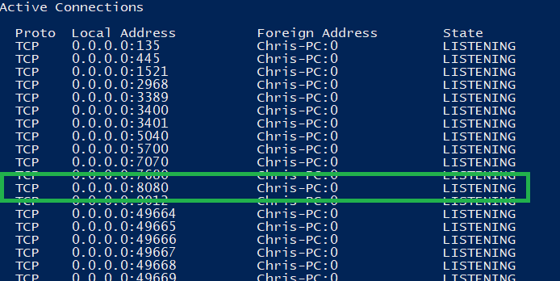

Develop, Test, and Deploy a Service
===================================

.. Should be introduction, and just provide overview.
.. Should introduce two applications:
.. 1. CountTheStars
.. 2. FlowshopDatabase

There are several aspects to developing, testing and deploying a service.
That is why this example consists of several components, and each component is described in a separate article.

Developing a service, requires:

#.  Implementation: An implementation of that service.  Which we will do using an AIMMS project. 

#.  Usage: An example client application that uses that service.  Which we will do using applications in various programming languages.

#.  Deployment:

    There are two ways of deploying a service in an AIMMS project:
    
    #.  Via AIMMS Developer.  This is ideal for development of a service; `just start the service <https://documentation.aimms.com/dataexchange/rest-server.html#activating-the-rest-service>`_ 

    #.  Via the AIMMS Cloud.  This is useful for users of the service that do not need access to the source code of that service.

    

Story
------

The service developed is intentionally trivial; count the number of ``*``'s in a couple of lines.
This story is chosen as it is trivial to test whether the response given by the service is correct.

Note that a service implemented in AIMMS can also implement an interesting optimization model; 
however, optimization applications are outside the scope of this article.

Overview
----------

#.  Coding the service, making it available for testing on your laptop, and deploy it on an AIMMS Cloud.

#.  Essential to testing a service are the URL's to be constructed that access the service at hand.

#.  Instead of detailing in various languages how Clients should be coded, we've enumerated the existing sample clients.

Activating the service locally
^^^^^^^^^^^^^^^^^^^^^^^^^^^^^^^^^^^

With the definition and implementation in place, you can activate the service on you laptop. 
For this you will need to call `dex::api::StartAPIService <https://documentation.aimms.com/dataexchange/api.html#dex-api-StartAPIService>`_ .

After calling this procedure (for instance by running the procedure ``pr_startService`` of the sample app), you can verify that the service is available using 
``netstat -a`` in a command prompt.  This should give that port 8080 is being listened to:

You can configure the port number and max request size if needed, see `this documentation <https://documentation.aimms.com/dataexchange/rest-server.html#activating-the-rest-service>`_ for details.

Activating the service on an AIMMS cloud
^^^^^^^^^^^^^^^^^^^^^^^^^^^^^^^^^^^^^^^^^^

Creating an ``.aimmspack`` from your server app and publishing it on an AIMMS cloud suffices to make the service available on that AIMMS Cloud.
After publishing on an AIMMS Cloud, it is not needed to call ``dex::api::StartAPIService`` for activating the service.

URL's for Clients 
------------------

To test a service, a client can cater for two variations:

#.  The URL to the localhost, when the service is activated locally.

#.  The URL to the AIMMS Cloud, when the service is activated by publishing the app that implements the service.

The distinction for the variations is made in the first part of the URL's used.

In addition, to handle a task, there are three steps:

#.  Submit a task, the response will be a task identification.

#.  Poll for the task status while it is queued or running, the response will be a brief status overview.

#.  Retrieve the response of the task, the response will contain the awaited for answer.

The distinction is made in the second part of the URL's used.

Let's assume that:

#.  ``port`` contains the port number, typically 8080,

#.  ``cloud`` contains the name of an AIMMS cloud, for instance ``chriskuip.aimms.cloud``,

#.  ``app`` contains the name of the app when published on an AIMMS cloud, here ``CountTheStars``,

#.  ``ver`` contains the version of the app at hand, for instance ``1.0.1.0``,

#.  ``service`` contains the name of the service,

#.  ``taskid`` contains the identification of a task submitted, for instance ``1f972631-68bf-4dcf-80b9-60d0757aeb47``, 

Then the variations can be handled by the ``url_prefix``, by defining it as:

#.  On Cloud: ``https://{cloud}//pro-api/v1/tasks/``

#.  On local host: ``http://localhost:{port}/api/v1/tasks/``

With this prefix, the URL's for each of the steps in handling a task are:

#.  ``url_submit``, is the URL to submit a task:

    #. On Cloud: ``{url_prefix}/{app}/{ver}/{service}``

    #. On local host: ``{url_prefix}/{service}``

#.  ``url_poll``, is the URL to poll for the status of a task: ``{url_prefix}/{taskid}``

#.  ``url_response`` is the URL for the response of a task: ``{url_prefix}/{taskid}/response``

Available Client implementations
-----------------------------------

#.  **Python**: 

#.  **AIMMS**: The AIMMS 4.95 client relies on the `AimmsDEX <https://documentation.aimms.com/dataexchange/index.html>`_ library.

    An AIMMS app that tests the ``countStars`` service: :download:`AIMMS 4.94 Client project <model/AimmsClient.zip>`
    
    
References
------------

    #.  AIMMS PRO REST API method documentation:
    
        #. Obtain a .json file describing the `OpenAPI 3.0 specification of AIMMS PRO REST API <https://documentation.aimms.com/cloud/rest-api.html#:~:text=OpenAPI%20specification%20of%20the%20AIMMS%20PRO%20REST%20API>`_ for your AIMMS Cloud environment.
        
        #. Import that .json file using the online `Swagger Editor <https://editor-next.swagger.io/>`_
        
    #.  The `AIMMS DataExchange library <https://documentation.aimms.com/dataexchange/index.html>`_, in particular `Providing REST APIs <https://documentation.aimms.com/dataexchange/rest-server.html>`_.