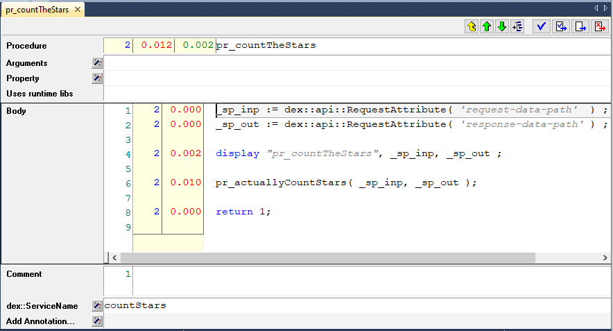

Develop, Test, and Deploy a Service
===================================

As a developer of a service; you want to have clients available that can test that service; both 
during development of that service and thereafter, after deploying the service.

This article illustrates how to build a client app that can test your service; 
both during development and when it is published. 

Story
------

The service developed is intentionally trivial; count the number of ``*`` in a couple of lines.
This story is chosen as it trivial to actually test whether the answer given is correct.

Overview
----------

#.  Coding the service, making it available for testing on your laptop, and deploy it on an AIMMS Cloud.

#.  Essential to testing a service are the URL's to be constructed that access the service at hand.

#.  Instead of detailing in various languages how Clients should be coded, we've enumerated the existing sample clients.

The service
------------

The AIMMS app that provides the service: :download:`AIMMS 4.94 server project <model/CountTheStars.zip>` 

implementing service
^^^^^^^^^^^^^^^^^^^^^^

We are assuming here that you have developed a service; to count the number of `*` is a dictionary of lines.

remarks:

* The arguments denote the name of the input and output files.

* Lines 3-8: reading of input

* Line 10: the actual computation

* Lines 13-16: writing the output

.. tip:: The procedure `ProfilerStart <https://documentation.aimms.com/functionreference/development-support/profiler-and-debugger/profilerstart.html>`_ is called in ``MainInitialization`` enabling tracking task invocations, and task performance.

definition of service
^^^^^^^^^^^^^^^^^^^^^^

A service is defined by associating a service name with an AIMMS procedure, as illustrated below:

Remarks:

* The annotation ``dex::ServiceName`` associates the procedure ``pr_countTheStars`` with the service ``countStars``

* Lines 1-2: copy the name of the input file and output file to local string parameters.

* Line 6: Call the workhorse (see sub section above).

Activating the service locally
^^^^^^^^^^^^^^^^^^^^^^^^^^^^^^^^^^^

With the definition and implementation in place, you can activate the service on you laptop. 
For this you will need to call `dex::api::StartAPIService <https://documentation.aimms.com/dataexchange/api.html#dex-api-StartAPIService>`_ .

After calling this procedure (for instance by running the procedure ``pr_startService`` of the sample app), you can verify that the service is available using 
``netstat -a`` in a command prompt.  This should give that port 8080 is being listened to:

.. image:: images/netstat.png
    :align: center

You can configure the port number and max request size if needed, see `this documentation <https://documentation.aimms.com/dataexchange/rest-server.html#activating-the-rest-service>`_ for details.

Activating the service on an AIMMS cloud
^^^^^^^^^^^^^^^^^^^^^^^^^^^^^^^^^^^^^^^^^^

Creating an ``.aimmspack`` from your server app and publishing it on an AIMMS cloud suffices to make the service available on that AIMMS Cloud.
After publishing on an AIMMS Cloud, it is not needed to call ``dex::api::StartAPIService`` for activating the service.

URL's for Clients 
------------------

To test a service, a client can cater for two variations:

#.  The URL to the localhost, when the service is activated locally.

#.  The URL to the AIMMS Cloud, when the service is activated by publishing the app that implements the service.

The distinction for the variations is made in the first part of the URL's used.

In addition, to handle a task, there are three steps:

#.  Submit a task, the response will be a task identification.

#.  Poll for the task status while it is queued or running, the response will be a brief status overview.

#.  Retrieve the response of the task, the response will contain the awaited for answer.

The distinction is made in the second part of the URL's used.

Let's assume that:

#.  ``port`` contains the port number, typically 8080,

#.  ``cloud`` contains the name of an AIMMS cloud, for instance ``chriskuip.aimms.cloud``,

#.  ``app`` contains the name of the app when published on an AIMMS cloud, here ``CountTheStars``,

#.  ``ver`` contains the version of the app at hand, for instance ``1.0.1.0``,

#.  ``service`` contains the name of the service,

#.  ``taskid`` contains the identification of a task submitted, for instance ``1f972631-68bf-4dcf-80b9-60d0757aeb47``, 

Then the variations can be handled by the ``url_prefix``, by defining it as:

#.  On Cloud: ``https://{cloud}//pro-api/v1/tasks/``

#.  On local host: ``http://localhost:{port}/api/v1/tasks/``

With this prefix, the URL's for each of the steps in handling a task are:

#.  ``url_submit``, is the URL to submit a task:

    #. On Cloud: ``{url_prefix}/{app}/{ver}/{service}``

    #. On local host: ``{url_prefix}/{service}``

#.  ``url_poll``, is the URL to poll for the status of a task: ``{url_prefix}/{taskid}``

#.  ``url_response`` is the URL for the response of a task: ``{url_prefix}/{taskid}/response``

Available Client implementations
-----------------------------------

#.  **Python**: The Python 3.10 client relies heavily on the `requests <https://requests.readthedocs.io/en/latest/>`_ module.

    A Python app that tests the ``countStars`` service:  :download:`Python code <model/main.py>` 

#.  **AIMMS**: The AIMMS 4.94 client relies on the `AimmsDEX <https://documentation.aimms.com/dataexchange/index.html>`_ library.

    An AIMMS app that tests the ``countStars`` service: :download:`AIMMS 4.94 Client project <model/AimmsClient.zip>`