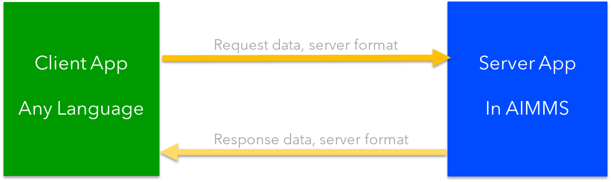

Development architecture of an AIMMS Service
==============================================

The development of an AIMMS service is based on the usual client-server architecture:

Here the implementation language of the server is filled in: AIMMS.

The important parts of this generic architecture to be detailed are:

#.  Where is the host of the service provided?

#.  How do clients communicate with the service provided?

Each of these two parts will be detailed in a separate section below:

Hosting the service
---------------------

An AIMMS service can be hosted on:

#.  **localhost**: A Windows machine with AIMMS Developer, or

#.  **AIMMS Cloud**: An AIMMS cloud environment which includes a tailored AIMMS PRO.

The specifics of hosting your application in these two environments are provided in the two subsections below:

Using localhost to host your AIMMS service
^^^^^^^^^^^^^^^^^^^^^^^^^^^^^^^^^^^^^^^^^^^^ 

Assuming the :doc:`services are defined <../585/585-AIMMS-server-app>` in your application you can activate the service 
from within AIMMS Developer using `dex::api::StartAPIService <https://documentation.aimms.com/dataexchange/api.html#dex-api-StartAPIService>`_ .

After calling this procedure (for instance by running the procedure ``pr_startService`` of the sample app), you can verify that the service is available using 
``netstat -a`` in a command prompt.  This should give that port 8080 is being listened to:

.. image:: images/netstat.png
    :align: center

You can configure the port number and max request size if needed, 
see `this documentation <https://documentation.aimms.com/dataexchange/rest-server.html#activating-the-rest-service>`_ for details.

Using AIMMS Cloud to host your AIMMS service
^^^^^^^^^^^^^^^^^^^^^^^^^^^^^^^^^^^^^^^^^^^^

Creating an ``.aimmspack`` from your server app and publishing it on an AIMMS cloud suffices to make the service available on that AIMMS Cloud.
After publishing on an AIMMS Cloud, it is not needed to call ``dex::api::StartAPIService`` for activating the service.

Communication by clients of an AIMMS service
---------------------------------------------

The time needed to solve an optimization problem varies from seconds to hours.
Therefor the service to solve an optimization problem is separated into the following steps:

#.  **Submit**: Initiate the solving of an optimization problem by providing the necessary data.

#.  **Monitor**: Regularly poll the status of the job at hand.

#.  **Retrieve**: Retrieve results.

The server process that is initiated, monitored, and retrieved is called a task in AIMMS PRO REST API terminology.

 

The URL prefix
^^^^^^^^^^^^^^^^^^^^

Then the variations can be handled by the ``url_prefix``, by defining it as:

#.  On Cloud: ``https://{cloud}/pro-api/v1/tasks/``

    #.  Needed: apiKey header when using this ``url_prefix``.

#.  On local host: ``http://localhost:{port}/api/v1/tasks/``

    #.  Don't provide apiKey header when using this ``url_prefix``.

The HTTP requests
^^^^^^^^^^^^^^^^^^^^^^^^^^

With this prefix, the HTTP requests are:

#.  **Submit** Initiate a task.

    ``url_submit``, is the URL to submit a task:

    #. On Cloud: ``{url_prefix}/{app}/{ver}/{service}``

    #. On local host: ``{url_prefix}/{service}``
    
    The request body should provide the data to execute the task. 
    Clearly, this data can contain references for a database or data lake to obtain the actual data.
    
    The response body is a task id, and this task id is used in the following steps.

#.  **Monitor**  Monitor a task.

    ``url_poll``, is the URL to poll for the status of a task: ``{url_prefix}/{taskid}``
    
    There is no request body, and the response body is a Json file containing the task status amongst others.

#.  **Retrieve** Retrieve response

    ``url_response`` is the URL for the response of a task: ``{url_prefix}/{taskid}/response``

    There is no request body, and the response body is defined by the service at hand.

Next
-----------

:doc:`../585/585-example-conventions`

.. spelling:word-list::

    apiKey

