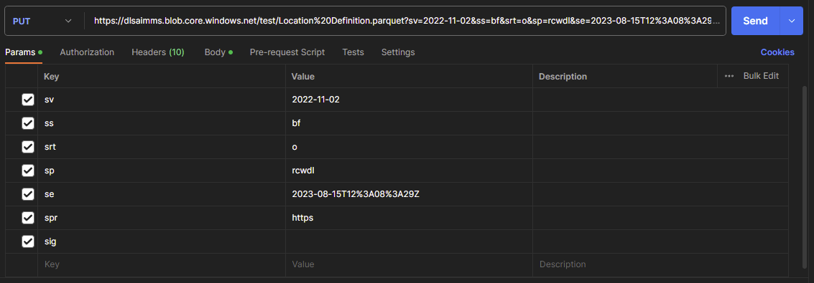
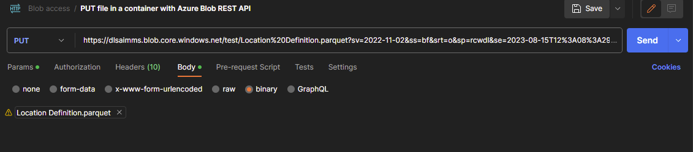
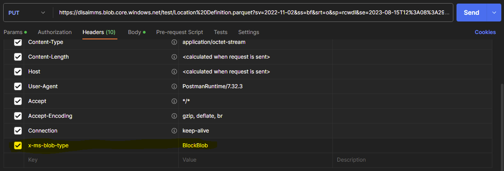

How to access the Azure Data Lake Storage from an external location
=======================================================================

You can store structured and unstructured files on the **Azure Data Lake Storage Gen2 (ADLS)** that is, by default, part of your AIMMS Cloud account. On one hand this makes it easy to save the results from your optimization in a file and to expose that file through the ADLS so it can be picked up from an external location. It can also be used the other way around; to put files onto the ADLS that hold data that need to be used within your AIMMS model(s). 

Either way you will want to access the ADLS without necessarily being logged in on the AIMMS Cloud, or because you want to automate a process where, for example, an API will take care of putting a file onto the storage. 

This article demonstrates one way of accessing the ADLS from an external source.

 
Prerequisites
---------------

#. In this example we will be using `Postman <https://www.postman.com/>`_ to manage the requests. If you want to reproduce this example, or build a flow where you push data from an external source, we recommend having **some software or tool with which you can test and configure outgoing API requests**.

#. You can use **our ADLS toolkit app** to validate the existing files and file structures on the ADLS (e.g. to check if the file you've sent is visible on the storage). `Visit the toolkit page here <https://how-to.aimms.com/Articles/598/598-datalake-tools.html>`__.

#. To communicate with the ADLS we are using the `related Azure Data Lake API <https://learn.microsoft.com/en-us/rest/api/storageservices/data-lake-storage-gen2>`_ and the `Azure Blob REST API <https://learn.microsoft.com/en-us/rest/api/storageservices/blob-service-rest-api>`_ - creating a **SAS token for each request for authentication**. We discuss SAS tokens in further detail in one of the chapters below, but for the creation of a SAS token it is necessary to be able to compute a string using the SHA256 algorithm, and to encode that string by using Base64 encoding. There are default tools available for this, but you can also use the ADLS toolkit app to create a SAS token.

Requesting a list of the file systems
---------------------------------------

Before we put a file onto the storage, we will first use a request to retrieve a list of the currently available file systems (or: containers) on the ADLS as we'll need to put the file into one of these. 

We can use `the GET request for listing file systems <https://learn.microsoft.com/en-us/rest/api/storageservices/datalakestoragegen2/filesystem/list>`_ for this:

.. code-block:: guess
	
	GET https://{accountName}.{dnsSuffix}/?resource=account

* The **accountName** is the name of your ADLS storage account. If you don't know what this name is, you can use the toolkit app to retrieve it. In our example we will use the name 'dlsaimms'.
* The **dnsSuffix** is often 'dfs.core.windows.net' (as it is in this example too).
* The parameter **resource=account** is required by the API.

For our example the URI will look like this:

.. code-block:: guess
	
	GET https://dlsaimms.dfs.core.windows.net/?resource=account

Now for authentication we will need to add a SAS token. In our example we will use an Account SAS token. This token is added as an extension of the URI and consists of several parameters. We'll show what the full URI looks like here and then describe the parameters in more detail in the next chapter:

.. code-block:: guess
	
	GET https://dlsaimms.dfs.core.windows.net/?resource=account&sv=2022-11-02&ss=b&srt=s&sp=l&se=2023-08-10T16%3A41%3A12Z&spr=https&sig=[signature]

A successful request will result in a JSON-formatted list of file systems on the ADLS:

.. code-block:: json

	"filesystems": [
        {
            "DefaultEncryptionScope": "$account-encryption-key",
            "DenyEncryptionScopeOverride": "false",
            "etag": "0x8DB9821A05F014B",
            "lastModified": "Tue, 08 Aug 2023 15:10:39 GMT",
            "name": "dlsaimmscontainer"
        },
        {
            "DefaultEncryptionScope": "$account-encryption-key",
            "DenyEncryptionScopeOverride": "false",
            "etag": "0x8DB98227B582D0B",
            "lastModified": "Tue, 08 Aug 2023 15:16:46 GMT",
            "name": "fs-9fa41300-eb70-468f-ae4d-61fcdc115124"
        },
        {
            "DefaultEncryptionScope": "$account-encryption-key",
            "DenyEncryptionScopeOverride": "false",
            "etag": "0x8DB9CCF6B4F93D0",
            "lastModified": "Mon, 14 Aug 2023 14:04:47 GMT",
            "name": "test"
        }
	]
	
A bit more information on SAS tokens
---------------------------------------

A full overview of the description of the parameters that are used in a SAS token can be `found on this page <https://learn.microsoft.com/en-us/rest/api/storageservices/create-account-sas#construct-an-account-sas-uri>`_. Each request could require its own SAS token as the values of the parameters might change, depending on the service you are using (listing a file system requires a different level of access than putting a file, for example) or even the type of SAS token you are creating. If you are going to use the Azure Data Lake Storage API we `recommend reading through the related documentation about SAS tokens <https://learn.microsoft.com/en-us/rest/api/storageservices/delegate-access-with-shared-access-signature>`_.

The signature part of a SAS token is secured using the storage account key. If you don't know the value of this key and cannot use the `ADLS toolkit application <https://how-to.aimms.com/Articles/598/598-datalake-tools.html>`__ to create a SAS for you, you can `contact support <mailto:support@aimms.com>`__.

Looking back to the example of getting the file systems, we are using the following parameter-value combinations:
 
* **sv:** the signed storage service version to use to authorize requests.
* **ss:** the service that this SAS gives access to. In this example, 'b' stands for 'blob', indicating access to the blob storage.
* **srt:** specifies the signed resource types that are accessible. In this example we use the value 's' as we need access to the service-level API.
* **sp:** the signed permissions for the account SAS. These need to match with the specified signed resource type; in this example it is 'l' as we are using the List request.
* **se:** the end date of the SAS token, formatted as yyyy-mm-ddThh:mm:ssZ in UTC time (where, in our example, %3A is the HTML-friendly replacement of ':'). In DEX the function :any:`dex::client::az::ExpiryDateFromNow` was introduced to ease the construction of this argument.
* **spr:** optional, but added here to specify we are making a https request.
* **sig:** the value for the signature is a unique string that's constructed from the fields that must be verified to authorize the request. It is a hash-based message authentication code (HMAC) that's computed over the string-to-sign combined with the storage access key by using the SHA256 algorithm. The result of that is encoded by using Base64 encoding. There are tools available for this, but we highly recommend using our ADLS toolkit to create a SAS token. 

Pushing a file to the ADLS
---------------------------------

We need to use `the PUT blob request <https://learn.microsoft.com/en-us/rest/api/storageservices/put-blob>`_ from the Azure Blob Service REST API as this API allows us to put a 'blob' (file) with contents into our ADLS:

.. code-block:: guess

	PUT https://myaccount.blob.core.windows.net/mycontainer/myblob

* **myaccount** is the name of your ADLS storage account. If you don't know what this name is, you can use the toolkit app to retrieve it.
* **mycontainer** is the name of the container you want to put the file into. As we've seen in the result of the previous request, we can use 'dlsaimmscontainer', 'fs-9fa41300-eb70-468f-ae4d-61fcdc115124' or 'test'.
* **myblob** refers to the file that is going to be pushed onto the ADLS. In our case this file is called 'Location Definition.parquet' and added as a binary object to the body of the request in Postman.

Taking these arguments into consideration, the URI will look like:

.. code-block:: guess

	PUT https://dlsaimms.blob.core.windows.net/test/Location%20Definition.parquet

Important to note here is that a required header needs to be added to this request:

.. code-block:: none

	x-ms-blob-type: <BlockBlob ¦ PageBlob ¦ AppendBlob>

In our case, we will choose the value 'BlockBlob' as we are adding a new file.

Of course we will also need to add our SAS token for authentication, consisting of the following values for the parameters:

* **sv** = 2022-11-02 (signed storage service version)
* **ss** = bf (we want to access blob and file system)
* **srt** = o (we are putting an Object so need access to an object-level API)
* **sp** = rwc (we'll need Read, Write and Create permissions for this request)
* **se** is the end date of the SAS token, formatted as yyyy-mm-ddThh:mm:ssZ in UTC time (where, in our example, %3A is the HTML-friendly replacement of ':'). In DEX the function :any:`dex::client::az::ExpiryDateFromNow` was introduced to ease the construction of this argument
* **spr** = optional, but added here to specify we are making a https request
* **sig** = the string-to-sign is a unique string that's constructed from the abovementioned fields that must be verified to authorize the request. The signature is a hash-based message authentication code (HMAC) that's computed over the string-to-sign and storage access key by using the SHA256 algorithm, and then encoded by using Base64 encoding. There are tools available for this, but we highly recommend using our ADLS toolkit to create a SAS token

Making our eventual request:

.. code-block:: guess
	
	PUT https://dlsaimms.blob.core.windows.net/test/Location%20Definition.parquet?sv=2022-11-02&ss=bf&srt=o&sp=rwc&se=2023-08-15T12%3A08%3A29Z&spr=https&sig=[signature]

Some screenshots from Postman:

   
   The parameters as used in the URI for the SAS token. 'd' and 'l' were added to the 'sp' parameter, but are not necessary

   
   The body that is holding the file we want to put on the storage

   
   The headers for the request, showing the required 'x-ms-blob-type' header

If the request succeeded you will get a 201 Created response, meaning the file is now stored in the 'test'-container on the ADLS.
From here it can be accessed from within an AIMMS application for further usage. You can read more about this process in <a future article>.

.. spelling:word-list::

    dex
	SAS
	ADLS
	blobs
	blob
	blockblob
	dnsSuffix
	dfs
	eb
	ae
	sv
	ss
	srt
	sp
	se
	spr
	sig
	rwc
	'test'-container
	string-to-sign
	HTML-friendly
	hash-based
	SHA256
	Base64
	dlsaimms
	yyyy
	ddThh
	ssZ
	dlsaimmscontainer
	fs
	eb70-468f-ae4d-61fcdc115124ae
	fcdc
	abovementioned

