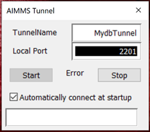

Connecting to and using the AIMMS Cloud database
=================================================

This article describes several ways to connect to the AIMMS Cloud database. The AIMMS Cloud database is a MySQL database and is an optional addition to the AIMMS Cloud, intended for data storage and to interact with AIMMS applications uploaded to the same cloud. The link to the database always looks like this: [nameofyourcloud].db.aimms.cloud. This database is **not** publicly available unless Option 3 is implemented. If you currently do not have this database, but you would like to use it, please `contact us <mailto:support@aimms.com>`__. 

After you have established a successful connection we recommend using the `Data Exchange Library <https://documentation.aimms.com/dataexchange/sqldb.html>`_ to map the data correctly onto your AIMMS model.
You can also use AIMMS database functions to interact with the data in the database - examples of their usage can be found `here <https://how-to.aimms.com/Articles/344/344-sparse-execution-for-write-to-table.html#write-data-to-a-table>`_ and `another one here <https://how-to.aimms.com/Articles/554/554-direct-sql-example.html>`_.

Option 1: Use SQLCreateConnectionString
~~~~~~~~~~~~~~~~~~~~~~~~~~~~~~~~~~~~~~~~~~~~~

When you want to connect to the AIMMS Cloud database from an AIMMS application that is uploaded to that same cloud, you can use the function :aimms:func:`SQLCreateConnectionString`:

.. code-block:: aimms 
    :linenos:

    :=  SQLCreateConnectionString (
            DatabaseInterface              :  'odbc',
            DriverName                     :  "[driver name]", !One of the available drivers on the AIMMS Cloud, or a local driver on your PC, see remarks
            ServerName                     :  "[nameofyourcloud].db.aimms.cloud", 
            DatabaseName                   :  "TestTable", !The name of your database
            UserId                         :  "[username]", !The username registered in the database
            Password                       :  "[password]", !The password for the user
            AdditionalConnectionParameters :  "") !E.g. a port, always in format 'KEYWORD=VALUE';

Remarks:

- There are multiple ODBC drivers available on the cloud that you can use for the 'driver' argument. With `this app <https://how-to.aimms.com/Articles/539/539-which-odbc-drivers.html#which-odbc-drivers>`_ (uploaded to the same cloud) you can get an overview of the available drivers. You can also use this app locally to get an overview of available drivers on your machine. If you are testing locally (e.g. with the DB Tunnel app open: see option 2), make sure to update the DriverName argument to match the driver of your local machine. 

Option 2: Use the DB Tunnel app
~~~~~~~~~~~~~~~~~~~~~~~~~~~~~~~~~

You can use the AIMMS DB Tunnel app to open a connection from your local computer to the AIMMS Cloud database. This connection will only remain active for as long as you are logged into the AIMMS Cloud, the Tunnel App remained open and has not been stopped. 

:download:`DB Tunnel app as AIMMS 4.74 aimmspack <downloads/DBTunnel AIMMS 4.74.aimmspack>`

All you need to do is publish this application with **AIMMS Version 4.66.2 or higher** on your PRO Portal and configure the Tunnel from the `Configuration <https://manual.aimms.com/pro/admin-config-1.html#tunnels>`_ menu. See also `Tunneling Support <https://manual.aimms.com/pro/tunneling.html>`_ for more details on Tunnels.

For example, if your app database is called ``example.db.aimms.cloud`` then your Tunnel configuration and DB Tunnel App would be as shown:

	

	
Where '*TunnelName*' is URI Context Path and '*Local Port*' can be any port between **1 to 65536**. 

You can Start/Stop Tunnel using **Start** and **Stop** buttons. Once you have provided '*TunnelName*' and '*Local Port*', you do not need to click **Start** or **Stop** each time. You can check '*Automatically connect at startup*' parameter, then tunnel can be started automatically upon launching the application. 

When you close the application tunnel will be also closed.

We have further enhanced DB Tunnel App such that it can report errors when it can not start the tunnel. Example scenarios/error messages are:

	* When the local port is already in use on the same machine by any other application. -- ``pro::tunnel::TunnelStart : while binding to tcp://localhost:3306``
	* When AIMMS PRO User does not have access to the Tunnel. -- ``pro::tunnel::TunnelStart : Access denied``
	* When TunnelName is not found. -- ``pro::tunnel::TunnelStart : Tunnel not found``
	

We recommend using an application like MySQL Workbench ``www.mysql.com/products/workbench`` to interact with the database once your connection is established. You can add a new connection there, filling out the highlighted details (port should be equal to what you have set in your DB Tunnel App):

	
For the 'Hostname' you can use 127.0.0.1, localhost or the link to your database ([nameofyourcloud].db.aimms.cloud).

Option 3: Use a VPN configuration
~~~~~~~~~~~~~~~~~~~~~~~~~~~~~~~~~~~

If you want to access the database from any source outside of the AIMMS Cloud, a VPN is necessary. Consult our data integration page to determine if this is the best option for you, or `contact us <mailto:support@aimms.com>`__ directly if you want to know more about this option.

.. spelling:word-list::

    nameofyourcloud
	aimms
	hardcoded
	hardcode