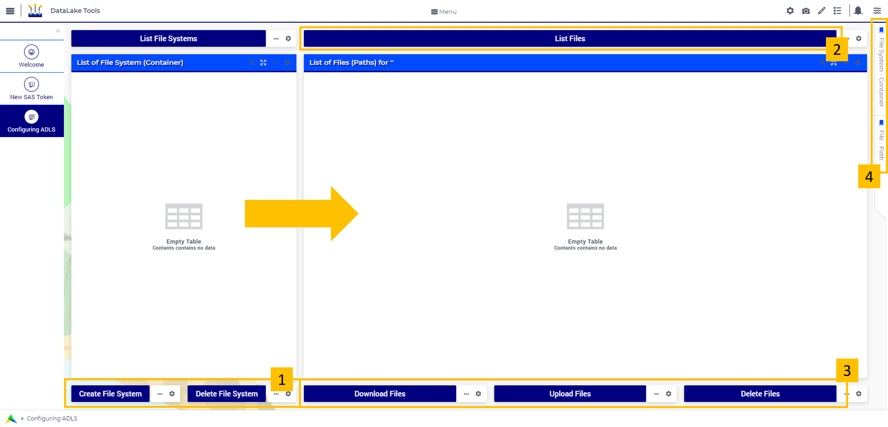

DataLake Tools
=================

.. meta::
   :keywords: datalake, azure, sas token, container, data integration, file system, file management
   :description: This article is for developers who want to integrate the Azure Data Lake Storage as part of their AIMMS account.

.. image:: https://img.shields.io/badge/AIMMS_4.96-ZIP:_DataLake Tools-blue
   :target: https://github.com/aimms/datalake-tools/archive/refs/heads/main.zip

.. image:: https://img.shields.io/badge/AIMMS_4.96-Github:_DataLake Tools-blue
   :target: https://github.com/aimms/datalake-tools

.. image:: https://img.shields.io/badge/AIMMS_Community-Forum-yellow
   :target: https://community.aimms.com/aimms-pro-cloud-platform-43/datalake-tools-1520

.. image:: images/data-lake.png
   :scale: 30
   :align: right
   :alt: DataLake Tools

Introduction
-------------
Every AIMMS Cloud account is by default equipped with an Azure Data Lake Storage Gen2 (ADLS). 
You can use this storage account to store all types of files that you want to integrate with your AIMMS application. 
You can also use it to store files generated based on the output of your optimizations, as to make them available to an external source.

The `Data Exchange Library <https://documentation.aimms.com/dataexchange/api.html#data-lake-storage-file-systems>`__ offers functions to easily interact with the ADLS.  

This toolkit offers you the possibility to easily create a SAS token which is needed for authentication if you want to access the ADLS from an external source. 
It also allows you to fetch and manage the currently known file systems ('containers') on the ADLS and the paths (folders) and files in it. 

Instructions 
-------------

This chapter is divided into three sections:

#. Application Preparation
#. Understanding 'New SAS Token' Page
#. Understanding 'Configuring ADLS' Page

Application Preparation
~~~~~~~~~~~~~~~~~~~~~~~
To use this application, you can either:

#. Use it on the cloud: 

Download this toolkit and upload it to your cloud. From there, there is no further need for authentication - the Data Exchange library will automatically extract the storage account name and access key of the Data Lake Storage account associated with your AIMMS Cloud account. 
Read more about the ADLS for the AIMMS Cloud `here <https://documentation.aimms.com/dataexchange/dls.html>`_. 

#. Use it locally:

Download this toolkit and open ``api-init/Data_Lake_Storage.txt``. Add your ``StorageAccessKey`` and ``StorageAccount`` replacing ``"add_name_here"`` string. Open the project. 

Understanding 'New SAS Token' Page
~~~~~~~~~~~~~~~~~~~~~~~~~~~~~~~~~~~~~~
In the next subsection, the functionality of 'New SAS Token' page will be detailed. If you prepared the application correctly, opening this page, you will see the 'Storage Account' name.
If you don't see it, go back to **Application Preparation**, without a 'Storage Account' name, nothing from this point on will work. 

.. image:: images/new-sas-token.png
    :align: center

|

To create a new SAS Token, please input the required information on ``1`` and ``2``. Click on the button below it.
A new SAS Token will be generated and will appear on the bottom.
If you don't know how to set your SAS Token, on ``3`` you will have further Azure documentation.

Understanding 'Configuring ADLS' Page
~~~~~~~~~~~~~~~~~~~~~~~~~~~~~~~~~~~~~~~
Upon entering this page, you will see the list of file system your datalake have. 
You can create and delete file system through the buttons on ``1``. Just be careful when deleting, this action cannot be undone!

|

To list the files under any file system, click on ``2``. 
By selecting which file system you would like to see, a list of files will appear. 
You will be able then, by the buttons on ``3``, to download any file or complete folder from it. Feel free to upload new files or delete anything you would like. 

Further Azure documentation can be found on ``4``.

Minimal Requirements
--------------------   

To work with this toolkit, you will need a PRO Cloud account with an Azure Data Lake Storage. 
You can check if your cloud account is equipped with one, open the uploaded toolkit on your cloud and go to the 'New SAS Token' section. 
If you see a name in the 'Storage Account' section, your account has an ADLS. If you do not see a name here, please contact `AIMMS Support <support@aimms.com>`_.

Release Notes
--------------------   

`v1.0 <https://github.com/aimms/datalake-tools/releases/tag/1.0>`_ (25/08/2023)
   First version launched!

.. spelling:word-list::

   github
   datalake
   