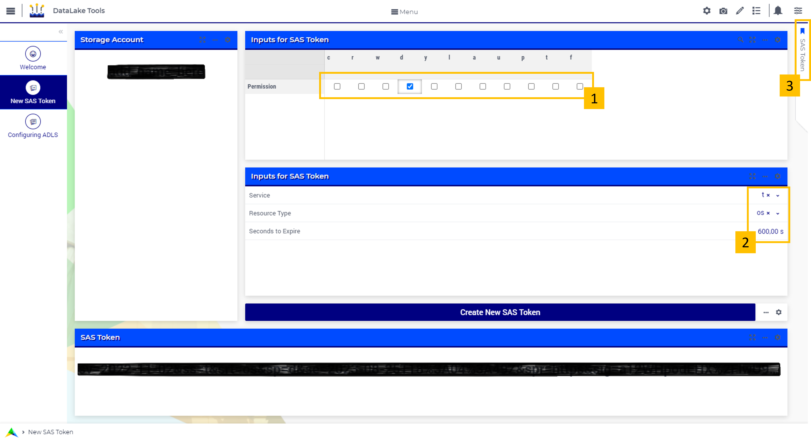

DataLake Tools
========================
.. meta::
   :keywords: datalake, azure, sas token, container, data integration, file system, file management
   :description: This article is for developers who want to integrate the Azure Data Lake Storage as part of their AIMMS account.

.. image:: https://img.shields.io/badge/AIMMS_4.96-ZIP:_ProfilerRunCompare-blue
   :target: https://github.com/aimms/profiler-run-compare/archive/refs/heads/main.zip

.. image:: https://img.shields.io/badge/AIMMS_4.96-Github:_ProfilerRunCompare-blue
   :target: https://github.com/aimms/profiler-run-compare

.. image:: https://img.shields.io/badge/AIMMS_Community-Forum-yellow
   :target: https://community.aimms.com/aimms-developer-12/profilerruncompare-app-1328

Introduction
-------------
Every AIMMS Cloud account is by default equipped with an Azure Data Lake Storage Gen2 (ADLS). You can use this storage account to store all types of files that you want to integrate with your AIMMS application. You can also use it to store files generated based on the output of your optimizations, as to make them available to an external source.

The `Data Exchange Library <https://documentation.aimms.com/dataexchange/api.html#data-lake-storage-file-systems>`__ offers functions to easily interact with the ADLS.  

This toolkit offers you the possibility to easily create a SAS token which is needed for authentication if you want to access the ADLS from an external source. It also allows you to fetch and manage the currently known file systems ('containers') on the ADLS and the paths (folders) and files in it. 

Download this toolkit and upload it to your cloud. From there, there is no further need for authentication - the Data Exchange library will automatically extract the storage account name and access key of the Data Lake Storage account associated with your AIMMS Cloud account. Read more about the ADLS for the AIMMS Cloud `here <https://documentation.aimms.com/dataexchange/dls.html>`__. 

Instructions 
-------------

This chapter is divided into three sections:

#. Application Preparation
#. New SAS Token Page
#. Configuring ADLS Page

Application Preparation
~~~~~~~~~~~~~~~~~~~~~~~
To use this application, you can either:

#. Use it on the cloud: 
    To do that, you will need to download the application, 

#. Use it locally:

New SAS Token Page
~~~~~~~~~~~~~~~~~~~~
In the next subsection, we will be comparing the results of runs made.  Doing such a comparison, you don't want to be distracted by differences that have a difference cause than the cause at hand.

For instance, when changing the cloud provider from AWS to Azure, the results should not be fogged by different database contents or different versions of the same application.

Configuring ADLS Page
~~~~~~~~~~~~~~~~~~~~~~

Minimal Requirements
--------------------   

To work with this toolkit, you will need a PRO Cloud account with an Azure Data Lake Storage. You can check if your cloud account is equipped with one, open the uploaded toolkit on your cloud and go to the 'New SAS Token' section. If you see a name in the 'Storage Account' section, your account has an ADLS. If you do not see a name here, please contact AIMMS Support.

.. spelling:word-list::

   github