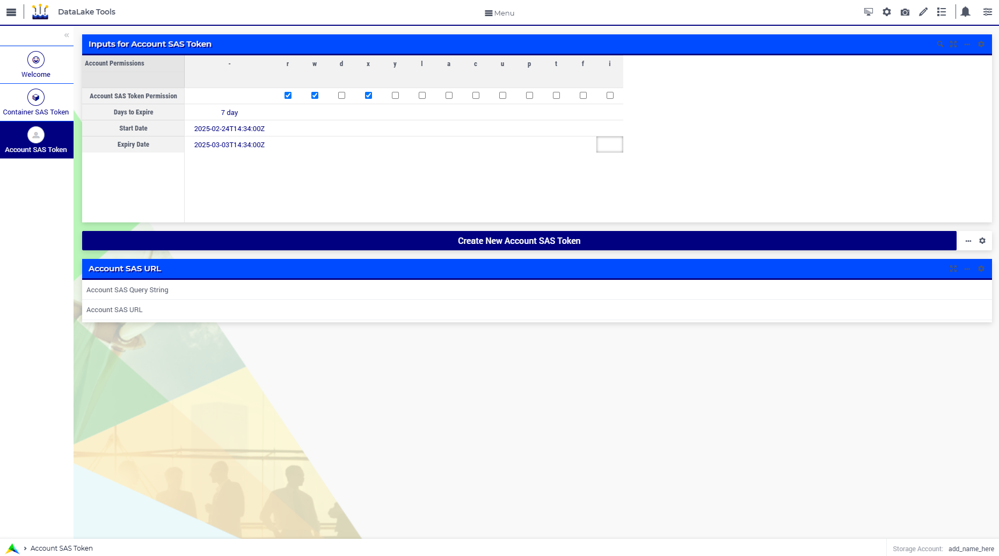

DataLake Tools
=================

.. meta::
   :keywords: datalake, azure, sas token, container, data integration, File System, file management
   :description: This article is for developers who want to integrate the Azure Data Lake Storage as part of their AIMMS account.

.. image:: https://img.shields.io/badge/AIMMS_25.1-ZIP:_DataLake Tools-blue
   :target: https://github.com/aimms/datalake-tools/archive/refs/heads/main.zip

.. image:: https://img.shields.io/badge/AIMMS_25.1-Github:_DataLake Tools-blue
   :target: https://github.com/aimms/datalake-tools

.. image:: https://img.shields.io/badge/AIMMS_Community-Forum-yellow
   :target: https://community.aimms.com/aimms-pro-cloud-platform-43/datalake-tools-1520

Introduction 
-------------
Every AIMMS Cloud account is by default equipped with an Azure Data Lake Storage Gen2 (ADLS). 
You can use this storage account to store all types of files that you want to integrate with your AIMMS application. 
You can also use it to store files generated based on the output of your optimizations, as to make them available to an external source.

The `Data Exchange Library <https://documentation.aimms.com/dataexchange/api.html#data-lake-storage-file-systems>`__ offers functions to easily interact with the ADLS.  

This toolkit offers you the possibility to easily create both Account SAS Token and Container SAS Token, which is needed for authentication if you want to access the ADLS from an external source.

Instructions 
-------------

This chapter is divided into three sections:

#. Application Preparation
#. Understanding 'Container SAS Token' Page
#. Understanding 'Account SAS Token' Page

Application Preparation
~~~~~~~~~~~~~~~~~~~~~~~
To use this application, you can either:

**Use it on the cloud:** Download this toolkit and upload it to your cloud. From there, there is no further need for authentication - the Data Exchange library will automatically extract the storage account name and access key of the Data Lake Storage account associated with your AIMMS Cloud account. 
Make sure to create the ``aimmspack`` with ``api-init`` folder unchecked. Read more about the ADLS for the AIMMS Cloud `here <https://documentation.aimms.com/dataexchange/dls.html>`_. 

**Use it locally:** Download this toolkit and open ``api-init/Data_Lake_Storage.txt``. Add your ``StorageAccount`` and your ``StorageAccessKey`` replacing ``"add_name_here"`` string. Open the project. 

If you prepared the application correctly, by opening the application, you will see the 'Storage Account' name on the right bottom of your page. Without a 'Storage Account' name, nothing from this point on will work. 

Understanding 'Container SAS Token' Page
~~~~~~~~~~~~~~~~~~~~~~~~~~~~~~~~~~~~~~~~~~
In the 'Container SAS Token' page you will be able to: create, update and delete Access Policies, manage File Systems and create a Container SAS Token.

File System
^^^^^^^^^^^^^^^^^^^^^^
In the 'Manage File System' tab, you will be able to: create and delete File Systems. If you prefer to create directly on Azure, here, you can also fetch an updated File System list.

|

Access Policy
^^^^^^^^^^^^^^^^^^^^^^

To generate a Container SAS Token, you must first define an Access Policy. Each File System can have up to five Access Policies. 
On this page, you can create a new policy, modify existing ones, or delete them as needed. As a best practice, grant only the permissions 
that are strictly necessary to minimize security risks. Avoid assigning excessive privileges, 
and regularly review policies to ensure they align with current access requirements.

.. image:: images/container-sas-token.png
    :align: center

|

Container SAS Token
^^^^^^^^^^^^^^^^^^^^^^

To create a Container SAS Token, please input the required information on the table. Note that once you select a File System and Access Policy, you can check the Access Policy information on the right side table. 
Once everything is set, click on the button below it. A new Container SAS Token will be generated and will appear on the bottom.

Understanding 'Account SAS Token' Page
~~~~~~~~~~~~~~~~~~~~~~~~~~~~~~~~~~~~~~~

On the 'Account SAS Token' page, you can create an Account SAS Token. This page is accessible via the Page Manager 
but not through the workflow. While the ability to generate Account SAS Tokens exists, we strongly recommend using 
Container SAS Tokens instead, as they help minimize security risks by limiting access to specific File Systems. As a best practice, 
always grant only the permissions necessary for the intended use, regularly review token usage, and avoid long-lived tokens to reduce exposure to potential security threats.

|

To create a Account SAS Token, please input the required information on Inputs table. Click on the button below it.
A new Account SAS Token will be generated and will appear on the bottom.

Minimal Requirements
--------------------

To work with this toolkit, you will need a AIMMS Cloud account with an Azure Data Lake Storage. 
You can check if your Cloud account is equipped with a Data Lake by launching this app to your AIMMS Cloud and checking if 'Storage Account' has value. This can be found at the right bottom of any page. 
If you do not see a name here, please contact `AIMMS Support <support@aimms.com>`_.

Release Notes
--------------------

`v1.4 <https://github.com/aimms/datalake-tools/releases/tag/1.4>`_ (24/02/2025)
   Access Policies are now required to create an Container SAS Token. UI updated.

`v1.3 <https://github.com/aimms/datalake-tools/releases/tag/1.3>`_ (13/03/2024)
   Make the app more usable by allowing: the expiry time to be specified in days as well as seconds, 
   choosing the right order of permissions for container SAS tokens, displaying SAS query string as well as SAS URL, 
   creation and deletion of File Systems (containers) within the storage account.

`v1.2 <https://github.com/aimms/datalake-tools/releases/tag/1.2>`_ (28/02/2024)
   Adding missing parameter to the table. 

`v1.1 <https://github.com/aimms/datalake-tools/releases/tag/1.1>`_ (08/02/2024)
   Both Account SAS Token and Container SAS Token are available to be created.

`v1.0 <https://github.com/aimms/datalake-tools/releases/tag/1.0>`_ (25/08/2023)
   First version launched!

.. spelling:word-list::

   github
   datalake
   aimmspack
