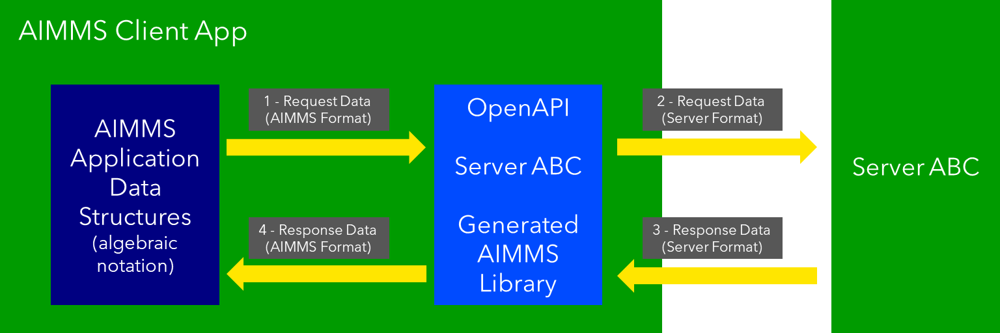

Develop a Python service and integrate it into AIMMS
=====================================================

.. Call this feature an experimental feature.

.. Show how to test Python/Aimms locally.

In today's data-driven world, the integration of powerful  
machine learning capabilities into optimization applications is becoming increasingly important. 
This article explores the seamless integration of AIMMS  
with a Python service built using FastAPI, Pydantic, and Uvicorn. 
We'll dive into how to leverage this service by creating an OpenAPI AIMMS library, and 
deploy this library first in AIMMS Developer and subsequently use the resulting app on the AIMMS Cloud.

Introduction
----------------

In the world of problem-solving, AIMMS serves as a reliable workhorse, helping organizations make data-driven decisions and streamline operations. 
On the other hand, Python has earned its stripes as a go-to language for data manipulation and modeling. 
When these two powerhouses combine forces, it's like unlocking a toolbox full of solutions. 
Complex optimization challenges meet Python's adaptable strength, paving the way for practical solutions and improved efficiency.

Join us on this journey as we unravel the art of bridging the gap between AIMMS and Python, 
unlocking the potential for innovation and efficiency in your modeling endeavors.

The remainder of this article is organized as follows:

#.  First, we'll present the story, the background against which the technology is illustrated.

#.  Second, we'll built the Python service.

#.  Third, we'll deploy the service using an AIMMS application.

Download
---------

:download:`AIMMS 24.2 project download <model/example.zip>` 

.. CK --> CK: see also Nirvana 0124.

Story: Bias in AI
-------------------------------

.. https://www.kaggle.com/code/var0101/introduction-to-ai-ethics
.. https://www.kaggle.com/code/alexisbcook/identifying-bias-in-ai/tutorial
.. https://www.kaggle.com/code/alexisbcook/identifying-bias-in-ai

The combination of machine learning and everyday applications is at the heart of modern tech advancements. 
From predicting trends to powering self-driving cars, machine learning reshapes how we use data to make smarter choices. 
But, hidden beneath its brilliance is a complex issue - bias within these algorithms.

In this example, we illustrate Bias, by creating an AIMMS front-end to an existing Python application.
The Python application is from
`Kaggle <https://www.kaggle.com/>`_ who teaches about 
`bias <https://www.kaggle.com/code/alexisbcook/identifying-bias-in-ai/tutorial>`_ in the context of 
`ethics <https://www.kaggle.com/code/var0101/introduction-to-ai-ethics>`_.

The AIMMS application uses the following steps:

#.  Get a comment from a user to determine its toxicity

#.  Read in training data

#.  Select two columns from this training data: the comment and the toxicity

#.  Pass the training data and the user entered comment to a Python service

#.  The Python service returns whether it considers the user comment to be toxic or not.

.. note:: 

    This app demonstrates bias, which can be observed by entering comments like:

    #.  ``black`` which is marked **toxic**, and  

    #.  ``white`` which is marked **not toxic**.

A few remarks on the choice of this example:

*   This example is about checking whether there is bias in your data.  
    At first, this may seem far fetched for Decision Support applications.
    However, basing a decision on data that is not representative of your market is not a good idea!

*   A practical aspect of this example is that the communication between two processes is relatively simple: a row of objects and a few scalars - that is all.
    In practice, there is often significantly more detail to the structure of the data communication; 
    however, that extra detail in structure will not make the flow of information easier to understand.

Developing the Python service
-----------------------------

Machine learning core
^^^^^^^^^^^^^^^^^^^^^^^^

The core of the Python app is based on materials from `Bias in AI <https://www.kaggle.com/code/alexisbcook/identifying-bias-in-ai/tutorial>`_.
For the Machine Learning core it uses `scikit-learn <https://scikit-learn.org/stable/>`_, in particular:

#.  `train_test_split <https://scikit-learn.org/stable/modules/generated/sklearn.model_selection.train_test_split.html#sklearn.model_selection.train_test_split>`_ Split arrays or matrices into random train and test subsets.

#.  `CountVectorizer <https://scikit-learn.org/stable/modules/generated/sklearn.feature_extraction.text.CountVectorizer.html#sklearn.feature_extraction.text.CountVectorizer>`_ Convert a collection of text documents to a matrix of token counts.

#.  `LogisticRegression <https://scikit-learn.org/stable/modules/generated/sklearn.linear_model.LogisticRegression.html#sklearn.linear_model.LogisticRegression>`_ Create Logistic Regression (aka logit, MaxEnt) classifier.

How these utilities work in detail is outside the scope of this article.

Information communicated
^^^^^^^^^^^^^^^^^^^^^^^^

The input (training data) to this machine learning code is an array of observations, 
whereby each observation consists of a comment (a text string), and a target (a binary indicating toxic when 1).
In addition, the input has a user-comment.  The purpose of the service is to predict whether this user comment is toxic or not.

The output to this machine learning code is a zero (not toxic) or one (toxic). 

So how do we model these inputs and output?

Data Modeling with Pydantic
^^^^^^^^^^^^^^^^^^^^^^^^^^^^^^^^^^^^^^^^^^^^^^^^^^^^^^^^^^^^^^^^^^^^^^^

`Pydantic <https://docs.pydantic.dev/latest/>`_ is renown for its data modeling. 
This library is widely used for its data validation. 
Here ``Basemodel`` is imported from ``Pydantic``.

First we construct the observation.

.. code-block:: python 
    :linenos:

    # Usually an observation has many attributes, but we use only these two here.
    class Observation(BaseModel):
        comment: str  # An observed text
        target: int  # A verified zero / one whether this text is considered toxic.

Next we create a row of observations and add a few scalars to it.

.. code-block:: python 
    :linenos:

    # The input class for the Bias_in_AI app:
    class BiasInAIInputTuples(BaseModel):
        no_observations: int
        observations: list[Observation]  # length is no_observations
        new_comment: str                 # determine for this string, whether it is toxic or not.

With that we have the input modeled. Next, we define the class for the output, which is just a single number.

.. code-block:: python 
    :linenos:

    # The output class for the Bias_in_AI app:
    class BiasInAIOutput(BaseModel):
        is_toxic: int  # 0: not toxic, 1: toxic.

Building the Python Service with FastAPI
^^^^^^^^^^^^^^^^^^^^^^^^^^^^^^^^^^^^^^^^^^^^^^^^^^^^^^^^^^^^^^^^^^^^^^^

.. Briefly mention the setup of the Python service with FastAPI, but focus on the core endpoints and functionalities relevant to AIMMS.

Using `FastAPI <https://fastapi.tiangolo.com/>`_ the paths are easily defined.

First create a global that represents the service, called ``app``.

.. code-block:: python 
    :linenos:

    # Create the application object
    app = FastAPI()

Remarks:

*   Line 2: Create the app, entry point for the provided services.

Next, for every path, here just one, name its inputs and outputs, as specified using Pydantic:

.. code-block:: python 
    :linenos:

    # Define the actual function ``compute`` to learn and predict and associate this function with the path ``/compute``
    @app.post("/compute", response_model=BiasInAIOutput)
    async def compute(inp: BiasInAIInputTuples) -> BiasInAIOutput:

*   Line 2: Define the path ``/compute``.

*   Line 3: Actual function definition.
    As Pydantic is used by FastAPI, this ensures that ``/compute`` input is validated against the data validation rules of ``BiasInAIInputTuples``.
    In addition, the output will be according to the class ``BiasInAIOutput``.

Deploying the Python Service with Uvicorn
^^^^^^^^^^^^^^^^^^^^^^^^^^^^^^^^^^^^^^^^^^^^^^^^^^^^^^^^^^^^^^^^^^^^^^^

And now running the service using `Uvicorn <https://www.uvicorn.org/>`_

.. code-block:: python 
    :linenos:

    if __name__ == "__main__":
        uvicorn.run("main:app", host="", port=8000, log_level="info")

Extras from the combo Pedantic, FastAPI and uvicorn
^^^^^^^^^^^^^^^^^^^^^^^^^^^^^^^^^^^^^^^^^^^^^^^^^^^^^^

There are a few extras that come with this combo, and, admittedly, I've grown used to those extras being present:

#.  Get Swagger dynamic interface docs. By entering the URL ``http://localhost:8000/docs`` you will get the interface documented.
    It looks as follows:

    .. raw:: html

        

        
Click me to see the screenshot 👇

    .. image:: images/localhost-docs.png
        :align: center

    .. raw:: html
    
        

#.  Get OpenAPI 3.1 specification.  
    An OpenAPI 3.1 specification of the interface can also be easily obtained, 
    by doing a HTTP Get on ``http://localhost:8000/openapi.json``. 
    Note that there are various `tools <https://openapi.tools/>`_ to work with such a specification.
    
    Using `Postman <https://www.postman.com/>`_, obtaining such a specification looks as follows:

    .. raw:: html

        

        
Click me to see the screenshot 👇

    .. image:: images/postman-get-openapi.png
        :align: center

    .. raw:: html

        

    We will be using this ``openapi.json`` file in the next chapter to base the communication by 
    the AIMMS client on.

AIMMS Integration
-----------------

The architecture of the AIMMS WebUI app, equipped with a generated OpenAPI library, regarding 
using this service :doc:`looks as follows<../561/561-openapi-overview>`:

.. _ref_figure_client_server_openapi:

    Client with OpenAPI lib and Server architecture

With this architecture, an AIMMS client only uses assignment statements to:

#.  Provide the input to the service at hand, and

#.  Receive the output from that service.

There is no need for the AIMMS app developer to write conversion specifications.

How do we create such an AIMMS OpenAPI library?  This is discussed in the next section.

Building a OpenAPI library from the Python app running as a service
^^^^^^^^^^^^^^^^^^^^^^^^^^^^^^^^^^^^^^^^^^^^^^^^^^^^^^^^^^^^^^^^^^^^

``https//:8000/openapi.json`` provides a copy of the OpenAPI 3.1 specification of the interface created in the Python app.
Using this specification, an AIMMS Library is created using:

.. code-block:: aimms 
    :linenos:

    dex::schema::GenerateClientFromOpenAPISpec(
        schemaFile      :  "openapi/openapi-biasInAITuples.json", 
        schemaName      :  "openapi-biasInAITuples", 
        schemaPrefix    :  biasInAITuples, 
        explodeDefault  :  1, 
        generateXMLData :  0);
        
Remarks:

#.  Line 2: input, filename.

#.  Line 3: output, name of the library

#.  Line 4: And its prefix

#.  Line 5: The library generated permits asynchronous calls and able to maintain data of the REST API call history.

Further information about generating such an AIMMS library:

#.  https://documentation.aimms.com/dataexchange/openapi-client.html#generating-api-clients-from-an-openapi-specification

#.  https://documentation.aimms.com/dataexchange/api.html#dex-schema-GenerateClientFromOpenAPISpec

Using Python Services in AIMMS Developer
^^^^^^^^^^^^^^^^^^^^^^^^^^^^^^^^^^^^^^^^

.. Explain how AIMMS Developer can utilize Python services to extend modeling capabilities.
.. Provide step-by-step instructions on how to integrate the Python service into AIMMS Developer.
.. Include examples of how AIMMS models can interact with the Python service.

Looking at :ref:`ref_figure_client_server_openapi` above, we start with action 1, 
passing the data to the OpenAPI and initiating the request, action 2, implemented in the OpenAPI lib. 

.. code-block:: aimms 
    :linenos:

    Procedure pr_callBiasInAITuples {
        Body: {
            ! By not setting the RequestResponseFilePrefix, we will be using memory streams!
            ! biasInAITuples::api::RequestResponseFilePrefix:= "requestsResponses/" ;
            
            ! As the OpenAPI library maintains a history of Rest API calls, we need to identify the call at hand:
            biasInAITuples::api::NewCallInstance(ep_loc_callInstance);
            
            block ! Fill in the data for making the request.
            
                ! Pass the data from the data model to the corresponding data in the biasInAI library.
                biasInAITuples::_BiasInAIInputTuples::no_observations(ep_loc_callInstance) := p_def_cardID ;
                biasInAITuples::_BiasInAIInputTuples::new_comment(ep_loc_callInstance) := sp_queryToInvestigate ;
                biasInAITuples::_BiasInAIInputTuples::_observations::observations_iter := ElementRange( 1, p_def_cardID );
            
                ep_loc_iterToId( biasInAITuples::_BiasInAIInputTuples::_observations::i_observations ) 
                := element( s_ids, val( biasInAITuples::_BiasInAIInputTuples::_observations::i_observations ) );
                       
                biasInAITuples::_BiasInAIInputTuples::_observations::comment_( ep_loc_callInstance, biasInAITuples::_BiasInAIInputTuples::_observations::i_observations) 
                := sp_commentText( ep_loc_iterToId( biasInAITuples::_BiasInAIInputTuples::_observations::i_observations ) );
            
                biasInAITuples::_BiasInAIInputTuples::_observations::target(ep_loc_callInstance, biasInAITuples::_BiasInAIInputTuples::_observations::i_observations) 
                := bp_target( ep_loc_iterToId( biasInAITuples::_BiasInAIInputTuples::_observations::i_observations ) ) ;
            
                block ! Check if we passed the data correctly.
                    _p_commentsCard := card( biasInAITuples::_BiasInAIInputTuples::_observations::comment_ );
                    if _p_commentsCard <> p_def_cardID then
                        ! display _p_commentsCard, p_def_cardID ;
                        raise error "internal error passing data \'comments\'" ;
                    endif ;
                       
                endblock ;
            endblock ;
            
            ! Install hook, which will copy the desired response data or handle the error
            biasInAITuples::api::compute_compute_post::UserResponseHook 
            := 'pr_responseHookTuples' ;
            
            ! Start the request.
            biasInAITuples::api::compute_compute_post::apiCall(ep_loc_callInstance);
        }
        ElementParameter _ep_id {
            Range: s_ids;
        }
        ElementParameter _ep_cmtNo {
            Range: biasInAITuples::_BiasInAIInputTuples::_observations::observations_iter;
        }
        Parameter _p_commentsCard;
        ElementParameter ep_loc_callInstance {
            Range: dex::Instances;
        }
        ElementParameter ep_loc_iterToId {
            IndexDomain: biasInAITuples::_BiasInAIInputTuples::_observations::i_observations;
            Range: s_ids;
        }
    }

Remarks:

#.  In the code fragment above, lines 11 to 23 pass the data from the client to the OpenAPI library. 
    This corresponds to action 1 in the image above. 
    
#.  On line 40, the call to the OpenAPI library is made to convert its data structures (action 2 in the image above)
    to the data structure format of the service, and to do make the Rest API call to the service.

Once, the request is handled by the server, and the result is passed back to the client, action 3, 
the response is handled, action 4, as follows:

.. code-block:: aimms 
    :linenos:

    Procedure pr_responseHookTuples {
        Arguments: (ep_in_callInstance);
        Body: {
            ep_loc_status := biasInAITuples::api::CallStatusCode(ep_in_callInstance);
            
            if StringLength( sp_queryToInvestigate ) > 5 then
                sp_log_cmtShort := substring( sp_queryToInvestigate, 1, 5 ) + "..." ;
            else
                sp_log_cmtShort := sp_queryToInvestigate ;
            endif ;
            switch (ep_loc_status) do
                '200': ! Call went ok. 
                    bp_calc_commentInvestigatedIsToxic := biasInAITuples::_BiasInAIOutput::is_toxic(ep_in_callInstance) ;
                    ep_calc_queryAnswer(ep_query) := if bp_calc_commentInvestigatedIsToxic then 'Toxic' else 'Not Toxic' endif;
                    sp_calc_imageQueryAnswer := if bp_calc_commentInvestigatedIsToxic then "toxic.png" else "not_toxic.png" endif;
                    biasInAITuples::_BiasInAIInputTuples::EmptyInstance(  ep_in_callInstance );
                    biasInAITuples::_BiasInAIOutput::EmptyInstance( ep_in_callInstance );
            
                '422': ! HTTP validation error.
                default:
                    display { biasInAITuples::_HTTPValidationError::_detail::msg, 
                        biasInAITuples::_HTTPValidationError::_detail::type_ }, 
                        biasInAITuples::_HTTPValidationError::_detail::_loc::loc ;
                    raise error formatString("biasInAITuples::isToxic(%s)/%s failed ( status: %e, error: %e): %s",
                        sp_log_cmtShort,  ep_in_callInstance,
                        biasInAITuples::api::CallStatusCode(ep_in_callInstance), 
                        biasInAITuples::api::CallErrorCode(ep_in_callInstance), "" );
            
            endswitch;
        }
        Comment: {
            "Client specific code for handling the response from the server, here
            whether the comment at hand is toxic or not."
        }
        DeclarationSection Locals {
            ElementParameter ep_in_callInstance {
                Range: dex::Instances;
                Property: Input;
            }
            ElementParameter ep_loc_status {
                Range: dex::HTTPStatusCodes;
            }
            StringParameter sp_log_cmtShort;
        }
    }

The procedure ``pr_responseHookTuples`` specified above, looks a bit bulky, but the essence,
for a successful call, verified by HTTP status code 200, is on line 13. 
Subsequently, lines 14, 15 are used for the communication to the end-user.
The remainder of this procedure is to notify, handle errors, and track when needed.

Regarding the above image: action 3 is taken care of by the ``callback`` procedure 
declared next to the ``apiCall`` procedure called at the end of ``pr_callBiasInAITuples``.
Action 4, corresponds to the procedure ``pr_responseHookTuples`` just discussed.

The above provides a nice framework that can be used on a development machine.
But how about deploying the apps created? This will be discussed in the next chapter.

Local testing
------------------------------

Once the AIMMS app and the Python app are finished, it is possible to test the combo on your development machine.

First start the Python app, it should come up with something like:

.. code-block:: none

    INFO:     Started server process [6320]
    INFO:     Waiting for application startup.
    INFO:     Application startup complete.
    INFO:     Uvicorn running on http://:8000 (Press CTRL+C to quit)

After this you can start the AIMMS App in AIMMS Developer.
Navigate to page ``results``, and enter a phrase for which you want the toxicity to be tested.
Send it to the Python service by clicking on the two masks in the lower right of the screen.

After a minute or so, the response should come back.

Note that training takes place for every request made; there is no caching of the computed machine learning model built in yet. 
(Clearly one of our todo's).

Deploying Python Services on AIMMS Cloud
-----------------------------------------------------

Deploying a Python app on AIMMS Cloud consists of copying it onto the AIMMS Cloud platform, and
launching the application.

In this how-to, the copying part is copying to AIMMS PRO storage, using AIMMS PRO storage functions such as:

* ``pro::storage::ExistsObject``: Procedure that checks for the presence of a file.

* ``pro::SaveFileToCentralStorage``: Actual procedure that copies.

* ``pro::DeleteStorageFile``: Actual procedure that deletes (old) versions.

Launching the Python app is achieved by the AIMMS PRO procedure ``pro::service::LaunchService`` as illustrated below:

.. code-block:: aimms 
    :linenos:

	_p_retCodeLaunchService := pro::service::LaunchService(
		connectionURI      :  _sp_remoteURL,                       ! output
		serviceId          :  "biasInAIService",                   ! Service name
		imageName          :  "services/aimms-anaconda-service",   ! Image name
		imageTag           :  "2023.07-1",                         ! Image version tag
		listenPort         :  8000,                                ! Port used
		storedApp          :  _sp_storedApp,                       ! AIMMS PRO storage location
		cmdLine            :  "python3 main.py"   );               ! Command line of app

This starts the service and makes it accessible to the WebUI AIMMS app itself.

Conclusion
------------

Modern tools such as: 

* Python, especially the libraries Pedantic, FastAPI, and uvicorn, 

* AIMMS Data Exchange library, especially the generation of OpenAPI clients, and

* AIMMS Cloud, especially the feature to launch additional services

make connecting a Python service to an AIMMS app, and 
subsequently deploying the combo, relatively straightforward.

.. spelling:word-list::

   Pedantic
   FastAPI
   uvicorn
   logit

Reference
----------

#.  `Launching Python, R and other services <https://documentation.aimms.com/cloud/launch-service.html#launching-python-r-and-other-services>`_.