Activating Licenses Offline
====================================

When AIMMS cannot make a connection to the internet license server to activate a nodelock, you will get the option to activate a nodelock offline. 

To complete offline nodelock activation, follow these steps:

Create Request File
-------------------

1.  Start AIMMS, go to :menuselection:`License Configuration`, and click :menuselection:`Install License`. 
This will give you the following screen:

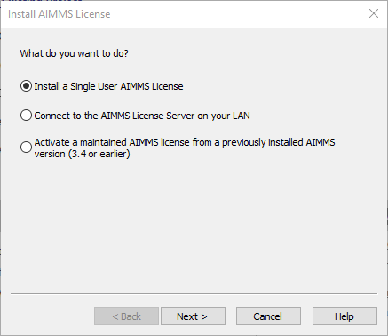

|

Select :menuselection:`Install a Single User AIMMS License` and click :menuselection:`Next`.

2.  Enter the license number and click :menuselection:`Next`. 

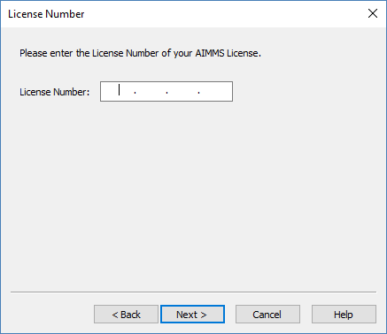

|

In case AIMMS cannot determine that the license number you entered is a nodelock license, 
you will get an option to choose between the protection of the license: nodelock or USB dongle. Select :menuselection:`Nodelock`. 

3. Enter the activation code for your license number and click :menuselection:`Next`.  

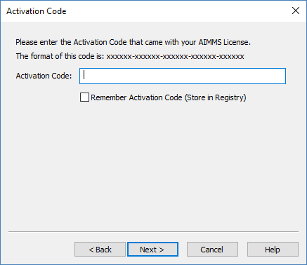

|

4. Choose the :menuselection:`Machine Nodelock` option and click :menuselection:`Next`. 

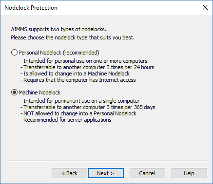

|

5. Choose the :menuselection:`Offline` option, 
and click :menuselection:`Browse` to select a location to save the license request file. 

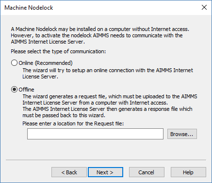

|

Then click :menuselection:`Next`.

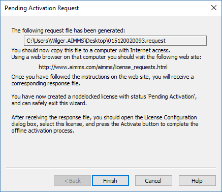

|

.. important:: Remember where you save the file, you will need it again!

AIMMS generates a license request file to the specified location. Click :menuselection:`Finish`. 

Create Response File
-----------------------

6. Open a web browser and go the `offline activation address <https://www.aimms.com/support/licensing/processing-request-files/>`_. 

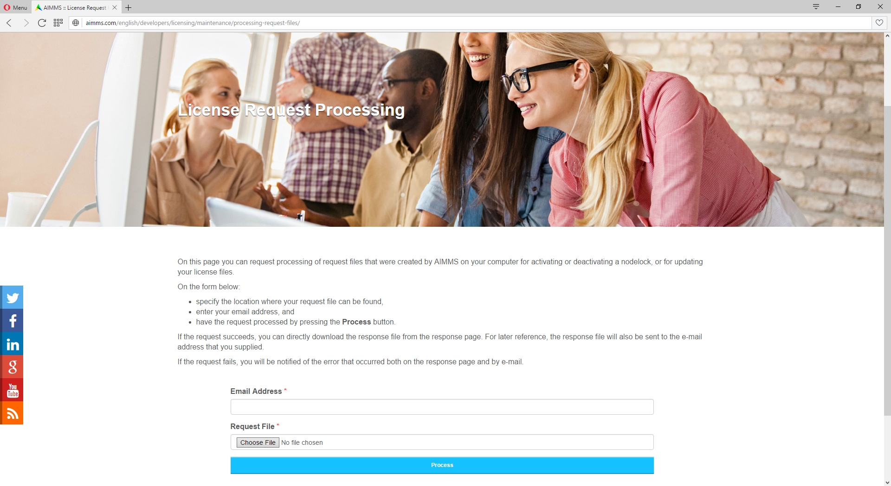

|

Click :menuselection:`Choose File` and browse for the license request file generated in the previous step. 

Enter the email address where you will receive the response file, and click :menuselection:`Process`. 

Please note that you can also download the generated response file from the website, after you click :menuselection:`Process`. 

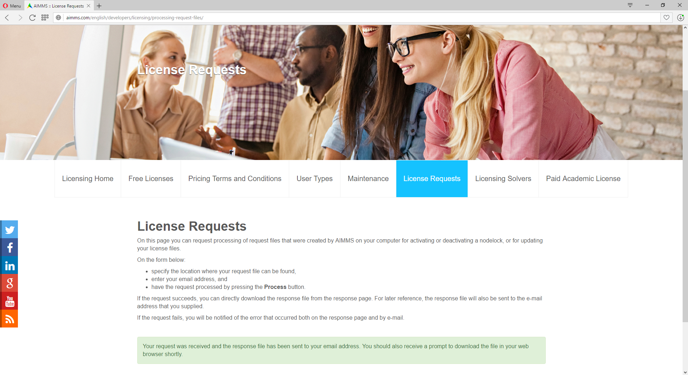

|

The response file is downloaded automatically, and sent to the email address you provided. 

Upload Response File
-----------------------

7. Start AIMMS again and go to :menuselection:`License Configuration`.

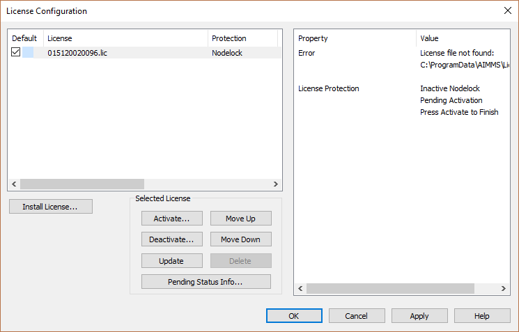

|

Select the license that you are activating and click :menuselection:`Activate`. 

8. Browse for the response file generated in step 6, and click :menuselection:`Next`.

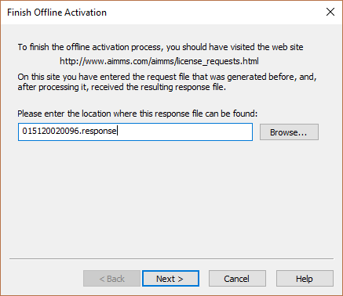

|

This should result in the following success message:

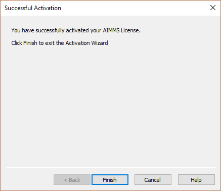

|

The license is now activated and ready for use.